# Hog 2.6 Matchups

## [Table of contents](hog-2.6-matchups.md#table-of-contents)

1. [**Weird noobish random decks**](hog-2.6-matchups.md#id-15kq1rs760qa)
2. [**Other tanks + splash combinations** ](hog-2.6-matchups.md#lw3aghi9pb9v)
3. [**Generic Beatdown**](hog-2.6-matchups.md#i81dnzigb9fd)
4. [**Balloon (no Lava Hound)**](hog-2.6-matchups.md#qmcclt1lc0lx)
   1. [**LumberLoon**](hog-2.6-matchups.md#id-3x01iyj130iq)
   2. [**Miner Balloon**](hog-2.6-matchups.md#um18sonjmc1r)
   3. [**Recruits Loon**](hog-2.6-matchups.md#ds88771u9v70)
   4. [**Pekka Loon (The Anaban Deck)**](hog-2.6-matchups.md#za35ycd2ksv9)
5. [**Elixir Golem**](hog-2.6-matchups.md#id-57tnro6dvyy2)
6. [**Giant Matchups**](hog-2.6-matchups.md#qbeokcncb0aq)
   1. [**Giant Double Prince**](hog-2.6-matchups.md#id-23a84svwpopx)
   2. [**Giant Balloon**](hog-2.6-matchups.md#uhlf4fur3zb7)
   3. [**Giant witch**](hog-2.6-matchups.md#id-59ucqlkr7tgc)
7. [**Golem**](hog-2.6-matchups.md#m662hoywjw02)
   1. [**Golem Matchups**](hog-2.6-matchups.md#p35wy6misae0)
   2. [**Golem Poison**](hog-2.6-matchups.md#tmas1tqfwhsd)
   3. [**Golem Lightning**](hog-2.6-matchups.md#id-59qfenyna0gm)
   4. [**Golem Electro Dragon**](hog-2.6-matchups.md#pl3remw6ck7x)
   5. [**Golem Clone**](hog-2.6-matchups.md#bl2bfd1mf1ek)
8. [**Graveyard Matchups**](hog-2.6-matchups.md#fhjjt1ule1or)
   1. [**Giant Graveyard**](hog-2.6-matchups.md#id-76h9d9s24a3j)
   2. [**Graveyard Freeze/Poison**](hog-2.6-matchups.md#id-2zc5z8ehojpp)
9. [**Hog Matchups**](hog-2.6-matchups.md#id-473epbc20w82)
   1. [**Hog Earthquake**](hog-2.6-matchups.md#im7p9uzbdyd0)
   2. [**AQ Giant Skeley w/ Hog/Pigs**](hog-2.6-matchups.md#id-9adjqm4xpioa)
   3. [**W/ out Giant Skeley**](hog-2.6-matchups.md#id-7l7f9yweguxi)
   4. [**Monk Hog EQ**](hog-2.6-matchups.md#id-5yghv9id9z2k)
   5. [**Using Cannon + Skelies + Spirit to defend Hog Eq**](hog-2.6-matchups.md#ijt58d2iui3)
   6. [**Hog Lightning**](hog-2.6-matchups.md#g30e32s97jeh)
   7. [**Hog Exenado**](hog-2.6-matchups.md#k7d98ekqh19a)
   8. [**2.6 Hog Cycle Mirror Match**](hog-2.6-matchups.md#dcp27kufwrrs)
10. [**Lava Hound Matchups**](hog-2.6-matchups.md#ipmxq7hynyy3)
    1. [**Lava Miner**](hog-2.6-matchups.md#id-7q2ni1fryv8t)
    2. [**Lava Clone**](hog-2.6-matchups.md#ndsyv1cxtptc)
11. [**Lavaloon Matchups**](hog-2.6-matchups.md#y2ztqum0kz3g)
    1. [**Lavaloon Fireball Zap**](hog-2.6-matchups.md#opvf5nsb390q)
    2. [**Lavaloon Guards/Barbs**](hog-2.6-matchups.md#f5j147c809ft)
    3. [**Lavaloon Lightning**](hog-2.6-matchups.md#vsztd8x9oql)
    4. [**Lavaloon Miner**](hog-2.6-matchups.md#aich9pg7fk6w)
12. [**Bait Decks**](hog-2.6-matchups.md#vdjewzdzozh6)
    1. [**Log Bait (Classic)**](hog-2.6-matchups.md#vdjewzdzozh6-1)
       1. [**Countering the Barrel**](hog-2.6-matchups.md#countering-the-barrel)
       2. [**Using Log**](hog-2.6-matchups.md#v44cu4hk91cj)
       3. [**Gameplay**](hog-2.6-matchups.md#c7er8ho8ghgh)
    2. [**Log Bait w/ Prince Rascals**](hog-2.6-matchups.md#n5e0v165cb64)
    3. [**Log Bait Cycle 2.8**](hog-2.6-matchups.md#id-8cxurzyjw8ju)
    4. [**MM 3.0 Bait**](hog-2.6-matchups.md#yyc01dyrhoe0)
    5. [**Mega Knight Bait**](hog-2.6-matchups.md#gyslyywi1iwc)
13. [**Miner Control Matchups**](hog-2.6-matchups.md#id-4o5io5tuty3r)
    1. [**Miner Poison**](hog-2.6-matchups.md#id-7o8dnopn9r8t)
    2. [**Miner Mortar Poison (with Valk + Musk)**](hog-2.6-matchups.md#id-7xs1y0sprpn0)
    3. [**Miner Mortar Bait**](hog-2.6-matchups.md#wy5zckfqmfer)
    4. [**Miner Wall Breakers**](hog-2.6-matchups.md#lfgrdqn3xcqd)
    5. [**Miner + GK + Nado**](hog-2.6-matchups.md#d8vb2ty0xgrn)
    6. [**Miner + Magic Archer + Nado + Wall Breakers**](hog-2.6-matchups.md#qla95hrlypfa)
14. [**Pekka Brigde Spam**](hog-2.6-matchups.md#id-2en0pehjfcy)
15. [**Royal Giant Matchups**](hog-2.6-matchups.md#hpgrzsf9pifi)
    1. [**Royal Giant Lightning**](hog-2.6-matchups.md#l75nqskv3vbi)
    2. [**Royal Giant Fisherman**](hog-2.6-matchups.md#rkl0kpnn6gux)
    3. [**RG Hog Sparky**](hog-2.6-matchups.md#ugl4hj9ryzxe)
    4. [**Monk RG**](hog-2.6-matchups.md#cexrp91ode7l)
    5. [**Skeley King RG**](hog-2.6-matchups.md#id-8mrsdkp554e)
    6. [**Note: Hog + Ice Golem counter Fisherman & Tombstone**](hog-2.6-matchups.md#id-335rthqjgm08)
    7. [**Note: Against Mother Witch**](hog-2.6-matchups.md#bv04tn9jx1vf)
16. [**Royal Hogs**](hog-2.6-matchups.md#mi71562ix4h5)
    1. [**Royal Recruits + Royal Hogs**](hog-2.6-matchups.md#id-7iqoloqtpdv9)
    2. [**Royal Hogs EQ**](hog-2.6-matchups.md#nvnskbrtr3fl)
    3. [**Other Royal Hogs Decks**](hog-2.6-matchups.md#dmcudln7kqs7)
17. [**Tank + Sparky**](hog-2.6-matchups.md#id-41193ivo447c)
18. [**X-bow Decks**](hog-2.6-matchups.md#x-bow-decks)
    1. [**X-bow Cycle 2.9**](hog-2.6-matchups.md#vuhe0gm73fs8)
    2. [**X-bow Cycle 3.0 w/ Knight**](hog-2.6-matchups.md#vafyq2qw3x9s)
    3. [**New Ice Bow w/Tesla**](hog-2.6-matchups.md#p3bb8afvverc)
    4. [**Old Ice Bow (no Tesla)**](hog-2.6-matchups.md#jjez0bn4wg8t)
19. [**3 Musketeers Fireball Bait**](hog-2.6-matchups.md#k331bm9gvp3a)
20. [**Mortar Decks**](hog-2.6-matchups.md#mortar-decks)
    1. [**Mortar Cycle w/Nado**](hog-2.6-matchups.md#qw1mc07y59pb)
    2. [**Mortar Knight Fireball/Log Bait**](hog-2.6-matchups.md#id-8sejm14coi9)
    3. [**Mortar Miner**](hog-2.6-matchups.md#iewcqc1q5isv)
21. [**Electro Giant Decks**](hog-2.6-matchups.md#zbhvfrs5haov)
22. [**Goblin Drill Matchups**](hog-2.6-matchups.md#id-7orzh9v0qi7u)
    1. [**Variants with Fireball**](hog-2.6-matchups.md#tnsg4c5sus1w)
    2. [**Variants with Rocket**](hog-2.6-matchups.md#e38766s9ce3h)
    3. [**MK Bait style Drill Decks**](hog-2.6-matchups.md#nz3gphigfwm3)
23. [**Macrostrategy**](hog-2.6-matchups.md#id-48hw2o45m4ei)
24. [**Microstrategy**](hog-2.6-matchups.md#g7k943f5izc5)

## Weird noobish decks 

In the lower ladder, you’ll usually see these kinds of decks a lot. Usually contains cards that seem outwardly strong, like Pekka, wizard, prince, minion horde, etc. Wizards are a threat to 2.6, so try to fireball + log the wizard if it’s played behind a tank. The rest of their deck usually are made of single-target hard hitters, so make use of your cycle cards to kite as much as possible. Watch out for prediction spells though, so be sure to be hovering a second cycle card in the location that will be sure to kite (against these hard hitters, 1 mis-kite will make you lose the game, so better be safe than sorry).

These decks can sometimes contain 3 or more hog counters. However, it is very likely that 1 of these is outplayable, for example with a prediction fireball, so that will be your win condition. If you truly cannot get hog hits, just spell cycle. Log cycling is the safest, but get fireball value whenever you can. ALWAYS remember to play it safe, and remember their cycle like your life depends on it. These decks are usually heavy, so outcycle and punish them HARD when they invest a non-threatening troop in the back. 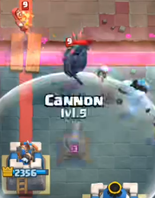

* Pekka Wizard

The dreaded ladder combo that can really destroy you. Kiting gets difficult, since 2 out of 3 kiting cards die quickly to Wizard. Generally, you can just fireball log the wizard, and you will be fine. However, if you aren’t able to do that, there are a few ways to deal with this. Luckily, there’s a play you can make here.

Just kite the pekka like normal. And then play cannon in the 5-0 position. This placement does not pull the Pekka, which is good. The wizard will walk forward and then target the cannon. When that happens, play an ice spirit at the side of the arena to freeze the wizard without pulling the pekka. The Pekka should walk out of range of your princess tower and cannon, so they can now target the wizard and kill it.

Alternatively, instead of playing cannon, you can use a musketeer to achieve the same effect. If you have damage advantage, you could let your tower take a few wizard hits and let the musketeer do its job. Or even use skeletons to kill it while your musketeer takes down the pekka.

If your opponent plays pekka wizard, remember their card cycle, and punish them hard when they try to play pekka wizard. If they play pekka or wizard, play hog with light support in the opposite lane.

* Elite Barbarians Rage

This combo is used a lot on low ladder and is not difficult to handle, but if you have bad wifi or play your units too late, you take a lot of damage.

Most of the time, if you wait for the elite barbarians to cross the bridge and you use ice golem or ice spirit for a max kite, only one of the elite barbarians will be kited, and the other will go straight to the tower. How you are supposed to kite is by playing your card early, right at the river into the opposite lane. Skeletons are your safest card to kite both elite barbarians, since one of the skeletons is close enough to kite the second Elite barbarian. Be sure to have your other kiting cards ready in case they spell your skeletons. As for ice spirit, I’d rather play it safe by planting it one tile closer than the max kite. As for ice golem, you can play ice golem before they fully cross the bridge to kite both of them. Make sure you play your musketeer to get rid of the elite barbarians. I would even play the musketeer first so that I could cycle back to musketeer earlier.

Ebarbs rage is a 8-elixir push, so expect to use a similar amount of elixir on your defense.

* Spawner Decks

This isn’t so bad to face if you know what to do and what not to do. A value fireball hits 3 things. So 2 spawners and princess tower is pretty good fireball value. Try not to fireball just a spawner and princess tower. Instead, find a way to stall with skeletons, ice spirit, ice golem, or even musketeer. You can even ignore spawners for about half their lifetime. Against spawners, try to snipe high spawners with musketeer and bypass the low spawners with hog on the opposite side. You can deal with the spawners with a very low musketeer or 4-2 cannon. As the game ramps up, it gets harder and harder to break through, so beware of that.

Against a barbarian hut, you can place your musketeer very low: like at the bottom corner of your princess tower. I used to play musketeer in front of the king tower, but the lower placement might be better. Against furnaces, make use of skeletons to deal with 2 waves and ice spirit to deal with 2 waves (details in the [Skeleton & Ice Spirit Tech section](https://docs.google.com/document/d/1zX0ZxkwfWdwybWr5fGfbVCgwEic-pMbLFVine5tBe\_8/edit#heading=h.yllk2kef2y7i)). Use log on barbarians and other units behind it. When musketeer slowly walks up, you can try to protect it with an ice golem, but now that I think about it, a log will also do pretty well if you are up against barbarians with units behind it. If there are a lot of spawned troops, feel free to destroy them using the electro spirit, but be careful not to activate KT, especially when they put a spawner between the KT and the princess tower, since KT+princess tower+spawner troops DPS will melt any type of push you make.

## Other Tank + splash combinations 

On ladder, you will see a lot of weird combinations of a big tank + splasher. Tanks can include Giant, Pekka, Megaknight, even Elite Barbarians. Splashers can be fire spirits, wizards, bombers, etc. I mentioned above how to deal with Pekka + wizard. The way to deal with these combinations usually depends on whether the splasher is spellable or whether the tank is a building targeter. If the splasher dies to your spells, just spell it out so that dealing with the tank is easy.

The other scenarios will have to be treated as if these were a beatdown push, since the DPS from your musketeer and princess towers is probably not enough in the presence of the splasher. Get the cannon involved. Tank with ice golem, use a 4-2 cannon instead of a 4-3 cannon to help with killing the splasher. Freeze and kill the splasher with musketeer and ice spirit.

## Generic Beatdown 

Surprisingly, 2.6 does not have a matchup advantage over beatdown. It all depends on what cards are involved, like lightning, tornado, and baby dragon.

The best time to play hog is when your opponent plays their tank. Your opponent’s best time to play their tank is right after they defend your hog. Keep this information in mind when you play.

* Generally, you will know a beatdown deck if your opponent does not play any cards, or if they ignore skeletons, ice spirit, and log.

Generally beatdown decks don’t have the best defense, but will have a cheap card to defend a lone hog. Because of this, use ice golem + hog to attack (make sure you play ice golem first, because you will want it back sooner than hog, since you may need to use it on defense). Specifically, use the anti-tornado ice golem + hog combo.

If you play a lone hog rider, some beatdown players will simply ignore your hog rider. You will know this if your hog gets 1 hit and no defense is played. In that case, immediately play skeletons. Hog rider alone will not take the tower, but hog + skeletons will.

Save your fireball + log for when support units bunch up. Don’t get baited when their single support troop is played near their princess tower (unless you know you can cycle to it again i.e if you already have your cannon and musk played).

## Balloon Matchups (no Lava Hound) 

Balloon matchups can get tricky, but you should be fine, as long as you are aware of not wasting your musketeer, cannon, ice spirit and fireball. They have a pretty quick cycle, so ALWAYS try to outcycle actively.

Generally run with lumberjack or miner. In these balloon matchups, it is important NOT to overcommit. If you play hog at 4 elixir and your opponent plays balloon at 5 elixir, you are the one that ends up taking more damage.

Defending against the balloon by itself is not too difficult. You can just play a musketeer, and the musk + princess tower will take down the balloon as long as you play the musketeer early.

If you don’t have the musketeer in your hand, you will have to use cannon + ice spirit. You can use a 4-2 or 4-1 or 0-2 cannon to pull the balloon. Do not use a 4-2 cannon on a side balloon. If for some reason you are forced to play cannon late such that the normal cannon placements do not pull, a 0-1 placement is good if you are just 1 second late.

With the ice spirit’s help and as long as the princess tower has been shooting, the balloon will die. Note that you will take the balloon death damage.

Cannon + fireball will also do fine, but it is a negative trade and used in emergencies. Although it is a good play to make if they support the balloon with another troop, i.e skeleton dragons, baby dragon, wizard, minions, and even lumberjack.

### LumberLoon 

[https://youtu.be/7I5xjW1KmJ8](https://youtu.be/7I5xjW1KmJ8)

[https://youtu.be/7Jsr0ZS\_N6Q?t=11](https://youtu.be/7Jsr0ZS\_N6Q?t=11)(Lumberloon Freeze)

[https://youtu.be/1K4FmszGbFs?t=622](https://youtu.be/1K4FmszGbFs?t=622)

Deck link: ([https://www.deckshop.pro/deck/detail/889](https://www.deckshop.pro/deck/detail/889)) (the one in the video above)

Deck link: ([https://www.deckshop.pro/deck/detail/929](https://www.deckshop.pro/deck/detail/929))

When it comes to lumberjack + balloon, the best way to defend is to use ice golem/skeletons/ice spirit to kite the lumberjack opposite lane, and then play your cannon (4-2 or 4-1 placement), and then play a musketeer at the side of the arena to shoot the balloon. You can use ice spirit to temporarily freeze the balloon if necessary. Lumberloon is surprisingly hard to counter the first time you play against it, so be careful.

Loon decks usually DO NOT have a big damage dealing spell, so use that to your advantage. FYI they usually carry barb barrel and snowball. Read the interactions regarding musk and barb barrel. Also, heavier lumberloon decks carry freeze, so watch out for that cheese.

### Miner Balloon 

Miner balloon can get very tricky. It’s better to be cautious in this matchup. If you feel like you don’t have enough elixir, it’s better to be on the safe side and not play hog and simply focus on defense.

A normal miner balloon push will be ice golem + balloon + miner on tower or musketeer, which is a 10-elixir push.

Against ice golem + balloon + musketeer, play a 0-2 cannon when the balloon is played. A common trap that you should avoid is playing skeletons on their ice golem. If you do that, it will take too long to kill the miner, and you will have to over defend to kill the balloon, and you will lose.

Instead, in that scenario, your defensive sequence will be 0-2 cannon, a musketeer below the cannon, and skeletons on the miner. Allowing the miner to lock on to the tower before surrounding it with skeletons denies more damage. If you cannot take ANY damage play ice spirit before the miner pops up, then surround with skeletons. This will stop all miner damage if the tower is targeting the miner, if the tower is locked on the ice golem, you will need the musk to hit the miner at least once.

Against miner + balloon (no ice golem), get rid of the miner first using skeletons on the miner. And then musk in front of the king tower. Pull the balloon next with a 0-2 placement (0-1 placement if you are a little late). The musk should kill the miner and then start shooting the balloon. If you know your opponent is about to attack, playing skeletons in the back ahead of time is a good idea. Consider using ice spirit on the balloon to prevent balloon death damage.

Against ice golem + balloon + miner, you still do the same thing. 0-2 cannon with a musk below it. The cannon will kill the ice golem and the musk will shoot the balloon. Don’t use skeletons on the ice golem. If they use miner on your tower, use skeletons there, as usual. If they use miner on your musketeer, instead of using skeletons there, use log and ice spirit.

If the balloon player uses freeze, you will have to fireball the balloon to prevent it from reaching the tower.

If the opponent tries to build a push from the back, as usual, you can prepare with a musketeer in the back.

In double elixir time, you want to activate your king tower with the double cannon pull. That way, future defenses will be much easier. Ideally, you cannon, then skeletons behind princess tower, then ice spirit the balloon, then ice golem to tank for any enemy ranged units like musketeers (if not, try to catch miner with it too), and log the miner. And then play the second cannon.

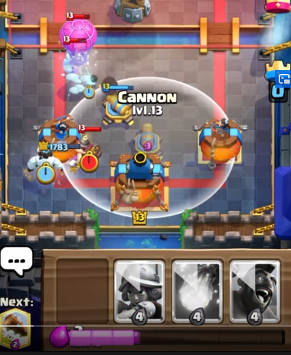

Here is a video example of Oyassuu doing this after cycling musketeer in the back:: [https://youtu.be/NbxmEP2Zvec?t=465](https://youtu.be/NbxmEP2Zvec?t=465)

A trick you can do in single elixir time is to time your hog rider for when they push in with miner balloon. They won’t have enough elixir for a building like bomb tower, and won’t be able to adequately defend. The defense on your part will be quite the same: cannon then skeletons (for miner) musk ice spirit (for balloon).

IMPORTANT: if they use ice golem, it is fine to musketeer early in the center, since that means the best they can do is miner loon opposite, which cannon fireball should be able to deal with (fireball the loon towards your musk to shoot it).

### Recruits Loon 

[https://youtu.be/5rX9fl9gyPI](https://youtu.be/5rX9fl9gyPI)

Recruits loon is a very mechanical matchup, as recruits are a dual lane card, and they’ll need to be dealt with quickly so that you can focus on the loon. Try to place your musketeer near the center so that she can take care of both the lanes, and use skeletons to protect her well. You’ll need to use both your musketeer and your cannon to defend. Try to place your cannon where the recruits cannot attack it, since your defense will be bad if your cannon dies without pulling the balloon.

Tips:

* Try not to take care of each unit individually, and try to pull the recruits around WHILE dealing with the balloon.
* If you are going to use fireball on the balloon, fireball the balloon itself to push it BACKWARDS and fireball the support units too.
* This deck has 3 hog counters (LJ, recruits and fisherman), and fisherman is a kt activation for your opponent, so be careful. Also, fisherman can pull your kiting troops towards the troops you are trying to kite, so be careful.
* Electro spirit is better than ice spirit in this matchup, as the electro spirit can chain stun all the recruits
* Try to clip their towers with your spells, since it will make the difference between a win and a loss.
* This deck does NOT have a big spell, so use that against them. But be wary, because you can’t avoid balloon death damage without making a negative elixir trade.

### Pekka loon (The Anaban deck) 

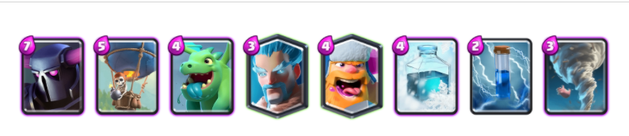

Once you recognize the deck, the strategy is to cycle cannon early if they try to build a pekka push. Early as in like, the first card you play in response to the pekka in the back. Play the first cannon in the 4-1 position, so no balloon can bypass this. If the opponent tries to play same lane, you’re pretty much ready to defend, and you should have an easy defense. If the opponent tries to go opposite lane after seeing the cannon, cycle back to another cannon, and play a 4-1 cannon on that side. Now you have two cannons, and you should be able to defend easily.

## Elixir Golem Battle Healer 

My win against this deck: [https://youtu.be/CU18\_IaoU6s](https://youtu.be/CU18\_IaoU6s)

Yersoncz’s video [https://www.youtube.com/watch?v=P6baBnSQS8k](https://www.youtube.com/watch?v=P6baBnSQS8k)

The elixir golem is pretty much a lot like a slow hog. It is a cheap threat that must be dealt with. You should not play hog opposite lane if elixir golem is played at the bridge, since the opponent is not low on elixir. Instead, just set up your defense. Unlike the golem, the elixir golem does not do damage when it splits into smaller parts. Because of this, your skeletons are very valuable when it comes to defeating the elixir golem and its smaller parts quickly. The elixir golem’s smaller parts have more DPS than its large parts, so take care of the small parts quickly. Usually this is done with a log.

If your opponent plays their elixir golem in the back, you can play hog rider, but be aware that your opponent is probably going to play 2 elixir golems on the field, which will be very difficult to defend. The main trick with 1 elixir golem in the back and another elixir golem at the bridge is that one of the golems will bypass the usual 4-3 cannon. Instead, when you see the elixir golem played in the back, you should be thinking about doing a 4-2 cannon.

The elixir golem is often played with one or both of the witches, so after defending, you can play ice golem + hog. Try to save your spells for defense. Using your spells on 1 witch too early is not as good as waiting and then spelling down 2 witches. Ice spirit can be used to tank a witch hit and freeze her as long as there are no skeletons near her.

If there is a night witch, there will be a lot of bats from the night witch. During your defense, you should use ice golem to tank for the bats spawning while the night witch is alive. When the night witch dies, try to use ice spirit to kill the bats. Electro spirit is a surefire way to kill all the bats and hit the egolem.

When it comes to dealing with the healer, it is best to kite the healer and prevent it from healing anything. Usually, this is an ice golem kite into the opposite lane. However, it is important to note that against decks that have tornado, this can fail. In this case, instead of kiting opposite lane, just place your ice golem in a way that it will protect your musketeer in case your musketeer gets tornadoed (like somewhere between musk and cannon, higher than the musk).

Elixir golem has an inherent weakness, which is that its main golem form pops much earlier than a golem does. Because of this, your units that were initially locked on to the elixir golem will lock on to the nearest support unit right when it pops. This is usually the battle healer. You can take advantage of this opportunity to kill the battle healer. Your towers, musketeer, and cannon will all be targeting the battle healer. Generally, when the elixir golem pops, there is a big clump of units around the battle healer, so it is a good time to fireball here to kill the healer fast.

Of course, log the elixir blobs. Try to use fireball on the support units..

One common mistake is trying to fireball log the Night Witch while the battle healer is healing. If you do want to spell out the Night Witch, make sure the healer isn’t healing first, and try to do it quickly. Otherwise, the Night Witch might heal and your spells will be wasted.

Regarding barbarian hut, which tends to be in Elixir golem healer decks, please read the[ Barbarian Hut chapter](https://docs.google.com/document/d/1zX0ZxkwfWdwybWr5fGfbVCgwEic-pMbLFVine5tBe\_8/edit#heading=h.ja5pz28sbvxy) of this guide.

## Giant Matchups 

Giant is an archetype that has many variations. There isn’t much in common between Giant decks, since the support cards in the deck can vary a lot from princes to witches, and that will determine the overall playstyle.

As for defending against giant in general, a 4-3 cannon placement will do fine, although most of the time, it is safer to play a 4-2 cannon, since the giant can be pushed by enemy units to bypass a 4-3 cannon. It’s also safer against giant balloon and giant graveyard as well. It’s definitely worth it to play skeletons on the giant, since the giant doesn’t explode or deal damage like Goblin Giant or Golem. Giant decks commonly have a secondary wincon, so be careful(usually loon gy or miner)

### Giant Double Prince 

<figure>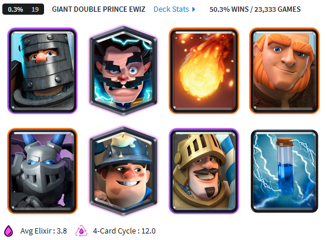<figcaption></figcaption></figure>

[https://youtu.be/I84rnM4OE6E?t=2918](https://youtu.be/I84rnM4OE6E?t=2918)

Quite straight forward, but you have to know that in this matchup, you should either be playing opposite lane the entire time, or be waiting for your chance to keep attacking the weaker lane. Otherwise, a smart opponent would just play prince in the lane ahead of time to defend hog easily. The princes are weak to kiting, so use ice golem and skeletons/ice spirit appropriately while your musketeer snipes.

* Dealing with the Miner

During a giant push, if you can, the best option is to wait for your opponent to play their miner. This is probably the best and most consistent option, but make sure you protect your cannon well during this time of waiting.

If you really have to play your musketeer, play your musketeer in front of your king tower, so that the miner will have to go into the 2 tower range. And try to play the musk late, so that they don’t immediately spell it out. If they have poison with the miner, play musketeer at the side of the arena, since you don’t want to give them poison value for both cannon and musk. Against any kind of large beatdown push where cannon + musk is required, you almost never should play a center musk. This even allows small spells like zap and giant snowball too much value.

Rescue your musketeer whenever it does get sniped by the miner by using skeletons, ice spirit, and/or log.

* Giant and Prince pushing

This is the only tactic you need to watch out for. Giant and Prince/Dark Prince are both units that are skinny enough to push through the bridge together (unlike golem, who is too fat and must go through the bridge by itself). This means that whichever unit is on the outside edge of the bridge can bypass maximum kiting placements. If the giant is on the outside edge, use a 4-2 cannon instead of a 4-3 cannon. If prince or dark prince is on the outside edge, play your cycle cards 1 tile closer than the max kiting placement.

Or you can just use a 4-2 cannon and use the safe kiting placements if you don’t want to take any risks at all.

* Cannon placements

If they are using fireball, make sure you are using the anti-fireball cannon, which is a 3-3 cannon.

### Giant Balloon 

The first balloon will surprise you, which is why you should be using a 4-2 cannon against giant in general. If they play a normal balloon placement, the cannon will pull the balloon, and you should be able to safely defend as long as you take out the giant and have a musketeer alive.

However, if they use a side balloon placement to bypass a 4-2 cannon, then you will need to fireball the balloon in order to get the balloon to go towards your cannon. The placement you use for the fireball will be all the way at the edge of the arena and ill be very high up. Afterwards, the safe sort of defense applies.

### Giant Witch 

4-2 cannons work, but once you see the witch, you can switch to using 4-3 cannons. Just use a cannon with an ice golem to tank the witch along with a musketeer to help DPS. You should be able to clean up everything with the help of ice spirit and log. You can use skeletons on the giant if you already have an ice golem tanking for the witch.

## Golem lines 

Every line here will start with golem behind KT.

Every line here assumes equal elixir.

Wrong lines

* IG behind KT, musk in corner
* Musk in corner, IG (cannon should be next)
* IG hog, skeletons (cannon should be next)

Single elixir time:

* IG behind KT, hog opp
  * Opponent ignores, NW baby D behind golem
    * 4-3 cannon, musk at side, fireball NW baby D
      * Spirit the bats. 1 elixir left.
        * Opponent uses LJ

IG to distract baby d and LJ while musk shoots LJ

*
  *
    *
      * IG the bats and baby d. 0 elixir left
        * Opponent uses LJ

Skeletons to distract LJ while musk shoots LJ

*
  * Opponent tornadoes hog, NW behind golem
    * 4-3 Cannon
  * Opponent lumberjacks, NW behind golem
    * 4-3 cannon, skeletons in front of princess tower so LJ rage is far away. Then musk at side to shoot NW.
    * Spirit to kite LJ backwards, so cannon can kill LJ far away. Then musk at side to shoot NW.
* IG behind KT 4-3 cannon
* IG behind KT, hog opposite, 4-3 cannon, skeletons if they used a LJ or something to defend hog, musk at the side of arena
* Musk in corner 4-3 cannon (note: hog opp is a blunder)
* Hog opp

Double elixir time

* IG behind KT, hog opp
* IG behind KT 4-3 cannon
* Musk in corner 4-3 cannon (note: hog opp is a blunder)
* Hog opp

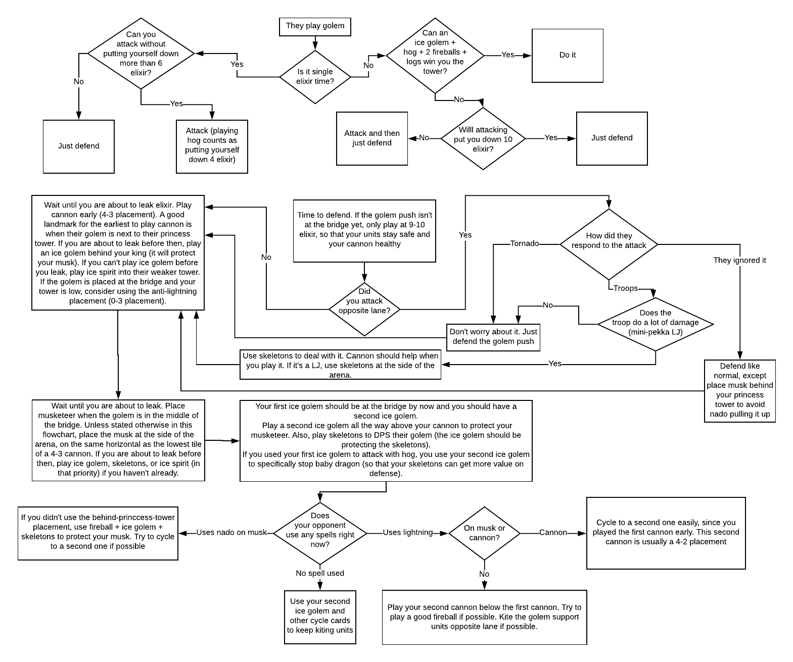

### Golem matchups 

[https://www.youtube.com/watch?v=FPDxBmUDdpo](https://www.youtube.com/watch?v=FPDxBmUDdpo)

* **Recognizing a golem deck**

If you see nightwitch it’s almost definitely a golem deck. Other cards in a golem deck that tell you it’s a golem deck are baby dragon, lumberjack, tornado, and mega minion.

**Always assume golem players have lightning unless they show a different big spell**, so make it a habit to play early cannon instead of early musketeers (except if musk is the first card you play), since musketeers will walk into lightning range of cannon (more details on this in the golem lightning section).

**Using skeletons on the golem**. Just like other matchups, makes this matchup a lot easier, since skeletons have a higher DPS than musketeer or cannon. The skeletons will do good damage to the golem and also kite support troops away from your musketeer and towards the golem, giving good fireball value.

**Assume golem players also have tornado, unless they show a different small spell**. Because of this, during single elixir, **for offense, go for as many ice golem + hog offenses as you can**. Their deck should not be able to handle this combination well. Specifically, use the anti-tornado ice golem + hog. Play ice golem first so that you get ice golem back into your cycle earlier to use against nightwitch and her bats.

1 thing to know for defense about the golem match up is how much elixir they will have for a push and how much elixir you will have to pressure and defend. When golem is played in the back at 10 elixir during single elixir time, the golem player will have 9 elixir (they went from 2 -> 9 elixir, generating 7) to use by the time the golem gets the bridge. If you log the golem back, they will have 10 elixir to use (you’ll get an extra elixir too). You have 17 elixir to use before the golem reaches the bridge. Both players can still generate 3-5 elixir during this push.

In double elixir, they will generate 14 elixir by the time the golem gets to the bridge (will have 16 elixir to spend). You have 24 elixir to use before the golem crosses the bridge. Both players will still generate a good 6-10 elixir during this push.

\
What does this mean for you as the 2.6 player? That means in single elixir time, with 17 elixir to use, you can play hog opposite lane (even with an ice golem/ice spirit/skeletons) and still have enough elixir to play cannon and musketeer (7 elixir) for the golem push.

The opponent will have 9 elixir to use, which basically equals 2 support units or 1 support unit and a spell(they will have to play their support unit pretty late if they use lightning). So if you force out 3+ elixir from the opponent for defending the hog, they can only support the golem with 1 support unit by the time the golem gets to the bridge. Or they can spell with no support units. Even if they decide to add an extra support unit a few seconds afterwards, it would not be difficult for you to deal with (since you’ve also generated some elixir and you can distract with cycle cards).

If they ignore your hog, be very careful. With a full 9 elixir, they can add a 4 elixir unit and then lightning shortly afterwards. I’ll go into more detail in the golem lightning section.

In double elixir, you have 24 elixir to use. You realistically can’t really invest in anything defensive, so you pretty much have no choice but to pressure opposite lane. An alternative risky play is attacking same lane if you are VERY confident you can take it.

Your card cycle is fast enough for you to get 2 musketeers or cannons down during double elixir time. Expect the golem player to be able to get rid of your cannon or musketeer in someway and prepare to replace these on defense.

* Defensive Fireballs

In big golem pushes, a defensive fireball is almost always required. Your musketeer does not shoot down medium health support units fast enough (night witch, lumberjack, baby dragon). Instead, fireballing those units first will let your musketeer defeat the push much faster. Let the support units group up, and then fireball. Fireballing also gives you a few extra seconds to pop the golem as most support units will be pushed back.

**For me, the hardest thing to do here is to stop playing cards. I tend to keep playing cycle cards during the defense, which prevents me from getting the 4 elixir to fireball.**

Now, golem players will typically only play golem AFTER you’ve played your hog. What if this happens? If you don’t feel like playing hog again, a typical response is to just defend, starting by placing ice golem behind the king tower. This is to tank for your cannon and musketeer during the golem push. Obviously play cannon and musketeer in the appropriate positions. Play your cannon when the golem is next to their princess tower. Play your musk when the golem is in the middle of the bridge. Play your skeletons on to the golem early to add DPS and prepare for a lightning or some other spell. Usually, since I started out with an ice golem in the back, I can play a second ice golem to kite the golem support units. If I see 2 or more support units, I play a fireball on them.

If your opponent over-defends your hog, that means you can play more cards on defense and play a hog again.

There’s one thing I have not fully investigated, which is completely cycling back to hog. It costs 6 elixir to get back to the hog and then another 4 elixir to play the hog. If you play a hog and your opponent defends and then plays a golem in the back, this is a full 10 elixir to spend. You can choose to play ice golem in the back or with the hog to push. Most of the time, you will end up using 1-2 cards defending your opponent’s recent defense, but this isn’t the case with tornado, which happens a lot in golem decks.

This doesn’t seem like a good idea, since we only have 17 elixir to spend during single elixir. You just barely have elixir for the musketeer and cannon, and there’s still a golem + counterpush from hog + a support unit behind golem or spell.

* Dealing with Tornado

One thing to watch out for is tornado, which is pretty common in golem decks. If the golem player uses tornado on offense to tornado your troops into the golem, there are pros and cons.

1. They just used tornado, so you can send in hog, if you have at least three elixir left afterward (for a cannon).
2. Your musketeer and other units will probably die

Play ice golem ahead of time to protect your musketeer if you think they will use tornado on offense.If you want to save your musketeer, you can fireball their support units and place another ice golem, but otherwise, you should try to cycle to a second musketeer.

* Ice golem + hog

If there is tornado, your main source of damage will be ice golem + hog rider. In fact, go with ice golem + hog even if they don’t. During single elixir, this combo is the best for you. You can even play ice golem hog into the same lane as a golem if you think you can take it down, especially if you already have a musketeer walking down the lane. This makes it so that the golem player has to choose between defending (resulting in troops being placed in front of the golem), or placing troops behind the golem that will eventually defend (but the tower should be down by then).

* Dealing with Baby Dragon

Found in many golem decks, this card can easily make your skeletons and ice spirit almost worthless. You can try using an ice golem to tank to help your skeletons and ice spirit get value via kiting. Experienced golem players will try to snipe ur musketeer or cannon with their baby dragon. It’s fine if the baby dragon goes for the cannon, but it’s not fine if it goes for your musketeer. If the baby dragon targets your musketeer, reset it with an ice spirit and use ice golem. Or better yet, place an ice golem a little bit earlier.

Defending against a baby dragon pretty much requires an ice golem and musketeer. Letting your musketeer shoot the baby dragon takes a lot of time, so it’s a very good target to fireball. In fact, since it is an air unit with a lot of health, it may be your priority to fireball. You can kite lumberjacks and night witches with skeletons and ice spirit, but not so much against baby dragon.

Overall, try to kite the baby dragon on to another unit like ice golem or cannon, and then instead of playing skeletons and ice spirit, save up elixir until you have enough for a fireball.

* Defending against golem pushes

You will generally need cannon, ice golem, musketeer, and fireball. The ice golem and the cannon can be played early. I do not recommend playing the musketeer early, since it can walk too high or into spell range. It’s best to play the musketeer late, and at the side of the arena. A sacrificial musketeer can alternatively be used (explained in the golem lightning section). You will need the ice golem to tank for the musketeer and pull units slightly towards the cannon. You will need the fireball to damage the support units so that musketeer quickly takes care of them (musketeer takes too long to take them out without the fireball).

The standard order you will want to play your cards will be ice golem in the back, then a 4-3 cannon, and then a musketeer at the side of the arena. You will be a 2 cards away from a second ice golem, which you will need to keep your musketeer alive, so feel free to play skeletons to DPS the golem (this is preferred), or ice spirit to kite, or even a log if there is a nightwitch behind the golem.

For golem matchups in double elixir, proper ice golem usage is essential and kiting to the opposite lane becomes less useful since they will be spamming all kinds of troops at the bridge and you won't be able to kite all of them to the opposite lane. I have found high ice golems in the same lane to be quite useful in conjunction with musketeer and fireball. It allows your towers time to finish off the golem while keeping all support troops distracted and clumping them up for a value fireball. Skeletons on the golem also achieve the same effect for clumping up units for a fireball while keeping units distracted.

**\*If the opponent plays golem in their back corner or on the bridge towards the outer edge, a 4-3 cannon will NOT pull a pushed golem, use a 3-2 cannon instead.**

<figure>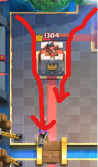<figcaption></figcaption></figure>

### Golem poison 

This matchup isn’t so bad. Even though the poison can kill your musketeer, it’ll still live long enough to deal damage on defense. Defend like a normal beatdown match, and watch out for tornado. Just be careful when it comes to playing skeletons. By placing the skeletons high up, the skeletons won’t get poisoned. If you didn’t, congratulations. You just lost your highest dps card along with 1 elixir.

### Golem lightning 

[https://www.replayroyale.com/?a=PIDUMA%3D%3D\&b=dNA%3D\&page=1](https://www.replayroyale.com/?a=PIDUMA%3D%3D\&b=dNA%3D\&page=1)

[https://youtu.be/BhuU4UzVYSM?t=1421](https://youtu.be/BhuU4UzVYSM?t=1421)

[https://www.youtube.com/watch?v=joo3dcGl6m0](https://www.youtube.com/watch?v=joo3dcGl6m0)

There’s one game mechanic that you need to understand before going into this matchup. And that is how ground units like musketeer walk, because a musketeer walking into lightning range of cannon will make you lose the game.

<figure>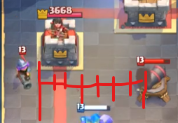<figcaption></figcaption></figure>

When a ground unit is placed in the back or somewhere that isn’t in the same 3 column as the bridge tiles are, the unit will walk diagonally until it gets to the same column as the bridge, and then walk straight.

Now, cannons are usually placed in the 4-3 position against golem/giant. That gives you some leeway when it comes to placing musketeer so that it doesn’t walk into lightning range. Placing musketeer in the back at the wrong time is a very almost-surefire way for it to walk into lightning range of the cannon, and you’ll lose the game, since you’ll lose your most important defensive cards to a lightning.

Lightning has a 7 tile diameter. So if even the tiniest part of the musketeer is touching the red line in the second image, the opponent can lightning the cannon and the musketeer. Placing the musketeer reactively is important. Often it does NOT look like the musk can be lightninged, but often times it can. There are no drawbacks to playing a musk farther to the side of the arena. Don't skirt the line of allowing a value lightning, the musk can make one wrong step, losing you the game.

There are three ways to defend against a golem lightning push. The first is to play cannon a bit early and play musketeer once the push is crossing the bridge, so that musketeer stands still and that the golem player cannot lightning both. This is normally done during single elixir time. Try to kite any support units into the opposite lane, if possible, since that will make defending very easy.

The second way is to take the lightning hit. This involves playing musketeer and cannon early and is done during double elixir time. You can try to lightning rod with the ice golem so that the lightning hits princess tower + cannon + ice golem. Make sure you cycle back to more of your DPS cards. This method is a bit risky and is not commonly used.

The third way is to use a sacrificial musketeer. This method gets used A LOT, and it is the most reliable, and complicated method. This can be done in single or double elixir time. Play musketeer such that it walks almost all the way to the bridge, but not crossing the bridge. This way, the musketeer is not in lightning range of cannon. The usual way to do this is to play musketeer in the corner VERY early, like either the first or second card played. This first musketeer will die, but it will play a key role in doing a lot of damage to the golem. You do not have to protect this musketeer that much. If they do use a barb barrel to kill the musk early, you SHOULD defend it with skeletons, but other than that, it’s fine to let it die.If you want to be able to consistently defeat golem decks, you NEED to learn this, as this is really the only reliable strategy 2.6 has against golem lightning in double elixir.

An important thing to note is that in single elixir time, if you use the sacrificial musk strat, you should not be looking to use hog rider opposite lane. After playing the musk, just cycle to another musk. In the meantime, while you are cycling, make sure you play ice golem and cannon. You DO want to have a second ice golem in hand to defend your second musk, so try to play those early after your musk (no need to rush though, wait until you are about to leak).

If your second musketeer gets lightninged, you are free to play a second cannon under the first one (I recommend a 7-2 cannon). And make sure you are kiting units to the opposite side if this happens.

The concept to win this matchup is that on defense, you need to let your musketeer deal damage without it getting lightninged and to prevent your opponent from3 getting lightning value. Preventing your opponent from getting lighting value is pretty straightforward. Play a 4-3 cannon (can be pre-placed), and then a musketeer at the edge (place it during the push). Keep your musketeer alive by preventing them from playing lightning, by playing hogs. This will force the opponent to spend elixir and attention so that they will have to lightning later.

Note: hog should be played when you hit 4 elixir. If you wait longer, like after you hit 6 elixir, it is very likely that your opponent also has 6 elixir and will lightning first. Playing hog after they lightning is too late (the opponent will generate 3 elixir by the time your hog gets to their tower). Playing hog before or after the lightning will have the same result for the hog, but in terms of your musketeer, playing hog before the lightning is much better for your musketeer and cannon, since they will live longer and deal damage.

Words from me:

<figure>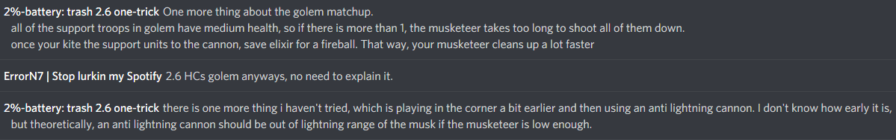<figcaption></figcaption></figure>

Play cannon early, since if they lightning the cannon and you don’t have a second cannon ready soon, you will take a lot of damage.

A game against golem has quite a bit of decision branches from your opponent, but because golem is such a heavy deck, you can actually just memorize what to do against every decision your opponent makes, especially during single elixir time when your opponent can do very little with their heavy deck.

If your opponent plays golem in single elixir, you should be able to defend this no matter what. Usually, your opponent will play golem in the back after they successfully defend your hog rider so you cannot punish them.

I see Yersoncz go same lane as the golem to take down the weaker tower quite often. Although it may seem bad, there are some upsides. Here are the benefits of going same lane as the golem:

1. You might secure a tower first and start working towards the second one.
2. The golem player will try to keep their support troops behind the golem, so if you play hog quick enough, it will get a lot of time to hit the tower before the support troops behind the golem take down the hog.
3. The opponent builds a push behind the golem, but it’ll just give more spell value for you.

You may want to consider anti-lightning cannons. Here are the benefits

1. It is out of tower range
2. If the opponent decides to lightning the tower and musketeer while the golem is going towards the anti-lightning cannon, the tower will reset its target and lock on to the support troops. Take care of the support troops and you win.

Here are the downsides of anti-lightning cannon:

1. Vulnerable to ranged units
2. Vulnerable to flying units

What not to do:

In single elixir for a golem push, I’ve tried playing an early musketeer (so that I can get a second musketeer in case it gets lightninged). This is not very good, and makes you lose the game. Also, playing your musketeer in the corner or in the back also loses you the game, since it’ll just walk into lightning range of the cannon. The only exception is if you lightning rod with your ice golem.

* Baiting the lightning

[https://youtu.be/FPDxBmUDdpo?t=151](https://youtu.be/FPDxBmUDdpo?t=151)

By playing musketeer and cannon intentionally inside lightning range, you can bait lightnings. Just play an ice golem between the musketeer and the cannon, and your musketeer should be fine. This can be risky though, as ice golem is often required to defend the musk from the support troops, and lightning will take out most of the IG's health.

### Golem Electro Dragon 

[https://youtu.be/Wqh-\_QoZzY4?t=1073](https://youtu.be/Wqh-\_QoZzY4?t=1073)

Electro dragon will let you activate your king tower early, so if the electro-dragon is played in single elixir, take the king tower activation, since it will really help during double elixir against the golem itself.

As for dealing with the electro-dragon during a golem push, use an ice golem high up to tank it, so that your skeletons can do work (don’t use skeletons to distract it). A high ice spirit will also temporarily distract it.

Try to get a second ice golem to tank the electro-dragon as soon as you can, since the electro dragon can really mess up your defense with its chain stun.

These decks generally don’t use lightning, so your cannon and musketeer should be able to do their job.

The electro dragon is also a good fireball target, since its health is not very high.

### Golem clone 

If you see them place skeleton barrel and then golem, you are likely playing against a clone deck. Once you know there’s clone, there’s no lightning to worry about (generally), so you can start your defense by placing musk behind the king tower after that point.

The most annoying clones will be the bats from the night witch and the baby dragon. You’ll have to use the splash available to you to defeat the clones. You can use ice golem to take out those clones and then use fireball on the rest. Ice spirit is ok too (if it can stay alive\[tip: place it far away enough]). Log is a little bit tricky, since it can backfire. It will pop the cloned lumberjack early, creating an early rage. Make sure you are ready to kite raged support units.

Make sure you first kill cloned baby dragons with an ice golem (place the ice golem close enough). That way, your skeletons and ice spirit have a much better chance of kiting units. Try to get to a second ice golem to tank the rest. Play ice golem, ice spirit, skeletons, log, fireball, ice golem. Don’t wait to play the ice spirit and skeletons because raged units run very fast. While the baby dragons are the most important as they kill spirit and skeletons too quickly, you need to make sure to kill as many bats as possible too, because if you don't kill any IS won't be able to kill the rest (its AoE is too small) and you can say goodbye to your tower.

The key to winning this matchup is focusing on defense first since they generally won’t have a big spell to kill your DPS. If you try to offensive hog after they place their golem, they will most likely counter with skeleton army which could bait out one of the important cards you need on defense.

This matchup becomes way easier if you use electro spirit.

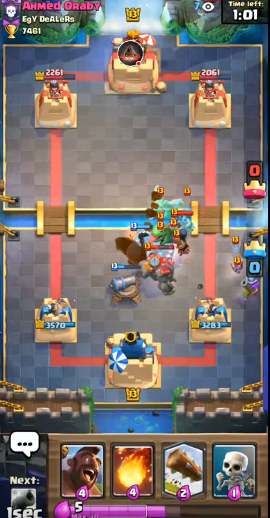

## Graveyard matchups 

[https://www.youtube.com/watch?v=3-4d1WK7jIw](https://www.youtube.com/watch?v=3-4d1WK7jIw)

[https://youtu.be/AAn7zrv34V8?t=502](https://youtu.be/AAn7zrv34V8?t=502)

If you didn’t see the CWA videos, the most basic defensive advice is that cannon and log are key to defending the graveyard. Placing it near the tower isn’t so bad when it comes to getting rid of the skeletons from the graveyard. Cannon + log do a pretty good job, as long as your log kills a decent number of them. Normally, placing the cannon in the corner is the best placement, where it can tank a few skeleton hits, but there are scenarios where the cannon might die early (like when poison is played and the princess tower is distracted, resulting in the skeletons overwhelming the cannon). If a poison is already played, you can play a cannon in between the crown towers as close as possible to the graveyard side without being poisoned. If you cannot play a 5-0, 6-0, 5-1, or 6-1 cannon without the cannon being poisoned, play a cannon touching the top of your crown tower and the side of the arena, or you can also play this if you need it to tank for something like a battleram.

Learning to bridge block is another important method to more reliably beat graveyard matchups, and winning bridge battles are key to securing a winn against graveyard. If you can bridge block their tank( not allowing your princess tower lock on to their tank and target the graveyard instead) the defense become much easier. If the graveyard player is able to negate most damage (as most decent graveyard players are able to do, learning to bridge block and winning bridge battle becomes the make or break points during the match.

So, cannon + log does a pretty good job, but if you can, musketeer + cannon is even better if your musk is shooting skeletons.

When using log, make sure to put it in the center of the lane. Even though graveyards may be biased towards 1 lane, using the log in the center will still kill the most skeletons. This is because the skeletons tend to surround your tower from all sides, even rotating towards the center of the arena if you let them build up (which you need to do a little bit to get proper log value).

Use musketeer, skeletons, ice golem, and/or ice spirit if you need extra support for defending the graveyard.

* Note about skeletons vs graveyard:

Using skeletons into a mass of skeletons from the graveyard is basically useless. What you want to do is play the skeletons into an empty area. You can either play skeletons early (graveyard has a 2.2 second delay before the first skeleton spawns), or create an empty area by using your log (play skeletons directly after you log). If you did not have skeletons in rotation when graveyard was played and do not have the log in rotation, play the skeletons outside the graveyard, as this will mitigate the most damage, if you have IG play it (otherwise you will take a game losing amount of damage), if not then don't play skeletons at all and just fireball.

* Note about ice golem vs graveyard

You can place an ice golem in the middle of the graveyard to kill a solid amount of skeletons from the graveyard but you will likely need to combine it with log/ice spirit so you can kill the skeletons before they retarget onto your tower. If your ice golem level is lower than the level of their skeletons, you’ll have a really hard time defending. Even if your IG is a lower level than the graveyard, it is still better to play it in the graveyard as long as you can log after it dies. The IG plays an important role in grouping up as many skeletons as possible for your log, and the death nova gives you valuable time to play your log without major chip damage. If your log is four cards away from being in your hand use IG to protect musk and cannon.

Every graveyard deck is extremely defensive in nature so don’t expect to get easy hog hits. You’ll have to attack while they are attacking.

What not to do:

Don’t play hog every time you have it. You might not even get hog hits and you’ll only be punished by a full graveyard push with poison included. Make sure you can defend first. Wait for the right time to hog (when they are low on elixir or don’t have a spell proof counter like bowler or use both their hog counters, and make sure you have the right counterplay card to deal with their defense). They will be low on elixir when they play some combination of tank + graveyard + spell.

### Giant Graveyard 

<figure>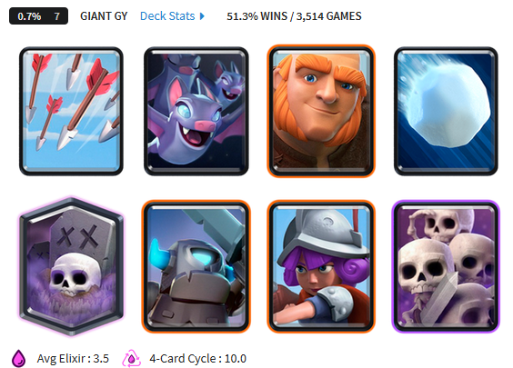<figcaption></figcaption></figure>

[https://youtu.be/O4VdZQlnh4c?t=818](https://youtu.be/O4VdZQlnh4c?t=818)

[https://youtu.be/tgMP99pJq5g?t=7235](https://youtu.be/tgMP99pJq5g?t=7235)

[https://youtu.be/Q6AX4-CucqA](https://youtu.be/Q6AX4-CucqA) (my game)

This is the most popular giant deck in the game at the moment (7/7/2020), so if you see a giant, just assume that it’s giant graveyard.

* (Current) Defending against Giant + Graveyard at the bridge

[https://youtu.be/Q6AX4-CucqA?t=50](https://youtu.be/Q6AX4-CucqA?t=50)

In single elixir time, this requires that you have 8 elixir and make sure log is NOT the last card in cycle. The goal is to use cannon, musketeer, and skeletons to take down the giant FIRST, and use log to stall for time while the giant is taken out. A 4-2 cannon is good because the cannon starts shooting the giant earlier. It’s ok if the opponent uses spells on your musk or skeletons. As long as the musketeer and cannon are both shooting the giant, the giant will die in time. Log is used to stall for time, so time it carefully. You can use ice spirit in case you need more time. Ice golem can also be used in the graveyard to delay if log is late in the rotation.

* (Outdated) Defending against Giant + Graveyard at the bridge

[https://youtu.be/O4VdZQlnh4c?t=881](https://youtu.be/O4VdZQlnh4c?t=881)

Against a sudden giant graveyard at the bridge, you can use a 4-2 cannon (like usual when you see a giant), and then when you see the graveyard, play musketeer in the corner, play skeletons on the giant (optional), and then use log when a few skeletons build up from the graveyard.

Alternatively, if you don’t have musketeer, you can use your cannon to pull the giant, while your ice golem + log will clean up the rest. You should consider letting a few skeletons pile up before logging, and then using ice golem right after to tank for the remaining skeletons. You can use ice golem first and then log, but I am not sure which ordering is better. You can also use skeletons to deal with the graveyard somewhat, although it will deal with a few skeletons. You can still decide to use musketeer, so that it can help deal with graveyard. Either way, the log is the biggest key to defending.

* Defending against Giant + Graveyard from the back

[https://youtu.be/tgMP99pJq5g?t=7314](https://youtu.be/tgMP99pJq5g?t=7314)

When your opponent plays giant in the back, you will have to start setting up your defense. Play musketeer in the corner. It will walk up a little, so feel free to play an ice golem in front of it. Also feel free to play a hog rider opposite lane as well. When the giant gets closer to the bridge, play skeletons for the graveyard (if you are playing skeletons a little early, play them in the corner; if it’s just in time for the graveyard, put them near your tower). Then play a cannon. You can play a 4-3 cannon or a 5-0 cannon (the 5-0 cannon will be a little close to your musketeer, so be careful of spells if you do that). If they use spells or get rid of your first musketeer, you can play a second musketeer close to your king tower to deal with the graveyard.

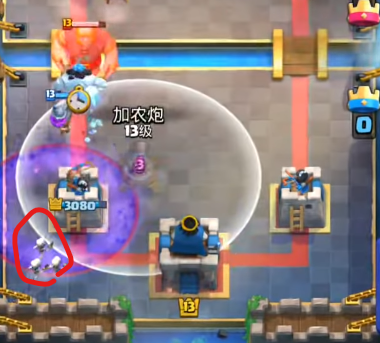 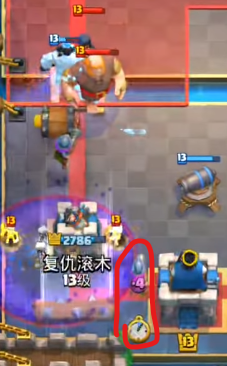

The graveyard is a much bigger threat than the giant, so prioritize defending the graveyard first.

Definitely try to take down 1 tower before the game ends, since graveyard has a much harder time when it comes to having the king tower activated.

Here is a cannon pull that you can do after 1 tower is down (works against balloon as well). When pulling any building targeting troops away from your towers when placed in the core a general tip is as long as the cannon has range of it when it is in the core it will pull it. You have to be fast though, so first practice in a friendly battle. This is useful because if your opponent has a high dps unit at the bridge where your building is your building may die too quickly.

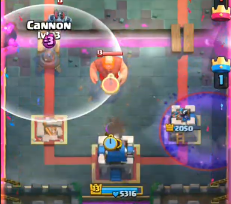

Remember that giant graveyard is a 10 elixir push, and you should feel comfortable spending about that amount on defense. Don’t try to weasel your way out of spending a few elixir, because that will cost you the game in a lot of cases(so don’t try to be cheap and use way less elixir e.g.:cannon+skellies on the giant, espirit once skellies start piling up; since it can backfire badly. In this case, you will get countered pretty hard since the opponent has 2 small spells.

Since giant graveyard decks generally don’t have a big spell, you have the ability to get down multiple musketeers (primarily during double elixir time) and they can get you a lot of value defensively by helping to dps down their giant, and offensively by forcing out some of their hog counters.

#### What not to do: 

Giant graveyard decks have spellbait like skeleton army and musketeer. Generally, it’s not worth using your spell on these, because you obviously need your log to defend the graveyard. It’s better to just defend them when those units cross the bridge

As Oyassuu says, don’t try to attack and defend at the same time. Normally, 2.6 is good at this, but against giant graveyard, you’ll lose your tower. The reason is because normally, 2.6 players can kite units to stay alive when they have low elixir, but against giant graveyard, there’s nothing to kite.

Try not to use log in single elixir time. It’s really bad if log is your last card and if you are at an elixir disadvantage (it’s fine if you are at an elixir advantage though) . If you use log in the wrong way, your opponent will use giant graveyard at the bridge, and you’ll take a lot of damage because you won’t be able to cycle to log fast enough.

### Graveyard Freeze/Poison 

<figure>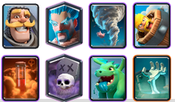<figcaption></figcaption></figure>

I highly recommend that you listen to the advice given here:[https://youtu.be/Wqh-\_QoZzY4?t=127](https://youtu.be/Wqh-\_QoZzY4?t=127)

[https://youtu.be/AAn7zrv34V8?t=502](https://youtu.be/AAn7zrv34V8?t=502)

[https://youtu.be/ssKGkjDBTWY](https://youtu.be/ssKGkjDBTWY)

[https://youtu.be/8FVw2sxdnvs?t=576](https://youtu.be/8FVw2sxdnvs?t=576)

* Tips from a graveyard player himself

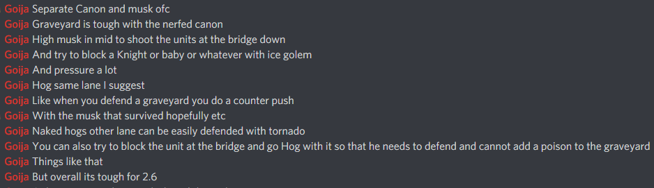

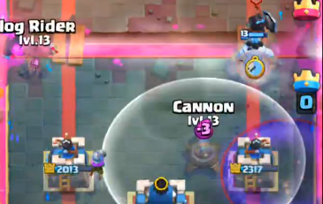

* Defending against the graveyard

Freeze and Poison negate skeletons, so try to get your opponent to play high poison/freeze so that you can use skeletons in the corner.

In these decks, the tanks are usually not building targeters, so playing ice golem at the bridge to stop the tanks is very good when it comes to making the graveyard pushes less effective. Ice spirit is also a good tool because it can tank 1 knight or baby dragon hit (not both though, so if there is both, place it further away from the knight because the baby dragon is going to hit no matter what) Hog rider can also be used to prevent baby dragon/knight from crossing the bridge in time to tank for the graveyard.

If you can, try to activate KT using their BBD. But do not risk tower damage for it.

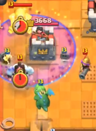

Remember that Graveyard + spell is a 9 elixir push. Generally, a Graveyard + spell won’t happen in single elixir, but if it does, punish with a ice golem + hog + fireball. Be careful though: the opponent will punish you for not having ice golem, so use ice spirit and musketeer perfectly when that happens.

Poison and Freeze have a 3.5 and a 3 tile radius respectively, so space your cannon and musketeer apart. With a musketeer in the middle and a cannon in the corner, the opponent cannot spell both. The formation in the picture below is pretty good. Normally, cannon gets overwhelmed by the number of skeletons, but by playing ice golem in that position, it pulls a few skeletons towards it, making cannon’s job easier while tanking for the baby dragon.

Also, make sure you place cannon early, since there is a 1 second deploy time. To start shooting skeletons earlier, you have to place it earlier. Also realize that cannon is ever so slightly better at defending graveyard than musk, due to the 0.9 sec hit speed compared to musk's 1 sec.

GY with freeze will try to take you by surprise and do a lot of damage in 1 push, while GY poison will try to consistently deal damage. Expect your opponents to have poison, but ALWAYS have a log/electro spirit in hand during their push just in case they have freeze. Freeze is high risk, high reward while poison is low risk medium reward.

* Offense

Tank + Graveyard + Freeze/Poison is over 10 elixir, so you can play a hog as soon as you see the graveyard is played. This is a fairly risky play and should not be done if the tower is super low, or if at an elixir disadvantage.

You want to outcycle the tornado and then prediction fireball the tombstone during an ice golem + hog push. A prediction log isn’t as good since tombstone still pulls the hog.

Having a surviving musketeer to counter push is very good in this matchup since tornado does not deal with the hog + musketeer very well. Also, the musketeer will either deal tower damage, shoot tombstone, or shoot the tanks that’ll counterpush for graveyard, so either way, there’ll be value.

[https://youtu.be/fkWkSYtD6S8](https://youtu.be/fkWkSYtD6S8)

Here’s my game against Graveyard Poison. I started making mistakes in double elixir, when I wasn’t anticipating the graveyard. I should have recognized that a graveyard was coming and should have played cannon early behind my princess tower. I should make it a reflex to play cannon ice golem quickly when the graveyard is played. But instead I played the cards one at a time, and took more damage as a result.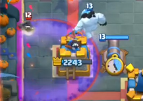

At 3:03 in the video, I should not have sniped with my musketeer. A simple fireball would have done the trick. Not only that, I didn’t even wait until 10 elixir to do it, so I misplayed there.

At 3:19 in the video, I place my cannon a bit too far away for it to be effective. If you look carefully, it doesn’t shoot much.

At 3:49, again the cannon is too far.

Upon reviewing my game, I know now that it is much better to have a corner cannon early. Almost every other placement isn’t as good against dealing with graveyard.

#### Graveyard Freeze important Info 

* Your opponent does not have a big spell to kill your musketeer, so just keep playing musketeer at the center into the lane that your opponent is attacking. Do this as much as possible. Your musks will deal damage to the tanks your opponents have.
* Keep your musketeer alive for as long as possible, so use ice golem, skeletons, ice spirit, NOT LOG to keep your musketeer alive. Play hogs ahead of your musketeer to keep your musketeer alive as well. Even if your hog riders don’t do damage, they will help your musketeer do damage to their units.
* Again, save both your log and your cannon to deal with the graveyard. If you don’t save both of those cards, you will take massive damage and lose. Essentially cannon and log take care of graveyard, musk kills support troops and everything else protects musks.
* If you have enough elixir, use fireball on units, even if they are mini-tanks like baby dragon and bowler.

#### Splitting up their push 

Splitting up the opponent’s units is pretty key to preventing undefendable graveyard pushes. The graveyard player will usually stack units from the back, like knight and then baby dragon. You don’t want to play hog into this push. Instead use hog in the opposite lane to force elixir out that way. This will be even more beneficial if you have outcycled their building since you can then use ice golem + hog to force out a troop + nado from the opponent and hinder their ability to push while you cycle to another hog.

#### Forcing/Punishing overcommitment 

From what I’ve seen, the biggest way for graveyard players to LOSE is for them to overcommit on offense and not being able to defend a hog.

This usually happens when they try to poison with the graveyard.

If you can force the opponent to do this, then you should play hog ahead of time, which they should have trouble defending.

For them to actually want to poison, there are 2 ways:

* A musketeer or cannon
* Become really good at using skeletons to defend poison-less graveyards. You can do this by using skeletons behind the graveyard ahead of time.

#### Sequences: 

Defending against bridge plays

GY barb barrel at the bridge -> cannon (in front of princess tower at the edge of the arena) + log on GY

Baby Dragon GY at the bridge -> musk to shoot and tank baby d (but close enough to GY to shoot GY afterwards) + log on GY

Knight GY at the bridge:

Optimal

5-0 cannon + log on GY and knight + spirit / skeletons

[https://youtu.be/HXJTjj7OqHc?t=1017](https://youtu.be/HXJTjj7OqHc?t=1017)

Sub-optimal

ice golem bridge to block knight -> 5-0 cannon + log on GY

[https://youtu.be/HXJTjj7OqHc?t=1098](https://youtu.be/HXJTjj7OqHc?t=1098)

Splitting up bomb tower and tornado in single elixir time.

Solo Hog -> nado -> out cycle nado solo hog -> bomb tower

## Hog Matchups 

2.6 has a good matchup against other non-eq hog decks because of the cannon. Just make sure you have cannon ready for their hogs, and you’ll be fine. 2.6 has the cheapest elixir cost out of all the hog cycle decks, so use that to your advantage. As long as you out cycle actively, you should be fine.

For some reason, I see players not using the auto-pig-push placement for hog. Punish these bad hog riders with a 4-3 or 3-3 placement if you’re quick enough. If you can, try to out cycle or outplay your opponent’s hog counters, since your deck is cheaper.

* Getting hog rider off of your tower

If the hog is already on your tower, you can still reset it. Play a cannon on the hog rider, and then push it backwards with an ice golem or ice spirit or log.

[https://twitter.com/i/status/1126417970610069504](https://twitter.com/i/status/1126417970610069504)

* Stop hog from bypassing cannon opposite lane

You can use either skeletons or ice spirit for this.

[https://instagram.com/p/BxPgSyjnIu1/](https://instagram.com/p/BxPgSyjnIu1/)

[https://instagram.com/p/BxPgiOkHMuh/](https://instagram.com/p/BxPgiOkHMuh/)

### Hog Earthquake 

<figure>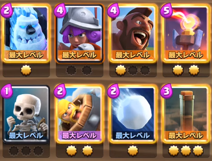<figcaption></figcaption></figure>

This was probably the best hog deck in the game at the time.

However, this matchup is very winnable if they only have 1 hog counter, since EQ decks usually do not have a big spell to get rid of your musketeers.

[https://www.replayroyale.com/v/yt536dd155ba61\_0](https://www.replayroyale.com/v/yt536dd155ba61\_0)

[https://youtu.be/I84rnM4OE6E?t=3636](https://youtu.be/I84rnM4OE6E?t=3636)

[https://www.youtube.com/watch?v=Z7bewF-vnpM](https://www.youtube.com/watch?v=Z7bewF-vnpM)

Earthquake has a 7 tile diameter, which means you can’t place a cannon that both pulls an auto-pig-push hog and is immune to earthquake. You can outplay this though. Read what I wrote for the card interactions for Earthquake.

<figure>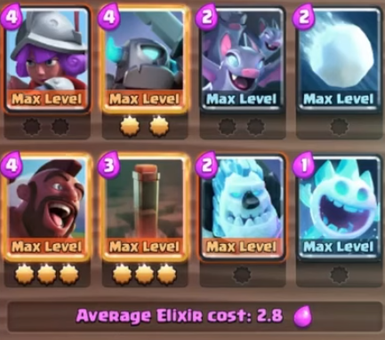<figcaption></figcaption></figure>

There is another defense that you might have to use, but it will require you to be ready by hovering a card over your screen. You can use a 0-3 cannon, which is EQ proof from the tower, but before that, you will have to use an ice spirit, skeletons, or ice golem to push the hog rider sideways towards the cannon. This is done by placing the troop on the outermost tile of the bridge. Or one tile away from the edge of the arena and one tile away from the river.

This is done right at the bridge, with almost instant timing. Try to look for opportunities to do this type of defense. Although I found out through practice this is quite difficult to pull off and requires practice, ice golem is the easiest, then skeletons with ice spirit being the hardest. If you are fast enough, you can try to place the cannon second, just in case you mess up the push mechanic. You can do this by dragging the pushing unit over, then tapping the cannon with your other hand. Then hoover your alternate hand over the 0-3 placement. Then place the pushing unit, and if it works then quickly tap the 0-3 placement. if you fail to push the hog (you can visibly see the hog move about a tile to the center if it worked), then quickly play the cannon in front of the hog to negate as much damage as possible. If you are able to nail this mechanic consistently you should win EQ hog matchups easily.

I quote: If hogs cannot connect and there are no musketeer counters, cycle musketeers and defend.

You can see the trick here (works against lightning too): [https://www.reddit.com/r/ClashRoyale/comments/gykxoj/push\_the\_hog\_rider\_just\_enough\_with\_ice\_spirit\_so/?utm\_source=share\&utm\_medium=web2x](https://www.reddit.com/r/ClashRoyale/comments/gykxoj/push\_the\_hog\_rider\_just\_enough\_with\_ice\_spirit\_so/?utm\_source=share\&utm\_medium=web2x)

### AQ Giant Skeleton w/ hog/pigs 

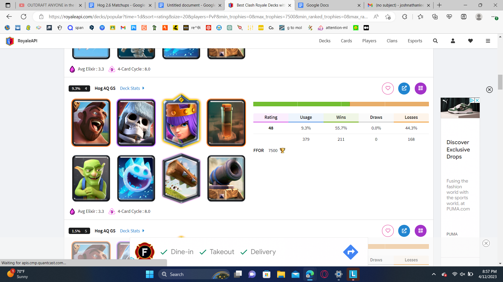

This is tough matchup, because if the 2.6 player doesn’t know what they are doing they’ll just get steamrolled.

You have to be able bridge block giant skeleys, even if it’s just for a second or two, just enough time so that the tower targets the hog not the giant skeley.

Ice golem death nova + fireball + log kills AQ

Or essentially fireball log + anything kills AQ,

This is important to know for defense.

To defend the big giant skeley + AQ + pigs + EQ pushes you have to bridge block the giant skeley, you have to, otherwise you just lose, the EQ kills cannon too quickly, you can’t place cannon in anti EQ position because they played their pigs in the auto pig push tile and the giant skeley helps push two pigs farther than usual to the edge of the arena. (The pigs will spilt 2-2 around the giant skeley) Ofc if your opponent plays pigs two or more tiles from the edge of the arena you can play and anti EQ cannon + and card one tile from river and x tiles from edge with x = number of tiles pigs were placed from edge of arena.

Ofc defending against hog is a little different as hog is one unit and pigs is four. But most interactions remain the same or very similar. (Bridge blocking the skeley is still af must) If your opponent is prediction EQing the middle you can play a cannon in the very edge of the arena if they play the hog in the auto pig push position.

You cannot push a hog to an anti EQ cannon if you see the get pushed from the giant skeley (when if lands it shifts towards the edge of the arena, essentially the reverse motion when you pig push towards your cannon with skeleys of spirit)

If this motion doesn’t happen you attempt to pig push towards an anti EQ cannon if you do not want to risk a 50-50 of getting prediction EQed by playing a cannon in the edge. But in practice this is hard to pull off.

I would personally recommend you to play a edge cannon the first big push, unless you have been doing this all game previously. After you introduce playing an edge cannon, it becomes a 50-50 on whether you cannon is hit by the EQ or not. This is your most reliable out to allowing your opponent to build up a a big push.

Some more generic notes:

For defense it is also important to know ability cooldown times and it is most important for GK and AQ since they have the two fastest ability cooldowns. You should take a note of the battle timer when your opponent triggers their ability especially if they trigger the ability deep on their side of the arena. This should effectively allow you to predict when they play their second ability.

This means if a AQ has their ability ready or so to be ready don’t play ice golem on top or in range, you really want the AQ to only shoot skeles and spirits during her ability if possible, logging the AQ to push her out of range and stall the ability to protect cannons and/or musks is always worth it.

Alternative defenses:

When bridge blocking fails:

THIS METHOD ONLY WORKS AGAINST HOG RIDER ( it can work against pigs, but only in the auto pig push position\[if you think they will pre place the pigs in the auto push position go for this defense, but if they instead do a 2-2 or 3-1 split you simply just lose])

If you didn’t use ice golem to bridge block you can kite the giant skeley to the other lane with it. The giant skeley is fast enough that you tower should retarget onto the hog and help support the defense.

Ofc this is allowing for an easier defense in the short term and neglecting the long term by allowing the opponent two giant skeleys on the board, and a very tough second defense, just don’t fail bridge blocking a second time, otherwise you just lose.

When bridge blocking fails part 2:

THIS ONLY WORKS WITH HOG RIDER

Body blocking the hog:

If they don’t have an AQ in the board you can try to stop the giant skeley and place down an ice golem next to it, pushing the hog in between the golem and the skeley, making the hog get stuck and go no where. This should give your musk cannon and tower time to either kill the giant skeley or hog, or weaken both to the point where after the ice golem dies or moves the hog is able to be killed by spirit + tower, or musk + tower or skeleys + tower.

Although this is a very difficult technique to pull off, in fact I have only seen if pulled of purposely (I have seen other players do it but it completely on accident) by players that have practiced this with friends/ coaches/clanmates in friendly battles over and over and over, so I suggest doing that if you want to consistently pull this off.

### W/ out Giant Skeley 

This matchup actually is in 2.6 favor. The main point is that 2.6 has a bail out card, namely fireball, but this deck doesn’t have a bail out for hog. This means that as the 2.6 player you can make more mistakes that the AQ pigs player and still win. (This deck isn’t very popular right now with bomb tower’s high usage rate currently 4/11/23) This is a mechanic matchup just focus on defense you can always spell cycle to win as fireball does more damage than EQ. Basically your defenses consist of anti EQ cannon ( you need to pig push the one pig to the cannon, details above ) or if you’re feeling cocky you play a side cannon predicting a prediction EQ the middle ( Ofc this is very risky especially after the first side cannon, I recommend playing only one side cannon per game.)

You should also consider trying to AQ block the river with a pre ice golem near your canon before you place your cannon this guards your cannon against any prediction AQs.

With hog instead of pigs:

This matchup is still 2.6’s matchup but less so than the previous matchup.

Treat this matchup almost like a 2.6 mirror matchup, expect they have EQ and during some portions of the match you can outcycle them (especially so if they run goblins instead of skeleys), but in other portions they can outcycle you.

Most of the time you can sorta outcycle them in single, but if an AQ stays alive too long in 2x and especially 3x you can find yourself getting outcycled, but you can just bail yourself out with a fireball + spirit or some other spam combination. Just remember you need to kill their AQ before they outcycle (usually doable) and you actually don’t need to get hog hits to win the game, fireball does more damage than EQ to crown towers this is essentially 2.6’s only pro to this matchup, but it is enough to give 2.6 slight matchup.

### Monk hog EQ 

This very similar to giant skeley hog, but in this case you can’t bail yourself out with a fireball or log. It is also harder to bridge block the monk as it can push back an ice golem. But you only need to bridge block for a second or two , just to get the hog to move in front of the monk.

Never pre place cannons in the matchup when defending monk hog pushes, the cannon will just die to the monk ability.

If you want to fireball or log their push you should only do so either before their push crosses the bridge or right as they pass the bridge. Essentially before they usually trigger their monk ability.

### Cannon skelly spirit vs hog eq 

[https://youtu.be/Js3hFzWaIQE](https://youtu.be/Js3hFzWaIQE)

I’d say that defending hog eq like this is probably the most important part of playing against hog eq. This defense will help you outcycle your opponent, without having to spend too much elixir.

Use ice spirit when the hog approaches the cannon (before it hits the cannon) and use skeletons between the cannon and princess tower on the hog after the earthquake does its second tick (drop skeletons between the first and second tick)

Use your ice golem for the bats on defense or with the hog on offense. If your opponent plays correctly, your hog won’t do much due to mini-pekka + snowball. They even have log as well. If you do want to get reliable damage in, you can either play a hog + fireball, or wait for your opponent to use their small spell, and go in with ice golem + hog + skeletons + ice spirit.

The key to winning this matchup is to use your musketeers on defense. Cannon + musketeer will definitely take care of hog + EQ as long as you space out your cannon and musk, so the musk isn't slowed down by the EQ. You can start cycling musketeers in the same lane just to help deny your opponent that lane. Be careful doing this against players using earthquake + snowball + log as they can kill your musk by using all 3 and get a ton of damage off on your tower..

If their deck has a secondary hog counter, then you’ll probably lose, but try to support your hog against that second counter. Try to use your first hog to bait out their primary counter, and then play ice golem hog against their secondary counter.

For decks that have knight, the opponent will want to do hog eq push when there is a knight at the bridge, so that the knight tanks for the hog. What you can do is simply stall the knight at the bridge before it crosses (with an ice golem, or hog for example). This makes defense so much easier that I believe that this is the only way to win matchups with knight in hog eq.

### Hog Lightning 

Hog lightning variants are a bit different.

You basically have to know how to avoid the lightning.

You do this by placing a 0-3 cannon, and then using skeletons or ice spirit to push the hog sideways. You have to be quick though. See page 28 for execution details.

Here are two examples

[https://youtu.be/G89oB0IJnDU?t=141](https://youtu.be/G89oB0IJnDU?t=141)

[https://youtu.be/G89oB0IJnDU?t=288](https://youtu.be/G89oB0IJnDU?t=288)

### Hog Exenado 

Known as the Happy Noob deck or the Viper deck, this deck is basically a hog trifecta deck. Their biggest offensive threat is valkyrie + hog with a log/tornado. You can defend against this with a 4-2 cannon and an ice golem to tank the valk.

2.6 has the matchup advantage here.

Tornado is the only good hog counter here, but you can outcycle it. Against newer players you can also use the anti-tornado IG hog placement, they might not recognize the placement and try to activate KT. If you outcycle the tornado and play hog, they can try to use goblins + log/ice spirit, but you can outplay that with a prediction log or fireball. You can also use hog + ice golem for this outcycle. Without tornado, ice golem + hog will be difficult to deal with.

The opponent could use rocket on this push, but that’s ok. Your log deals damage to their tower, and if they continue this, you’ll spell cycle your opponent down.

* Note: You can also play musketeer after they use their rocket, but I’m not sure if this is helpful. Although theoretically, it does help deny the lane.

The executioner + tornado combo they have doesn’t really do anything against your deck, so play like it’s a normal tornado deck.

Just make sure you don’t place musketeers or ice golems in the back.

### 2.6 Hog Cycle Mirror match 

[https://www.youtube.com/watch?v=pl0tJCrvgAc](https://www.youtube.com/watch?v=pl0tJCrvgAc)(one player does have snowball instead of log, keep that in mind)

[https://www.youtube.com/watch?v=9t7erU1TC3U](https://www.youtube.com/watch?v=9t7erU1TC3U) (This is a mirror match)

In a mirror matchup, obviously neither player has an advantage(unless it comes down to card levels), so it comes down to knowledge. There are a couple of tactics you need to recognize, learn, and counter.

* Fireball

Fireball is actually a big risk. The player that uses fireball first will be the first one to get outcycled (assuming that the other player knows to outcycle). However, using a fireball can gain you massive damage. If you fireball, make sure you also know a good way to defend against hog without cannon. If your opponent uses fireball, then you can outcycle your opponent. They will have to defend without cannon after you outcycle, so make sure to prediction log their skeletons. There is one case where the game starts and your opponent rushes with hog and you don't have cannon. The next push it is actually okay for you to use fireball because you already have cannon in hand, and you might be obligated to do this to prevent yourself from falling further behind.

* Outcycling cannon

The only real hog counter is cannon. If you are new to the mirror matchup, it is extremely easy for an experienced player to simply outcycle cannon, since most people don’t pay attention to the significance of seeing cycle cards getting played. After a hog defense, if you see cycle cards getting played, you may as well play your cycle cards to get back to your cannon and defend a second hog. Furthermore, if your opponent likes to play their musk in the back a lot you can try to outcycle there too by pushing opposite lane, defending the musk with cycle units and then pushing again.

* Outplaying 4-2 cannon

The standard cannon placement against hog rider is a 4-2 placement. This placement is vulnerable to fireball, since the player can fireball both the cannon and princess tower. Not only that, a fireballed cannon dies to 1 hog hit. If your opponent is only playing 4-2 cannons, you can wait until 7-8 elixir, and go for a hog + fireball.

* Defending against hog + fireball

Since 4-2 placements are vulnerable to fireball, you can use other placements. A 0-2 placement (right at the river) will counter hog and will also be fireball proof. You can also play cannon at the side of the arena, although this will not completely counter the hog, so prepare either skeletons/ice spirit/log to help out. Either way, a high cannon or a side cannon will render the prediction fireballs useless.

You don’t mind spending more elixir, you can just use the same 4-2 placement, and then use a log or an ice spirit to keep the hog in the 2 tower zone. Do this while the hog is in the zone, but before the hog hits the cannon, so you get the max DPS of cannon + 2 princess towers. If you use ice spirit, try to use it outside of the fireball or time it right after the fireball lands.

Furthermore, you can play a 4-2 cannon 1-3 times to get our opponent prediction fireballing. Then play a 0-2 cannon, and if the opponent prediction fireballs you will gain a huge advantage.

* Defending against ice golem hog

You can just use a 4-2 cannon and log both of them while they are in the 2 tower zone.

* Outplaying a high cannon

If the player is playing high cannons to avoid fireballs, then that is the best time to use musketeer at the river to snipe. Musketeer can hit any building that is placed 3 or less tiles from the river. A prediction musk later in the game can help you gain a damage lead.

* Defending against prediction fireball + hog with 4-2 cannon

If the player is doing everything to outplay the cannon including sniping with musk, you can still use 4-2 cannons, but you have to do one of two things:

The first way is ice spirit. You will have to use the ice spirit and possibly musketeer/log. The cannon will still pull the hog into the 2 tower zone. The key will be keeping the hog rider in that zone. Place ice spirit in a position that is out of the fireball, but will still freeze the hog rider. It is even better if you manage to freeze the hog before it hits the cannon (that way, both princess towers and the cannon will be shooting at it).

The second way is to use log, but applying the same concept to keep the hog rider in a high DPS area. You will have to deploy skeletons right after the fireball lands to deal damage, while the log keeps the hog in this high DPS range.

In both scenarios, you should use skeletons if you have them in hand to deal the extra damage to take down the hog. If you can’t, you’ll have to use a musketeer or both log and ice spirit. Either way, you’ll need 2 of these 4 cards.

You can support these two methods by using a musketeer. Remember to keep your musketeer away from the tower though

* Dealing with musketeer

Musketeer isn’t too difficult to deal with, especially since you have skeletons and ice spirit.

On defense, you can use ice spirit to tank one musketeer hit and freeze it and surround with skeletons. Try to place the ice spirit 2-3 tiles to the side though. The opponent will try to do this as well, and may try to use a prediction log.

If you want to kill your opponent’s musketeer with your own musketeer, you’ll have to get your cycle cards ready, since all of them will help you win the musketeer 1v1, but your opponent will also have them as well.

Place your cycle cards in front of your own musketeer so that the enemy musk locks on to those cards, and so that your musk can safely shoot their musk.

If your opponent’s musk locks on to yours, you can use log (or ice spirit in some scenarios) to reset the enemy musketeer.

* Dealing with hog without cannon

Skeletons alone will let the hog get 2 hits. Skeletons + log lets 1 hit. Skeletons + ice spirit + log gets 0 hits if timed correctly to stall the hog as much as possible (time the ice spirit freeze and the log knockback apart, so you delay the hog as much as you can).

Fireball + log perfectly timed during the hog’s attack animation will completely stop hog.

Fireball + skeletons is also a way to defend. Although you have to use fireball on defense, it’s worth it if you don’t have cannon as the placement’s pretty easy to learn. Place skeletons to chip down the hog and fireball RIGHT BEFORE THE HOG GETS READY TO SWING. This pushes the hog back to the skeletons and the skeletons finish it off.

* Defending ice golem + hog + musk combo

Play an ice golem to tank for the musk when it is in tower range (right before it finishes crossing the bridge). Play your 4-2 cannon like normal. Play your musk in front of the king tower (into the lane of the stronger tower). You can log or ice spirit the hog if necessary. You will have to do this if the opponent decides to fireball your cannon.

* Minor Optimizations

Use your ice spirit to tank their own ice spirit. If you do this when your opponent plays a lone ice spirit at the bridge, you can push in with your hog at the same time and still have ice spirit.

* What not to do

Don’t place your musketeer near your weak princess tower. It’s a free fireball with extra tower damage

Don’t play hog without a plan to outplay. You’ll just make negative elixir trades with the cannon.

Don’t keep using the same outplay strategy, it’ll be used against you.

## Lavahound matchups 

Lavahound matchups are generally 2 tower games, since you can’t really defend against a real lavahound push without your opponent giving you a chance to do a very good fireball. If they create a big push that you won’t be able to defend, just go for the second tower.

[https://www.youtube.com/watch?v=GIKgHzgI4Vg](https://www.youtube.com/watch?v=GIKgHzgI4Vg)

If they play lavahound in the corner and you play musketeer behind the king tower, the musketeer will walk up to here: Pretty high up, but still defendable from minions, mega minions, lumberjacks, etc. Getting the early damage into the lava hound makes a pretty big impact.

The idea is to play musketeer before pressuring so that you’ll get a second musketeer on the field pretty quickly.

There is a CWA video where Jack doesn’t play musketeer at all in single elixir, but that’s because he knew his opponent was playing lavaloon. Just seeing a lava hound can mean a larger variety of decks now, like lava miner, lava clone, so it is a safer decision to play a musketeer when you see a lava hound. Although, if you have the choice, play it later rather than earlier, since you don’t want your musketeer to walk too far up.

### Lava clone 

[https://youtu.be/djPXUtXb3eI?t=1019](https://youtu.be/djPXUtXb3eI?t=1019)

If you see a flying machine and a lava hound, there is a chance it is lavaclone. Even more so if you see lumberjack..

Weakness:

1. Generally no big spell, so they can’t get rid of your musketeer with spells.
2. Generally does not have good hog defense
3. Electro spirit+ice golem can kill all the clones if done well.

Strengths:

1. It is a direct hard counter deck to 2.6, because of the fact that 2.6 has no air splash units that last long enough to kill the push.
2. It is a one-trick deck in some occasions, so it WILL be hard to play against.

[\[5주차\] 복제 시작했다 게임 끝났다](https://www.youtube.com/watch?v=4MpEawPFqvk)

This is JACK’s loss against lavaclone. If you see this video, you can see the one-trick aspect of this deck, and the shortness of the match will catch you off guard. As you can see, even 2.6 pros have trouble with this deck, because you will need 2+ air splash units that survive to do its job, a defensive fireball and a musketeer to deal with this well in the best case.

* Defensive Fireballs + ice golem

Perfect defensive fireball at the right time is the key to this matchup. Whether you hit good fireballs or not will determine whether you win this matchup. There will be lots of fireball targets, like flying machine, baby dragon, lava hound, lava pups, lumberjack. Experienced lava clone players will place the flying machine further away from their push so that it can’t get fireballed at the same time as the rest of the push. The best time to fireball is when the lava hound pops (if there is a lava hound clone too, then wait for both to pop). Your princess tower and musketeer will take a long time trying to shoot down those lava pups, so fireballing them will save a lot of time. However, it is pretty much even more important to fireball the support troops. Baby dragon and flying machine are both ranged support units, so they will be further behind. Not only that, baby dragon is quite tanky, and the princess tower + musketeer will take a long time to kill it. Try fireballing the baby dragon, flying machine, and the lava pups near it. This will knock the baby dragon back, kill the flying machine and any clones nearby. The lava pups in the front will stay alive and do some damage, but a little bit is ok. If you can get the lumberjack into the fireball as well, that is great. As for ice golem, the same idea can apply. Ice golem’s death nova will kill clones and slow down units. Rather than placing it near the tower where it will only slow down lumberjack and lava hound, place it a bit higher up, where it can slow baby dragon and flying machine as well as lumberjack and kill those clones. Furthermore, if there are bats along with the clones, then that is even more reason to use ice golem near the bats to kill them.

One thing not to do is waste your elixir on cycle cards when you are low on elixir (below 4) and are getting close to the point where you need to fireball. Hold on to your elixir. Wait for cards to clump together.

* Using ice spirit and skeletons on defense

There aren’t many ground units in lava clone, and with baby dragon around, it is very hard for them to get value, especially in a big clone push with a giant clump of enemy units that would instantly kill your skeletons and ice spirit. However, you can use your skeletons and ice spirit (in that order) to distract your opponents flying machine. Flying machine has a big 6 tile range. Because of that, the flying machine will be furthest away during a lava clone push. Since the flying machine is furthest away in the back, you can play skeletons and ice spirit (out of range of baby dragon) and distract the flying machine. Remember that ice spirit can tank 1 flying machine hit. Also the ice spirit can kill clones. By distracting flying machine, you take away a big source of the lava clone push’s DPS, allowing your ice golem, cannon, and musketeer to live longer.

* Using Cannon

Your cannon exists not only to tank for your tower and musketeer, but to also kill any ground units that the lava clone player might have. Usually this is a lumberjack. You can use skeletons/ice golem to distract the lumberjack so that it’ll get taken down. Leaving the lumberjack alive will almost certainly make you lose the tower, since it’s DPS is comparable to a mini-pekka’s.

* Single Elixir

During single elixir, you want to protect your musketeer for the entire defense. Fireball when both the lavahound and lavahound clone pop. Your ice golem and cannon will tank for your musk.

You don’t want your musketeer too high up. Try to play an ice golem down first, then a musketeer. You want to place ice golem first because you want to cycle back to a second ice golem. A second ice golem is much more practical than a second musketeer because:

1. Ice golem is cheaper. You might need your ice golem to tank immediately after your first one times, and the cheapness helps
2. Ice golem has AoE and slowdown, which is useful during this defense.
3. Ice golem is also very helpful in taking out the clones.
4. Musketeer is expensive. You might not have the time to wait until you get 4 elixir.
5. Musketeer needs time to gain damage value. If you do get a second musketeer down during single elixir, chances are, it doesn’t get to shoot much, so there isn’t much value for that second musketeer.

\
Then cannon at a 4-0 placement. The reason why you want to play your cannon so close to your princess tower is because you want all of the enemy units close together for fireball. Then play ice spirit if you need to. Make sure the ice spirit stays alive, since the freeze and the splash are needed (for a safe ice spirit, place it next to the cannon or somewhere else near it. Then fireball everything. It’s more important that you kill the support units behind than the lava pups in the front.

* Double Elixir

[https://www.instagram.com/p/B001YZElvSu/](https://www.instagram.com/p/B001YZElvSu/)

2.6specialist has a short guide in the instagram link on how to handle this.

In double elixir, get 2 musketeers and 2 ice golems down. So basically when you see lava hound played, play musketeer in the back. It will walk forward a lot, but that’s ok. Cycle back to another musketeer and ice golem in hand.

Fireball the support units + lava pups after the lavahound pops. According to 2.6specialist, you will want to place a high cannon because

1. You want the lavahound to end up close to the support units so that you can get a good fireball.
2. Since your musketeer walked up high, you will want your cannon to also be high to tank for your musketeer.

Yersoncz actually loses the game here, since he misses the fireball on the baby dragon (his fireball only hits 4 lava pups), doesn’t have any units to protect his second musketeer, misses distracting the flying machine with the skeletons + ice spirit, and then fails to kill the flying machine when his third musketeer locks on to the opponent’s second lava hound instead of the flying machine.

The lava clone player will intentionally play their flying machine away from the rest of their push to prevent you from getting fireball value.

I need more gameplay data on this, but some things that I might want to try out

1. Letting the first golem, musketeer, and cannon die, so NOT playing the SECOND golem to protect the FIRST musketeer
   1. so that the flying machine comes closer. That way, the flying machine goes into fireball range with the rest of the push.
   2. Also, the cannon was already in position to protect the first musketeer from the flying machine.
   3. It is too costly to keep the FIRST musketeer alive. Yersoncz’s second golem only bought the first musketeer a few extra shots.
   4. Also, skeletons can be used to distract any flying machines/lumberjacks temporarily to buy some extra time, while allowing you to cycle to a third ice golem.
2. Using the SECOND ice golem to protect the SECOND musketeer. Yersoncz played the second ice golem to protect the FIRST musketeer, and was left with nothing to protect the second musketeer.
3. Using a second cannon to the tank for any surviving musketeers. Yerson actually has 7 elixir at 0:24, so it seems like an option.
4. Cycling faster/using cycle cards earlier (more spammy). It seems like there’s enough elixir, but not enough good cards to play. After the first cannon, Yersoncz did not play cannon, log, or hog, so he basically had a 1 card hand. He waited to play skeletons, but that seemed to be a misplay. He had elixir, but couldn’t get to a third musketeer/ice golem before the flying machine locked on to his second musketeer and tower.

* Clone Skipping

This is a technique that can be used by the lava hound player to bypass a 4-1 cannon placement. Because of the lava hounds short sight range, it is possible to use clone so that the non-clone lava hound to skip forwards and go straight for the tower. A 4-0 placement is not clone skippable (at least I don’t think so)

### Lava Miner 

Saving your musketeer from the miner is key in this matchup.

Place musketeer in the 2 tower zone or behind your king tower if you have it early in your hand. You can save your musketeer from the miner by placing a cannon/skeletons on it. You can log it so make the miner retarget. Otherwise, it is played like any other lava hound match up.

One thing to note is that, if you notice that they do not have balloon, you can start using a high cannon, 0-1 placement, to pull the hound and also protect your musketeer from miner snipes and support units behind the hound.

## Lavaloon Matchups 

[https://youtu.be/GlkUW3qKrX8?t=6255](https://youtu.be/GlkUW3qKrX8?t=6255)

[https://youtu.be/uO7Illcg5Xk?t=2386](https://youtu.be/uO7Illcg5Xk?t=2386)

Things to know:

1. Double win-condition decks can have terrible hands
2. This will probably be a 2 tower game.
3. Attack with ice golem + hog
4. A side balloon takes about 10 seconds to reach a 4-1 cannon. They will generate 5/10 elixir during that time
5. Use 4-1 cannons to pull side balloons. (this is also the most reliable placement to pull LH)
6. All balloons are pulled by a 0-2 cannon (except if the balloon gets pushed away by minions).
7. Lava pups can be tanked using skeletons or ice golem. If there are other units, they are usually fireballed.
8. A lone musketeer + princess tower will take down the lava hound without taking too much damage
9. Lava hound is not the big threat, so it is semi-ignorable. Just don’t ignore the pups, since they can wreak havoc on your tower.
   1. Generally, if musk is still alive, musk will kill them.
   2. If musk is locked on to something else, you’ll need to use fireball. Or you can kite the pups upwards with skeletons, or tank with ice golem.
10. Save your cannon for their balloon. If they don’t use their balloon, don’t use your cannon (unless you figure out that they don’t have balloon at all).
11. Always protect your musketeer.

The good thing about lavaloon is that in single elixir time, lava hound and balloon is a 12 elixir push, and it is very difficult for the opponent to gain enough elixir for a fireball + zap or a lightning to get rid of your musketeer, especially if you make them spend elixir defending your own hog rider.

Against balloon, make sure you know the correct building placements to use. 1 misplaced cannon will lead to a loss. A 0-2 cannon will always pull balloon though, so that placement and the 4-1 placement will be your default placements.

Of course, if you see a misplaced balloon, you can take advantage of that and use a 4-2 placement, but then the lava hound would go to the tower instead of going to the cannon (that should be ok since the hound’s DPS is quite low. Just take care of the lava pups).

When you first see the lavahound, you won’t be sure of which lava hound deck it is, so a musketeer is usually played behind king tower or corner or a hog is played on offense.

* Defense TYPE 1 (musketeer first card played) RECOMMENDED

As I said earlier, the normal first response to the lava hound in the back is a musketeer behind your king tower same lane. Note that this method of defense requires that you aren’t at a big elixir disadvantage (like -4 elixir).

After that, the defense against a lava hound player can really branch out, since their offense is extremely reactive according to what you do. Some players will try to kill your musketeer with minions for example. Fireballing those minions is the proper response. Some players won’t play their balloon at all. In that case, you probably don’t have to play cannon.

You can try to play your cannon early, but the lavaloon player might play their balloon in the opposite lane as a response.

The general next card played is a hog rider if you have it in your hand. If it’s single elixir time, you don’t have to support this hog rider too much. But if you can use a log to support it, go ahead.

However, using fireball to support your hog in single elixir time is a mistake. You will need your fireball on defense to save your musketeer from the lava pups if they support the hound with a unit like miner or balloon or mega minion.

If you don’t have hog in hand, you can play ice golem in front of your musketeer instead, and play hog later.

If you have skeletons in your hand, you can put them behind the ice golem and you will have an ice golem + skeletons push in one lane and you can put hog in the other lane. This combination of hog in the opposite lane and ice golem skeletons in the same lane is probably the best offensive punish you can pull off, even in single elixir time. However, tombstone does stop both lanes, so it is best to be wary of that.

If you don’t have skeletons in your hand, you can play hog behind the ice golem so that you have an ice golem hog push in front of your musketeer.

Normally, their balloon is played at this point. Play a 0-2 cannon to pull the balloon. If the opponent responded to your offense earlier, then you should prepare to fireball the lava pups + balloon.

If they don’t play the balloon, don’t play your cannon. Just play some other cards.

If they didn’t respond to your offense, that means they are trying to save elixir to kill your musk and take your tower. They will play their balloon and then spell your musk out. This is where the fact that you played musk first comes in handy. Once your cannon is played, you should spam your cheapest cards to cycle to another musketeer ASAP, even before they play their spell. You might take a balloon hit, but should be able to save your tower.

* Defense TYPE 2 (musk not first card played) NOT recommended unless forced

Hog oppo, opponent responds with tombstone [https://youtu.be/N5r-QN2DgMI?t=26](https://youtu.be/N5r-QN2DgMI?t=26)

Down elixir, pure defense: [https://youtu.be/gAlz-NmiXvI?t=401](https://youtu.be/gAlz-NmiXvI?t=401)

Hog oppo, opponent responds with cage: [https://youtu.be/-mvqytHAxcU?t=2449](https://youtu.be/-mvqytHAxcU?t=2449)

opponent ignores IG hog: [https://youtu.be/QtCyuyzB2q4?t=1663](https://youtu.be/QtCyuyzB2q4?t=1663)

IG hog fb [https://youtu.be/QtCyuyzB2q4?t=755](https://youtu.be/QtCyuyzB2q4?t=755)

This version of defending is something that you must know, since this situation comes up sometimes. You HAVE TO DO THIS when you just played a hog, or when you are down more than 3 elixir.

After you spent some elixir on a hog, or after waiting to get to 10 elixir if you were down, you should just cycle some other cards while waiting for the opponent to play a balloon. When they play the balloon, you want to play a cannon to pull it, and then a musk to snipe it. Playing a musk here is a mistake since, the opponent can just spell it out and you’ll lose your tower, because your musk wasn’t the first card, so you can’t cycle to a second one fast enough.

If they play their balloon before you hit 10 elixir, you can play your musk so that it locks on to the balloon. Then, fireball the balloon further into the 2 tower zone, and it should die, and you are safe at this point.

If you hit 10 elixir before they play balloon, you should just play your musketeer to shoot the lava hound. If they decide to play balloon after you play your musk, you do the double cannon KT activation (you have enough elixir to do so).

This alternate method is good to know because it is mechanically very easy to do, and allows you to use your musketeer in other ways (otherwise, you’d be restricted to only using musk when they hound). You can see Oyassuu do it again here: [https://youtu.be/N5r-QN2DgMI?t=141](https://youtu.be/N5r-QN2DgMI?t=141)

Here you see Yerson do this too: [https://youtu.be/GlkUW3qKrX8?t=6308](https://youtu.be/GlkUW3qKrX8?t=6308)

* Alternate Defenses

Kitassyan, a Japanese player, likes to open with ice golem in front of king tower into the opposite lane, then musk in the back, and then hog behind the ice golem.

* If the balloon opposite lane

This is why you save your cannon. You want to pull the balloon with a 0-2 cannon on the balloon’s side, and use an ice spirit (because cannon alone isn’t enough).

* Double cannon King tower activation

In double elixir time, this is not too difficult. You just need 7 elixir by the time the balloon is played for you to play a cannon and cycle to a second cannon. However, you do need to spam your cards quite quickly to get to the cannon quickly enough.

In single elixir time, this king tower activation is much more difficult. So there are certain requirements that you have to fulfill before doing it.

1. When you see the lava hound in the corner, you cannot spend more than 4 elixir before playing your first cannon.
2. You can play a musketeer in the corner, or a hog rider opposite lane. Pick one, but not both. Musk is preferable
3. Play the cannon in the 4-1 position, but wait as long as possible before you do so. You need to make sure that the opponent is actually playing lavaloon. And besides, you might want your cannon to be as healthy as possible, so waiting will preserve some of its lifetime.
4. Cycle back to another cannon, but play either a musk or a hog, whichever you didn’t play in step 2.
   1. Since musk is the preferred start, hog is usually used here.
   2. If you didn’t play musk earlier, you will have to do it here to take down the lava hound. Place it at the side of the arena obviously.
   3. If you didn’t play hog before, play quickly after you play the cannon, so that your opponent pays attention to your hog. (You can probably time it right when your opponent is about use balloon, so your opponent will have to let go of the balloon in their hand for a second).
5. Use other cycle cards to get back to cannon.
   1. If your opponent defended against your hog rider with something that might attack your tower, you can use skeletons to kite them closer to your cannon, so that your cannon is doing some damage.
   2. If you think you might not have enough elixir in time to get a second cannon, you can freeze the balloon with ice spirit (bonus if you freeze the lava hound too), so that you might generate another elixir.
   3. Ice golem is much more valuable for protecting your musketeer, so use that in case the hound somehow pops early, if there are other units coming closer to your musk. You can also use ice golem to tank lava pups if you think that your opponent will spell out your musk when the lava hound pops.
   4. If you don’t need to protect your musk, you can just log the princess tower, and get closer to taking it down.
6. Play the second cannon in front of the king tower, 3 tiles from your princess tower.
7. Fireball the lava pups if you need to.

Play the cannon in the 4-1 position, and then cycle to another cannon. Play skeletons, ice spirit (use it on the balloon, this is very important), log, ice golem (make sure it walks up to tank for the lava pups when the lava hound pops. Play cannon right in front of the king tower and 3 tiles from your princess tower.

[https://youtu.be/lNUFgLpYKbc?t=375](https://youtu.be/lNUFgLpYKbc?t=375)

[https://instagram.com/p/Byu31tNA5H7/](https://instagram.com/p/Byu31tNA5H7/)

[https://www.youtube.com/watch?v=GIKgHzgI4Vg](https://www.youtube.com/watch?v=GIKgHzgI4Vg)

There are other variations of this double cannon pull involving different cannon placements. The initial cannon can actually be a 3-1 cannon or a 0-2 cannon as well. There is less time for you to cycle though, so this is more viable during double elixir.

It is important to know that a popping lava hound will push the balloon in the outward direction. So it is important to freeze the balloon or kill the lava hound early so that the lava hound pop does not end up pushing the balloon forward. The balloon got pushed forwards here. You can prevent this if you perfectly time your fireball to kill the lava pups before they spread out, but that is fairly difficult. A safer option is to fireball primarily focusing on pushing the balloon back, if you miss a pup or two it's not the end of the world, and hopefully, your musk will help clean up.

Also, since it is common for lava hound matchups to be 2 tower games, when 1 tower is already down, balloons played in the pocket (the middle of the opponent’s arena) can be pulled like this. This is very good buying time for your musketeer to kill the lava hound first.

You may encounter some really good lavaloon players using balloon + minions to let the balloon bypass your cannon pulls. In this case, you will have to use fireball on this tile to push the balloon towards the cannon.

### Lavaloon Fireball Zap 

You have a much better chance in this matchup since you can actually defend during double elixir (lightning won’t kill both your cannon and musketeer. With fireball + zap, as long as you space your cannon and musketeer apart, your opponent can only choose one). You can play musk when they play lava hound, and you can still play 2 cannons to kite the balloon to king tower. CWA has lots of videos on this. You can safely use the double cannon king tower activation.

### Lavaloon Guards/Barbs 

The lesser known brothers of Lavaloon, the guards and Barbs provide extra defence. You will have a tougher time breaking through with hog, as guards are log-proof, and barbs can tank log. Barbs and Guards are mostly used on defence. As well as this, your opponent has tombstone, which can prove to be quite annoying. Overall, not a great matchup. Your only saving grace will be getting as much damage in single elixir and taking advantage of bad hands, and this deck can start out quite a couple of bad ones.

One thing to note is that when you play hog and they play barbarians, you can play musk as a response (make sure the musk is the first thing you play though, so that you can cycle back to musketeer faster).

### Lavaloon Lightning 

[https://youtu.be/Wqh-\_QoZzY4?t=426](https://youtu.be/Wqh-\_QoZzY4?t=426)

[https://youtu.be/I84rnM4OE6E?t=1329](https://youtu.be/I84rnM4OE6E?t=1329)

Deck weakness to exploit:

1. The deck can have a really bad hand, like Lavahound, balloon, lightning, arrows. This allows you to play hog when you think they have this really bad hand. You might even be able to force them to have a bad hand if you continually play hogs so that they can’t use these 4 cards at any point in time.
2. If you make the opponent spend 3+ elixir, your opponent can’t use lightning with lavahound balloon in single elixir in time.
3. The deck generally doesn’t have a good way of dealing with ice golem + hog, so this is a good combo to finish off a tower.
4. Split lane attack so that they cannot lightning your push.

Same as the golem lightning matchup, offense is needed to prevent lightnings. Not only with hog, but with ice golem + skeletons

You may want to split your offense. An ice golem + hog + musketeer will get lightninged, which will be a -4 trade.

Also, if your musketeer gets lightninged early, as long as there’s no support, the lava hound can be ignored for a while. Just take care of the balloon.

You can still do the double cannon king tower activation on the balloon, but be careful and make sure there isn’t enough elixir to for your opponent’s lightning.

During double elixir, the opponent will have enough elixir for a lightning. You can try to lightning block with ice golem, but it will probably be more worthwhile to attack opposite lane.

See the golem lightning section for more tips on playing against lightning. One important difference is that in the golem matchup a 4-3 canon and side musk prevents lightning from hitting both, but with a 4-1 canon there is practically no safe tile for your musk. All you can do is defend and maybe attack the opposite lane, and have canon and musk already in hand by the time lightning is played.

### Lavaloon Miner 

[https://youtu.be/WDJz4eUcs3I?t=12](https://youtu.be/WDJz4eUcs3I?t=12)

[https://youtu.be/7Jsr0ZS\_N6Q?t=325](https://youtu.be/7Jsr0ZS\_N6Q?t=325) (kinda weird game)

Instead of having a big spell, a lavaloon miner deck will have arrows. They will also use miner to take down your musketeer. To deal with lavaloon miner, you defend against the lavaloon in the same way, but with some small changes. First, you just have to place your musketeer either behind king tower or in front of the king tower. This is so that your other princess tower can help shoot miner if they try to use miner to snipe your musketeer. Then, you have to play an ice spirit + skeletons / log + cannon to get rid of the miner when they do try to snipe your musketeer. Play the ice spirit first to see if they do snipe, then skeletons or log to deal damage, and cannon to shoot the miner and also distract the lava hound. Against lavaloon miner, there isn’t a need to space out your units, so you can use several cannon placements. A 4-1 placement is probably best.

If they try to balloon opposite lane because you used musketeer and cannon, you use your fireball on that balloon. You don’t really need fireball for the lava pups, because you can just tank them with your cycle cards.

## Bait Decks 

### Log Bait (Classic)  

There are many versions of log bait, but they focus on having many cards that usually require log to counter and having many defensive cards. If you can properly elixir count and card count you will have the upper edge in this matchup. Elixir counting is vital in this matchup because this allows you to semi-reliably predict princesses at the bridge and prevent this main source of damage to your tower. As most logbait players will princess the bridge at 10 elixir.

This video explains a lot [https://youtu.be/Wqh-\_QoZzY4?t=1839](https://youtu.be/Wqh-\_QoZzY4?t=1839)

[https://www.replayroyale.com/?a=PIDUMA%3D%3D\&b=cyAsMObA\&page=1\&t=12fa](https://www.replayroyale.com/?a=PIDUMA%3D%3D\&b=cyAsMObA\&page=1\&t=12fa)

[https://youtu.be/U7RjBcePmNI?t=1670](https://youtu.be/U7RjBcePmNI?t=1670)

[https://youtu.be/I84rnM4OE6E?t=3377](https://youtu.be/I84rnM4OE6E?t=3377)

This matchup will go a lot better for you if you can read tricky goblin barrels. Here is a video to help you read them.

#### Countering the barrel

How to Use & Counter Tricky Barrel by Orange Juice Gaming [https://youtu.be/A6NVATaKl\_g](https://youtu.be/A6NVATaKl\_g)

Personally, when logging deep barrels, I find that using log a few more tiles back is better as insurance, since it will catch the not-so-deep barrels as well. Usually, I mess up when the barrel is 1 tile deeper than my log, so when I know it is a deep barrel, I like to play deeper logs for safety.&#x20;

One game mechanic for you to understand first: for a standard goblin barrel planted right in the center of the tower, the princess tower will first target the inner goblin, the outer goblin, and then the bottom goblin.

If you don’t have log in rotation, you can take advantage of this knowledge to do this:\
Musketeer (in the center of the arena, shoots inner goblin) + skeletons (kill bottom goblin) + ice spirit (tank + freeze outside goblin) can completely deny goblin barrel. It’s fine if you switch the skeletons and ice spirit, as long as the ice spirit tanks and freezes. The musketeer will shoot the inner goblin and shoot the bottom goblin, and the tower will take care of the outer goblin. You can do the same thing with cannon.

You can also do something like this with the cannon and the skeletons. The cannon will tank one goblin and kill the rest while the skeletons tank other goblin hits. This will also deny the goblin barrel.

If you only have a musketeer and skeletons, you can use this placement to do the same. Electro spirit + skeletons btwn outer and lower goblin should also do fine.

#### Using log 

Generally, save log for their goblin barrel. Don’t let the rest of their deck naively bait you into using your log on a lone goblin gang or princess.

There are some scenarios where using your log elsewhere is a good play:

* It is ok to log if your opponent gives you huge log value. This happens when your opponent decides to make a big push with princess and goblin gang along with a tank like knight. The same goes with rascals or dart goblin if those are in the deck. Basically, if you are logging 2 or more cards that are weak to log, then it is worth it to log. Also try to hit one more thing, like tower, or even their inferno.
  * One reason why this is ok to log is because you have made a big positive elixir trade, and if your opponent decides to barrel, you can just fireball it, or use some combination of skeletons + ice spirit to deal with it.
  * Another reason is that if you don’t use log, you will end up using a lot of elixir to defend this push without the log, and you might end up taking a lot of tower damage because you were reluctant to use the log
* It is ok to log if your opponent’s princess locks on to your tower and you think your opponent will protect it. Princess damage is the best way for the log bait player to get damage on your tower. Normally, you can just use a cannon or skeletons to kill the princess, but a good logbait player will try to protect this valuable princess that is currently doing damage to your tower.
* It is ok to log if it is a prediction spell to support your hog and you don’t have enough elixir for fireball and you know for sure that the opponent will use goblin gang.
* It is ok to use log on something loggable (princess, a split gang, dart goblin, etc) if you are in the process of trying to outcycle.

#### Gameplay 

On defense, pretty much everything can be defended with a musketeer + ice golem, although this doesn’t mean you SHOULD do this. You can use cannon if necessary.

Your opponent will have 4 win conditions:

1. Damage from the goblin barrel
   1. You can completely deny in multiple ways, as I detailed above.
   2. Remember not to let them bait you into using your log onto something else that can be easily countered without using log.
2. Princess damage. Your opponent will be looking for chances to play princess at the bridge to get damage.
   1. You can prevent this if you continually place units like ice golem in the center of the arena when their princess is in their hand. Although, this is a little inefficient, so just count cards to see if your opponent has the princess in cycle. This is very easy in single elixir time. In double elixir time, just make sure that your arena isn’t empty.
   2. In double elixir and triple elixir time, just make sure your field is never empty.
   3. If you are expecting your opponent to play the princess at the bridge, you can actually react to it if you are extremely fast. You have to drop your card as the princess is dropped down. The key to consistently performing this is counting elixir and knowing cycle. Often when your opponent hits ten elixir and they have a princess in cycle you can predict princess at the bridge. And if you have more elixir than your opponent you can try to bait a princess at the bridge by playing something in the back (not your musk if they have rocket in cycle)
3. Rocket.
   1. You can punish them if they use rocket. More on this later.
4. Log damage
   1. You can prevent this a lot if you play opposite lane, which you should. If you play same lane, you just give the logbait player log value.

Your opponent has 3 main ways to defend your hog

1. Inferno tower. You can pretty reliably outcycle inferno tower. In single elixir time, a lone inferno tower will die by the time you get to your second hog rider. In double elixir time, the inferno is still alive, you should use an ice spirit or a sniping musketeer with the first hog, or a fireball, to make sure the inferno tower is dead so your hog can reach the tower
2. Rocket. This is a negative elixir trade, so this is fine. A good logbait player will use rocket if you have outcycled their inferno tower. A good logbait player will use a rocket if they see the hog is supported with an ice golem and/or musketeer, so that the rocket is no longer a negative elixir trade. Them using rocket on defense also opens you up to build a musketeer push in the back (if you have it in your hand).
   1. Against ice golem + hog, if their rocket knocks your hog forwards or if they rocket late enough, you will get a hog hit. You can try to make this happen if you make your hog rider run past the ice golem, but it’s not guaranteed that the opponent will make this mistake.
3. Goblin gang + ice spirit / log. You can use a prediction spell to deal with this.
4. There is another secret way for them to defend hog that I won’t specify, because I don’t want them to know about it in case they read this. But the way to deal with this is to fireball.

If your opponent plays perfectly, your win condition is just fireball cycling. If your opponent doesn’t play perfectly, you can probably predict your opponent when they use goblin gang, and use a prediction fireball or log.

Generally, inferno tower is run in this deck, which is a negative trade on hog. It is pretty easy to outcycle the inferno tower as long as you don’t play too many cards in between your hogs. If you can’t outcycle the inferno tower, you can take down a high inferno tower (3 or less tiles from the river) with ice golem hog fireball and sniping musk. Although it is probably easier to out cycle the inferno tower, and then fireball their second hog counter (usually goblin gang).

Rocket is run frequently here, so place musketeers away from your towers. You might think this is a positive elixir trade, but that is not the case. Although you are up 2 elixir, you just lost your bulk defensive dps, and you won’t be able to defend effectively for a short amount of time.

Use cannons as a cheap substitute for musketeer in this matchup. You can use it to kill princesses across the bridge. Don’t be afraid to use log if the opponent bunches up a lot of loggable troops. You’ll make a positive elixir trade, which will cover for negative trade of using fireball (or the musketeer skeletons ice spirit combo) on the goblin barrel.

When killing the princess at the bridge, if you have a choice between using musk or cannon, choose musk.

* Even if the princess is in the opposite lane of the one you are attacking, an opposite lane musk can still kill the princess.

It took a little bit of practice to start reading the goblin barrel’s shadow, but this is something you must do to win this matchup against a good log bait player.

\
If you do use log early, I have seen top bait players play good tricky barrels, like a few tiles IN FRONT OF THE PRINCESS TOWER, a location that most players have never encountered before, so most 2.6 players wouldn’t think to fireball there.

The reason I think players do these short distance barrels instead of deep barrels is because deep barrels can be punished with a king activation. If you ever recognize and see a deep barrel (a few tiles behind your princess tower), you can put skeletons next to your king tower. The goblins will run to the skeletons and then activate your king tower.

[https://instagram.com/p/B0Glfrclj28/](https://instagram.com/p/B0Glfrclj28/)

Short barrels near the edge of the arena are quite weird, but they are used nonetheless. They look a bit like normal barrels which are placed towards the edge of the arena, and are pretty unpredictable. I’d suggest skeletons one or two tiles in front of the princess tower if the barrel is not-so-shallow.

Also, very deep barrels with no tank don’t even require a log. An ice spirit + princess tower will do fine. An electro spirit+princess tower will do better.

Also, you can use skeletons to keep your field from being too empty. An empty field is just asking for your opponent to play a princess at the bridge. However, you can also use this knowledge to your advantage and play a prediction cannon at the bridge (whenever they have princess in cycle and the field is empty).

If you do push with musketeer, try to play hog a bit further up front earlier, so that a single rocket doesn’t take down your whole push.

* What not to do

Don’t use log on princess if you have other options. Log should be used on the goblin barrels, or on offense to help hog. Wait for the princess to walk closer to the bridge and kill the princess with your cannon. Musketeer will work too, but cannon is a cheaper option that also deny the lane from any sort of offense from your opponent (also the cheapness helps your cycle).

Since your opponent has rocket, don’t be so eager to create a big push with ice golem hog musk.

#### Against buildings 

Against a log bait deck that has a building like inferno tower or tesla, the WRONG THING to do is to slowly build a push with ice golem + hog + musketeer. If you do this, you will never get past their building, unless your opponent misplaces it. The right thing to do is to outcycle their building and go for an ice golem + hog. For single elixir, the best way to do that is this sequence:

1. Play a LONE hog at 10 elixir. If you know they have and will use the building, you can play the hog into the opposite lane you are attacking if you want to. Generally, since it is single elixir time, that building will die by the time you cycle back to your second hog. The purpose of going the opposite lane is just in case their building doesn’t die in time, so at the very least, your second hog can bypass that building in the correct lane.
2. Your opponent plays their building. If the hog gets 2 hits on the building, the building will die when you get to your second hog in single elixir time.
3. Start cycling (use ice golem last since you want to save it for the ice golem + hog). It doesn’t have to be right away. But start with skeletons in the middle just in case your opponent decides to play a princess at the bridge.
   1. If your opponent attacks you, this is the perfect chance to just use all of your cycle cards to get back to ice golem + hog. This is also a good chance to use log as part of your cycle.
   2. If your opponent doesn’t attack, you should still try to log something that is loggable as part of your cycle. Being forced to play a musk or fireball to cycle makes it much harder to outcycle their building.
4. If hog is your next card, play ice golem then hog.
5. Prediction fireball here, since your opponent will mostly likely use their goblin gang. If they use rocket to defend instead, you are free to play musketeer in the back and start the process all over again.
6. NOTE: before the first hog and after the second hog are OK times to play musketeer. Playing musketeer in between will make it harder to outcycle, but it’s not impossible.

If it is double or triple elixir time, the process is the same, except for 2 differences.

1. The first building will be still alive. The fact that it is alive is fine: you will just have to fireball it anyways to kill it.
2. You can no longer wait to outcycle. You will have to start cycling right away. But your opponent will probably be attacking you, so it should be fine.

Against logbait WITH BUILDINGS It is pretty important NOT to play musketeer or fireball during the outcycle process if possible. You should think about playing musketeer before you start the outcycle process. (and fireball during your push).

#### Punishing rocket 

I’ve seen players do hog + musketeer to punish a rocket. By playing both on the same tile quickly, the musk ends up in front of the hog and the hog pushes the musketeer towards the tower fast. Usually the musk locks on the tower. If your opponent still manages to play their building, just do the normal outcycle process.

You can also punish rocket using the normal outcycle process. You can see it here: [https://youtu.be/Qtq4kcgNIso?t=304](https://youtu.be/Qtq4kcgNIso?t=304)

[https://youtu.be/BoMC8lTuFZg?t=232](https://youtu.be/BoMC8lTuFZg?t=232)

Basically, if you go for the outcycle process, your opponent will have to defend without their building for one of your hogs (usually, they will use a goblin gang). If you guess right, you will get a lot of damage on their tower. But it’s a 50/50 shot.

### Log bait w/ Prince Rascals 

Amazingly, this is a matchup that you can pretty easily win, as long as you are willing to use your cannon for the prince and/or rascals. If you are unwilling, you will lose though, since you will have a hard time stopping their prince pushes with just the musketeer for DPS.

You generally play like any normal logbait game, except that since they don’t have a building, they won’t have an easy way to stop your hog. Their hog counter will be the prince, which you can outcycle. After outcycling, you can just go for a hog + fireball, which they can either fall into the trap of using their bait cards, or have to use a rocket.

Take any fireball value in the lane you are going for.

Either way, the secret to this matchup is to just use your cannon against any aggressive pushes they make with their prince or rascals. If they play goblin gang with their rascals, feel free to fireball or log that for a positive elixir trade.

Make sure you protect your cannon though. Feel free to use your musketeer to help out as well (sort of like a beatdown push).

The only thing you have to be careful of is their dart goblin, which they can use to turn the tides. Make sure those dart goblins don’t lock on to your cannon or musketeer.

If the dart goblin is behind a tank, feel free to log or fireball it, as long as you have another spell in your hand.

Knowing which tile placements to use against dart goblin also helps a lot, since you can use an ice golem, ice spirit, or skeletons to reliably deny a lone dart goblin.

### Log bait 2.8 

You counter this version of logbait because they don’t have a big spell. However, this deck is a little difficult to play against in single elixir time because of the overwhelming amount of bait cards. Focus on defending in single elixir time; you don’t have to play hog rider during this time.

In double elixir time, you can try to start doing damage. You can try to play hogs and outcycle, but it can be very difficult depending on your opponent. Instead, you can just start fireball cycling and play defense.

Some things to know is that you should always be combining ice golem with cannon or musketeer when defending. Also, your cannon can get extra value if you place it high against any dart goblin + skeleton barrel pushes. Also, your quickest cycle is 6 elixir(skeletons, ice/electro spirit, log, ice golem), while theirs is 9(skeletons, log, and 2 of the 3 elixir cards), so try to exploit that 3 elixir. Also, feel free to play musk freely since there is no big spell. Your general defense will consist of cannon for the skeleton barrel, log for the goblin barrel, and ice golem when they use dart goblin. Musketeer and ice golem should be used whenever there are a lot of units.

Keep in mind that you can deal with the skeleton barrel with musketeer, ice/electro spirit, log, or fireball.

Feel free to cycle musketeer behind your king tower if you aren’t confident with defending.

Your best cards to use WITHOUT USING LOG while defending are:

* Electro spirit for skeleton barrel
* Skeletons for the dart goblin
* Cannon for Princess
* Electro spirit/ musk skeletons ice spirit trick for goblin barrel
* Kite ‘n destroy the knight lol

### MM 3.0 bait 

This matchup is important to include here because playing against all MM bait variants is different than the other logbait variants, with the main difference being that this variant can pressure much more than the other variants.

With this being said the most important thing to remember is to not overcommit on offense in single elixir as this deck can and will punish you easily with Mighty goblins down one lane and a barrel opposite lane. In other logbait variants you can be extremely agressive because their main offensive threat is goblin barrel while everything else is just chip damage, but the MM can wipe your tower if you overextend yourself. While attempting to outcycle their cannon in single can be attempted it is much more difficult than the other logbait variants, and should not be attempted while a mighty is on the board.

If you find yourself up a lot of elixir, such as up 6+ elixir, a cheap trick can be attempted, you can log whatever they have on the board, a princess, goblins, etc, and an inexperienced player will instinctively barrel you can go hog and they wont be able to defend the hog. This is applicable to all logbait variants.

### Mega Knight Bait 

[https://youtu.be/WDJz4eUcs3I?t=194](https://youtu.be/WDJz4eUcs3I?t=194)

[https://youtu.be/U7RjBcePmNI?t=759](https://youtu.be/U7RjBcePmNI?t=759)

A lot of new 2.6 players have trouble with mega knight since the way you have to play against mega knight is quite different than usual.

* Mega Knight jumping

The three things that you don’t want the mega knight to jump on are: musketeer, ice golem, and cannon. You do want to make the mega knight jump towards the center or towards the cannon using skeletons or ice spirit. You do this by placing the skeletons or ice spirit 1 tile diagonally from the cannon. The mega knight will jump close to the cannon, but it will need to walk to the cannon.

There is a trick with hog rider. If you place the hog rider here, the mega knight will jump towards the hog, but the hog will be in mid-air and will be unhurt.

There is another trick with hog rider, involving placing hog rider right at the river, but this requires the MK to already be charging up its jump. The hog rider has to be placed down while the MK is getting ready to jump. The MK will jump at the hog, but the hog will be in the air and will not take any damage.

* Killing the Megaknight

There are several ways to kill a Mega Knight. Videos for the ones involving KT activations can be found in King Tower Activations chapter.

1. Kite it to the king tower with skeletons + ice spirit. This is a good option in single elixir time if you have skeletons and ice spirit, and enough elixir to take out the support behind the Mega Knight.
   1. Note: using ice spirit causes a delay on the MK, so if you use ice spirit first, delay your skeletons by 0.5 seconds
   2. Note: using ice spirit second is better in case they use zap or snowball to counter your KT activation
   3. If you use the first unit too low, the MK will jump onto the tower.
   4. When using skeletons then ice spirit, the right timing for the ice spirit is lifting your finger right before the MK lands on the skeletons.
2. Kite it to the king tower with cannon + skeletons / ice spirit
   1. You can use a 3-2 cannon for any timing. A 4-2 can be used if it is placed early, but it won’t get the MK’s attention if the MK is already prepared to jump.
   2. Cannon will die in 1 MK jump + 1 MK hit.
   3. Ice spirit is preferred in case the opponent tries to use zap or snowball, which will kill skeletons.
   4. I find it very useful to let go of my finger for the skeletons right before the MK does the killing hit on the cannon.
3. Ice golem + 4-2 cannon. The ice golem can be placed near the MK or opposite lane in the highest tile.
4. Ice golem + musketeer. Same as above. Example photo below.
5. Skeletons / ice spirit + cannon. Place the cycle card 1 tile diagonal of the cannon towards the MK. You place the skeletons / ice spirit right BEFORE the MK prepares to jump, so that the MK jumps onto the cycle card and walks to the cannon. With the KT activated, this will kill the MK.
6. Ice golem + cannon + musk. This is for when there are support units behind the MK.

* Playstyle against a Megaknight deck

Don’t play hog rider stupidly. Trying to even make a push with ice golem + hog + musk or just making a push with any combination of the two or three will just get destroyed by a mega knight. Instead, attack both lanes when attacking or don’t attack with hog at all. Don’t create scenarios where the opponent can favorably use mega knight.

In single elixir time, it’s ok to use hog when they have MK in hand, but try to take advantage of your second hog when you outcycle the MK. In double elixir time, you can’t do this anymore, since there is too much counterpush value for the opponent.

I prefer fireball cycling against mega knight, at least until they over commit. If they over commit, or if they use their mega knight, then you have the chance to play hog rider, but make sure you can defend first.

Don’t try to push with ice golem + hog unless you are sure they can’t use mega knight.

Learn the mega knight king activations: they help defend the mega knight cheaply. Go to my “King Tower Activations” section of my guide to see this.

Personally, I like to cycle musketeer’s in the back (usually mega knight decks don’t have a killing spell for your musk). When the musketeer reaches the bridge, I go with a hog opposite lane. That way, the opponent has to choose one side to use mega knight on.

* Defending against the Mega knight

An ice golem + musk/cannon will take care of a LONE mega knight. If the mega knight is alone, don’t try to kite the mega knight into the opposite lane with your ice golem; just place your ice golem 3 tiles away from the mega knight so that the mega knight walks. Making the mega knight just walk actually wastes more of the mega knight’s time.

In double elixir, the opponent will often support the mega knight, so you will end up using both musketeer and cannon along with your ice golem. If you do not have ice golem ready for defense for some reason, try to cycle to it. In an emergency, you can use hog rider.

* Note: as mentioned above, if you are kiting with the hog rider, you can actually make the mega knight jump towards the hog.
  * 1 tile away from the river if the MK isn’t ready to jump.
  * Directly at the river if the MK is about to get ready to jump.
* Only try to kite the mega knight into the opposite lane if your musketeer is already on the other side or if there are support units with the mega knight that will kill the ice golem quickly like a mini-pekka or lumberjack.
* Note: if it is something like bats, it is still better to use ice golem near the mega knight so that the mega knight walks and the ice golem kills the bats. Just make sure you are ready to prevent the mega knight from jumping on to your cannon / musketeer.

The ice golem will die at some point, so you will have to estimate when the ice golem will die, because the mega knight will immediately prepare to jump and it is not possible to react in time if you do not play a card before the ice golem dies. What I do is play an ice spirit 1 tile diagonally above the cannon’s corner. This way the mega knight will jump near the cannon, but not on top of it, and the mega knight will be in the 2-tower zone and will quickly die. One way to save your ice golem and pull MK into the opposite lane with it is to first play skeletons/ice spirit in the center, then play ice golem opposite lane three (or two if want to be safe) tiles away. This perserves the health of your ice golem and allows your canon and musk to get a lot more damage.

## Miner control matchups 

* **What not to do**

I think the biggest mistake I make against this matchup is playing too aggressively and not waiting to 10 elixir. Your opponent is running a control deck, so they will want to counter push, so don’t play into their hands. Wait until 10 elixir so that you have enough elixir for a prediction spell or support units like ice golem and musketeer.

Another mistake I would do is waste ice spirit. Ice spirit is crucial in this matchup when it comes to preventing miner damage. It is easy to waste an ice spirit when you are cycling, but please try to wait to use it. You can probably cycle something else in this matchup, like musketeer in the opposite lane.

The last mistake would be not playing hog when you are in the process of outcycling. Usually this is because you are low on elixir and the opponent is attacking you. This pretty much happens because you aren’t using your cards efficiently or you were playing too aggressively and not waiting until 10 elixir.

* What to do

Go read the interactions with miner in section “Other cards’ interactions with 2.6”

Attack opposite lane of their attack. Try to save skeletons for their miner. You don’t have to do a hard prediction. Just placing skeletons behind the princess tower will let the skeletons walk to where the miner will be. Ice spirit is also good to use against miner, since it will reset its target. If possible, you can reset it and place a cannon on the miner so that the cannon tanks the miner.

However, if you can predict, do so. Every prediction you make gives you more time to take down their tower.

If miner is placed on the side of the tower, you can place ice golem below the miner, and the ice golem will walk up and push the miner away from the tower, and the miner will retarget on to the ice golem.

You can play cannons right next to, above, or below to your own princess tower to deal damage to the miner while discouraging other miners for a short period of time.

You have one advantage over their deck: your hog requires an immediate response because it has high DPS, while responding to a miner can wait because of its low DPS. If both of you are chipped down to 1000 hp or so, you can easily make an all-in push with both of your spells and ice golem. It is much more reward for you to go all-in than it is for them. If you don’t commit hard enough to your offenses, then the opponent will always be able to defend easily with something like bats. Go for a prediction fireball, even on bats.

You have 3 cards that can reset the miner: fireball, log, and ice spirit. Try to use fireball on offense, while keeping either log or ice spirit on defense.

### Miner Poison 

[https://youtu.be/MZEbh4\_c9ho?t=4051](https://youtu.be/MZEbh4\_c9ho?t=4051)

Hog Counters: Usually a building

Weakness to exploit:

* You can wait to deal with a miner, while they cannot wait to deal with your hog.
* You can use your cycle cards to deal with the miner push

Read the miner interactions, obviously.

Poison is equal to a little more than 3 miner hits on your tower.

Again, go opposite lane. Don’t put musketeer anywhere near the tower they are attacking. They will poison it. Defend all chip damage. When the game gets really close (like a few hundred hp on the tower), don’t be afraid to fireball a miner, if you have to. It will be knocked back and will reset its target to whatever is near it, so play ice spirit or skeletons when you do so. These matchups are almost always extremely close, and fireballing a miner can save your tower when it is really low..

There are many versions of Miner Poison, so know and play the interactions against each card accordingly.

In single elixir, ice spirit + skeletons is a pretty good counter. Just place ice spirit behind your tower, and it will go towards the miner no matter what. After that, just use skeletons or ice golem to tank the miner. If you use ice golem, try to place it so that it stays in miner’s range for the longest time. If you don’t have ice spirit, log will do the same job. If you only have skeletons available, you can split skeletons directly behind your princess tower and it will tank the miner for 1 to 2 hits when it spawns.

However, in double elixir, if your opponent is going for poison, you will have to stop using skeletons. Ice spirit can tank 2 poison hits and still freeze the miner. You can still go for the ice spirit or log to reset the miner, but this time, tank with ice golem or cannon if possible. Ice golem doesn’t really work if the miner is directly behind the king tower. You will have to use cannon. Or if you use log to knock it sideways, ice golem can be used again.

During a miner poison push, if your cannon is tanking the miner and in the poison, miner will kill the cannon in 3 hits, so make sure to add an ice golem afterwards.

A miner poison push costs 7 elixir. If you played a hog at the same time they go for this miner poison, they will only have elixir to play 1 hog counter, which you can outplay. The miner can wait, and the poison damage is inevitable. After doing so, use your cycle cards (ice spirit, log, ice golem) to minimize damage from the miner. Basically, attack at the same time and pay elixir to support your hog on offense, and deal with the miner later.

Personally, I’m not a fan of trying to predict the miner using the ice golem. It seems like a waste of elixir more than half the time. Just go for an ice spirit to reset the miner.

Their deck is by all means a control deck. Sending in unsupported hogs without outcycling is the easiest way to lose. You can start a push in the back with musketeer towards the tower you’re attacking (away from your weak tower). The opponent has no way of punishing this, since miner poison does not have good bridgespam capabilities.

* Gameplay Flow

After practicing a lot against miner poison, I can say that since the miner poison deck is quite cheap, if you want to outcycle, you really have to play hog when you get it. When I see miner being played, I will play hog opposite lane, and then play ice spirit behind my princess tower. Then I will use my other cycle cards to deal with the miner, further pushing my cycle. It is at this point that you can out cycle your opponent’s counter. If you don’t play hog before defending, you probably will not be able to outcycle your opponent. If you need extra elixir to outplay your opponent’s first or second counter, wait until you have enough elixir. Miner poison has a good number of soft counters.

### Miner Mortar Poison (with Valk + Musk) 

Author: KeeganAM

Generally a 20:80 matchup for us according to Oyassuu but many experienced Mortar players in the CR practice discord who’ve finished top 50 in GT’s and .

This deck has a 3.1 average elixir cost. We can outcycle them in single elixir since their fastest cycle is 9 and ours is 6. Single elixir is where we need to get our damage.

If the Mortar player is competent, he will save his Mortar for the Hog. They will usually either place a high mortar or a defensive one (which you can fireball).

If they place a high mortar, use skeletons to activate king tower (see King Tower Activations). This king tower activation will help a LOT since almost all of their damage will be from Miner Poison. You can also predict their high mortar with a musketeer.

Mortar players will usually place either goblins/bats or musk to kill the hog if they place a high mortar. It’s crucial to go with Ice Golem + Hog to mitigate the defensive value of their bats. Besides swarm troops (goblins/bats) and the mortar, their only other way to counter Hog is Valk + Snowball, which you can outplay by either fireballing the valk (and possibly another troop) or going Ice Golem + Hog.

Predicting a mortar will be hard since good mortar players will switch up whether they want to use a high mortar or a defensive one.

You NEED to go opposite lane of them, otherwise each time you send in a hog, there will be a counterpush (usually valk + musk+ miner) and that will require a musketeer to defend, which will give them poison value and this damage will rack up as the game progresses. I play this deck on ladder and was able to beat my friend who is a 20 win player, top 1k, PB of 7300 just because I was able to go same lane. You can’t let them counterpush.

When they go valk + musk, fireball + log this and place ice spirit + skeletons when they miner. Similar to the miner poison matchup, you need to go Hog as soon as they miner poison. Don’t be afraid to use cannon on defense against the Miner. Be careful when placing an Ice Golem to defend a Miner in double elixir, they might snowball it away allowing the miner to get on the tower.

The only way to win is to out cycle them in single. Send in a lone hog to bait out their mortar, and defend their miner with cycle cards. Then send in IG + Hog to prevent bats and prediction log if they have goblins in cycle. If the Mortar player is keeping track of cycle, they will probably not place goblins and will instead play valk + snowball and maybe a musketeer which will allow them to counterpush. You need a good damage advantage to win, and need to play aggressive.They usually try to stay alive till 2x elixir so you keep your foot on the gas and outcycle. Sending in unsupported hogs is a recipe for disaster as this will allow them to cruise through single elixir and they can easily shut down your hogs in 2x elixir.

The hog + musk push is really good in single elixir once you’ve outcycled their mortar. It’s not that effective in double elixir since they can keep up with you in double elixir. Once you get their tower into 3 fireball range, just spell cycle.

### Miner Mortar Bait 

[https://youtu.be/U7RjBcePmNI?t=1984](https://youtu.be/U7RjBcePmNI?t=1984)

Their only spell-proof hog counter is the mortar.

Using fireball on offense when the opponent doesn’t have mortar in cycle is the key to winning this matchup. Usually, bats is the preferred defense when mortar is out of hand, since their goblin gang is loggable.

Play hog to force out a mortar, kill the mortar, and then use ice golem hog, outcycling their mortar. You will mostly need to use prediction fireballs on offense instead of prediction logs since their deck has bats. Electro spirit works even better here, but they CAN just log.

You will be using ice golem a lot to tank for swarms that are played with the miner. Keep your cannons near your princess tower to take care of the miner and any ground swarms.

### Miner Wall Breakers 

[https://youtu.be/1K4FmszGbFs?t=312](https://youtu.be/1K4FmszGbFs?t=312)

Make sure you read the interactions for wallbreakers. Cannon will tank the two wall breakers as well.

DO NOT use a 5-0 cannon against wallbreakers. The wallbreakers will deal splash damage on to your tower. Use a 4-0, or even a 4-1 cannon placement.

To defend a miner + wall breakers push, I would play a 4-0 cannon, log the miner + wall breakers and then use ice spirit/skeletons to kill the wall breakers. Meanwhile the cannon will damage the miner. Skeletons can also be played to tank and damage the miner.

Or, I would log the miner + wall breakers, and then play musketeer to finish off the wall breakers and shoot down the miner.

If the miner is played up, you can choose to fireball instead.

After playing and winning against a Megaknight Miner Wallbreakers Witch deck just now, I will say that activating your king tower with the Megaknight using skeletons and ice spirit will make this matchup a lot easier.

Definitely fireball the wall breakers if you have to. Log + ice spirit definitely helped (my own writings here prepared me for this moment haha)

I actually did not get a chance to play a 4-0 cannon + log + ice spirit due to not having them at hand and having an incoming megaknight on the field. I just used a 4-2 cannon and a musketeer + skeletons for the miner, and an ice golem to tank for the Megaknight

I practiced against a different miner wall breakers deck, this time with bomb tower, valkyrie, bats, and magic archer. This time, my opponent like to play valkyrie in front of the wall breakers, sometimes with bats. With this bridgespam, I would fireball, which seemed like a good play. Otherwise, I would have to play cannon. In retrospect, I think I should play cannon high at the river, since I do not want the valkyrie to come near my tower. Also I could not use the ice spirit + log combo on the wall breakers since I was using the ice spirit on the miner. However, since this way of playing is very bridgespammy, if your first response is hog rider, and then you defend, you will easily outcycle your opponent’s hog counter, since they will have to play their hog counter after they finish their offense.

I practiced against a version with witch and megaknight. In this case, I really had to play passively. I pretty much had to play lone hogs. I had to stop myself from counterpushing with surviving troops, since they would all just die to a megaknight.

### Miner + GK + nado 

Some important changes when playing against GK is to not overcommit on defense against a miner placed in the front of the tower, unless you are in single and not down half an elixir bar. In 2x and 3x this is a free GK dash onto tower, even after the GK dash range nerf. This is often an impossible matchup as with the nado and bomb tower it is almost imposible to get damage besides fireball, and with them having a faster cycle with the GK on the board and a 7 or 8 elixir cycle (depending on the variant) without the GK, and poison doing more damage than fireball, it is a very difficult matchup. Most variants do not have a log, so you can try to out spell chip that way.

The only way to win this matchup is to force the opponent to always use the nado on defense, as besides the miner poison, GK + nado is very dangerous against all defense.

### Miner + Marcher + nado + WB 

Some important changes, one never play ice golem on the miner to push it off your tower, this is fine against other miner matchtups but not this one, this is free marcher damage on your tower. Don’t worry about taking a few extra miner shots on your tower than other miner poison variants as this one miner variant usually doesn’t carry poison.

As said in the previous matchup it is always a good idea to force out the nado on defense so they can’t pull musks or ice golems in line with the tower and a marcher.

## Pekka Bridgespam 

[https://youtu.be/IzNE2t-dkZg?t=1387](https://youtu.be/IzNE2t-dkZg?t=1387)

[https://youtu.be/U7RjBcePmNI?t=1010](https://youtu.be/U7RjBcePmNI?t=1010)

[https://www.youtube.com/watch?v=Czh2HjziXOY](https://www.youtube.com/watch?v=Czh2HjziXOY)

Mechanically difficult game. And most Pekka Bridgespam players know how to play against 2.6 at this point, so if you don’t know what you are doing and the pekka player does, you actually lose this matchup.

This is a matchup where you should wait for Pekka to be played, or simply outcycle it, and look for when your opponent spams.

This Pekka deck has 2 hog counters: Pekka and Electro-wizard

Weakness of the deck for you to exploit:

1. If your opponent wants to have Pekka ready at all times, they cannot play more than 1 card at once (their deck mostly consists of 3-4 elixir cost cards). If they play 2 cards quickly, that means you can play your hog opposite lane and then just defend.
2. A lot of the deck is weak to fireball (E-wiz, barbs from battleram, minions, bandit)
3. A lot of the deck is weak to kiting (musketeer + cycle cards beats almost everything in this deck)
4. Usually poison is run, so your defensive DPS (musk/cannon) will still be able to do their job on defense, making it very difficult for your opponent to do anything other than poison damage.

Key Interactions to know:

1. Skeletons can stop bandit completely (2 tiles above king tower, 2 tiles from princess tower)
2. Skeletons can stop electro-wizard completely (use the top skeleton to push the E-wiz backward when it is about to attack the princess tower).
3. Skeletons split in the middle can distract Dark Prince for up to 3 swings in the 2-tower zone.
4. Pekka should be kited by any cycle cards (ice golem is the most reliable)
5. Battle ram can be pushed by Pekka or bandit to avoid 4-2 cannons.

[https://youtu.be/v\_8g553kMPw?t=1483](https://youtu.be/v\_8g553kMPw?t=1483) (Bandit pushing ram out of cannon range)

* Electro-wizard to defend your hog

A good pekka BS player will use a high electro wizard to defend your hog, so that their e-wiz can’t get fireballed with tower. Your hog will only get 1 hit. But you can play skeletons or ice spirit afterwards at the bridge so that your hog can get 2 hits. Also, as of the recent update, equal level ewiz can NOT kill ice spirit in 1 hit, so hog+ice spirit can be a good push if your opponent doesn't have enough elixir for a pekka.

Even better pekka BS players will combine the E-wiz with a bandit or another melee unit to completely stop the hog, so be aware that they can do this also. E-wiz is actually quite lethal if undefended, so be wary of that. As soon as their defense is completed, they will switch to offense, and you have to defend well then.

* Pekka to defend your hog

Some pekka players are fast enough to play their pekka early and higher up so that your hog gets 0 hits on the tower. In these cases, play your skeletons, so that their pekka retargets on to the skeletons, letting your hog get more hits if they leave it alone. Don’t play ice golem + hog into a pekka. Your hog will still only get 1 hit and you need your ice golem for defense.

* Bandit

The most annoying card in this matchup is the bandit because of its huge dash range. Single bandits aren’t the issue; the issue is when bandit is used during a push with Pekka. When the bandit is played during a big offense with battle ram, you should definitely look to fireball it (fireball + log will kill the bandit). If you do not, you will end up spending a lot of elixir trying to inefficiently kite their push.

You really want to prevent the bandit from dashing into your musketeer or cannon, so have your cycle cards ready so that the bandit ends up dashing close to the cannon, and ends up walking towards the cannon.

If you are running out of cycle cards, make sure that you are using your log to gain access to your other cycle cards.

If the bandit is not used during a big push, you can kite it still, but be careful. Do not assume that you are a god at timing your units. Just play your kiting units early, so that the bandit doesn’t do anything that you aren’t expecting it to be doing (like dashing).

* Magic Archer

Magic archer is a card you should be wary of. MA has a piercing shot, so your opponent will get serious chip damage on your tower if they position their magic archer correctly. He does die to a fireball, but you will need to cycle back to it quickly, since fireball will be a very important card for defense.

* Royal Ghost

Newer versions of bridgespam have the royal ghost in the deck instead of dark prince. Since the princess towers don’t target the royal ghost while you kite it, you have 4 options

* Use ice golem to kite to the middle, where the 2 princess towers will kill it.
* **Play a solo cannon.** This is important
* Over defend by using something like skeletons + musketeer
* Play a hog rider so that the opponent has to play more cards, so that when you do play your musketeer, it will deal with both the ghost and whatever they used to defend the hog.
* Pekka + Battleram push

You USUALLY be placing high cannons when there is a Pekka coming down the lane with battleram behind it or in cycle. Experienced bridgespam players know that Battleram can bypass a 4-2 cannon by blocking the way with pekka. Placing high cannons has multiple benefits over the normal 4-2 placement:

1. The barbarians that spawn from the battle ram will be further from your towers and musk
2. Pekka will be kited and will also be further from your towers and musk
3. Even if battleram is played opposite lane, as long as the cannon is 2 or less tiles from the river, the battle ram will be pulled.

You just need to make sure that the cannon doesn’t die before the battle ram crashes into it. Usually, the Pekka is the cause of this, so you can play skeletons to prevent this from happening.

One more thing to note is that the Pekka is actually able to prevent units next to it from being kited into the opposite lane using the same method. Again, you can first use skeletons or ice spirit 1 more tile closer so that both units get closer to the center, and then you can use the ice golem to kite into the other lane.

This deck excels at double lane pressure, so always look at both lanes, even while defending. If you ignore a battle ram and it connects, it’s game over.

The gameplay in single elixir is pretty straight forward. Play hog rider, and then play musketeer and kite to defend. Cannon if they play battleram (obviously). The only way you can lose is if a pekka attacks your musk, cannon, or your tower, or if you miss the kite on the battle ram (4-2 placement for non-pushed battlerams, higher for pushed ones), or if you aren’t aware of how little time you have to block a dashing bandit.

Yersoncz seems to be comfortable with playing ice golem + hog other lane when he sees that Pekka is played in the back during single elixir. This is his major source

of damage when Electro-wizard is used to defend.

During double elixir, send hogs while they are bridgespamming. They have no way of playing Pekka and will usually be on low elixir. You will have enough elixir to play your cycle cards anyways to distract.

* Pekka in the back

I just practiced a bunch against a top 1000 Pekka Bridgespam player, and he plays Pekka in the back (corner) on of the side of his weaker tower when he is up on elixir. Normally, I try to play opposite lane, but after playing multiple games, I have found much more success in just focusing on defending first. Being down on elixir and still attacking with hog resulted in a terrible defense.

In this case, I had to play like it was a Golem deck. If hog was in hand, I would play it. You can even play the hog same lane (it’ll get 3-4 hits if they do nothing). But I do not think it is worth it to waste cards and cycle to a hog and play it. I would set up my defense first, and play hog when I think I’m safe enough for it. Their deck’s bridgespam ability is too high for you to be down another 4 elixir.

To set up the defense, you can start with just an ice golem in the back and then a musketeer in the back a bit later. Just try not to play the musketeer too early, since would mean the musketeer would walk up very high. For big pushes, set up your cannon as well. Even if the opponent plays battle ram opposite lane, you can still log it closer to the cannon, so that the battle ram goes towards the cannon.

* Using ice golem during this pekka push

I’ve discussed with some experts, and I’ve come to the conclusion that this is **not only very important, but it’s not very obvious how to use ice golem during the pekka push (at least to me).**

Apparently, kiting the pekka is not really the biggest priority. It’s kiting the bandit and royal ghost. I used to just kite pekka with ice golem right away, and I would have no way of really kiting any bandit or ghost that comes after the pekka.

Instead, you want to perhaps stall the pekka a bit with your other cycle cards. And when the bandit and ghost are played, then it is ok to use ice golem to kite all of them. This is true for several reasons. Skeletons and ice spirit get better value at kiting PEKKA, and ice golem gets better value for kiting royal ghost. PEKKA is slow, it takes a lot of time for it to even get near your tower, while the bandit and royal ghost are much faster, meaning that they are the greater immediate threats.

### What not to do 

Generally, trying to attack opposite lane in double elixir time is not a very good idea. Not only are you splitting your damage, but pekka bridgespam excels at attacking both lanes at the same time. Don’t give them such an easy opportunity to dual lane pressure you. If they start playing pekkas near their weak-side tower, prepare your defense with ice golem and musketeer in the back, and when the pekka crosses the bridge, you can then play your hog rider into their weak tower.

However, there are exceptions to this rule, which I will mention in the gameplay section.

Playing 4-2 cannons, although is usually standard, in this matchup, having enemy units so close to your towers is quite dangerous. You should be playing high cannons, so that the barbarians that spawn out, and maybe a ghost, pekka, or bandit, end up being further away from your towers.

Don’t assume you will be a god of timing when dealing with bandit. Play skeletons, ice spirit, or ice golem early so that the bandit doesn’t dash onto anything important, like cannon or musketeer.

Don’t let any magic archers live. Fireball them when you can.

Don’t let the pekka hit anything important. Even the cannon.

Of course, don’t play ice golem hog when they have pekka in their hand.

Don’t spam yourself to zero elixir with hog in single elixir time. You’ll get wrecked.

### Gameplay 

Generally, you will not be attacking like crazy, since being at an elixir disadvantage against pekka bridgespam will make you lose your tower. Instead, you want to master learning how to cheaply defend, and recognize when your opponent spams you. When your opponent spams you, that is your signal to play your hog rider.

Your other signal to play hog will be when you hit 10 elixir in single elixir time. Watch and see how your opponent responds to your hog rider during this time.

There are several ways for your opponent to respond to hog

* E-wiz by itself
  * You can punish this by playing ice spirit or skeletons after it to make your hog hit their tower twice.
  * If the E-wiz is placed low or late, your hog will naturally hit the tower twice.
* E-wiz + support
  * You can’t really do anything about this. Don’t expect your hog to get any hits here
  * If your opponent spams an extra unit after this, you defend and cycle to another hog, and play that hog at low elixir. They won’t have a good response (they’ll have something like zap, poison, pekka, battleram, or some other support unit in their hand.
* High placed Pekka
  * You can send in ice spirit to guarantee 1 hit
  * You can send in skeletons to get 3 hits
* Low placed Pekka
  * You can’t really do anything about this, but your hog will get 1 hit.

The last signal for you to play hog is when the opponent plays their Pekka very far in the back, like the corner or behind king tower. You can play hog into either lane (just go for the weaker tower), and use log if necessary to further prevent the Pekka from reaching the hog.

If the Pekka isn’t very far back, don’t play the hog rider. You need to set up your defense

Pekka bridgespam is heavier(3.9) than your deck(2.6), so you’ll be able to get hog hits if you actively outcycle, and use prediction spells and light support. Be careful not to drain yourself, especially in single elixir.

NEVER ignore a troop. Bandit, battle ram, royal ghost will take 50%+ of your tower if ignored, and ewiz/MA will still deal some serious chip damage.

### Defense against Pekka pushes 

There are two types of Pekka pushes: the ones that start all the way in the back, and the ones that start a little more up front.

For the Pekka pushes that are ALL the way in the back, you can play your hog to deal some damage to their weaker tower, and then transition to the instructions for the pekka pushes that are more up front. If you can’t hog, then cycle a few cards until the pekka walks up a little bit, and then follow the next paragraph.

For the Pekka pushes that are a little more up front, you start your defense with a musketeer in the corner. The opponent should poison this musketeer, but if they don’t, then your musketeer gets more value when you defend the musk, so hooray.

After they poison (or not poison) your musketeer, your goal should be to cycle to another one. Ice golem is pretty important, so you should cycle that first. It can be in front of the king tower, or behind it, depending on how far away the Pekka is (you want the ice golem to meet the Pekka on your side of the arena at the bridge. Then you can cycle skeletons, ice spirit, and log in any order (you can do ice spirit and log on the weaker tower to deal chip damage). Just remember to play these cards when you are almost at 10 elixir like normal.

If your opponent plays battle ram during this outcycle process, you can play your cannon in the lane of the battle ram so that you don’t have to waste elixir on cycle cards. If they play battle ram in the opposite lane of the pekka, you can use a 4-2 cannon in the lane of the ram. If they play the battle ram in the lane of the pekka, you should use a high cannon in the lane of the pekka, so that the ram does not bypass the cannon (Pekka is fat enough to prevent the ram from going to the cannon).

You will be back to your musketeer. It is important to play this second musketeer in the middle of the arena. There are 2 reasons why:

* They should have already used poison, so you don’t have to worry about giving your opponent spell value
* You need this musketeer to defend both lanes

It is extremely important to defend this musketeer. If this musketeer dies, it is very likely that you will lose the game.

One thing to note is that during this time of the Pekka push, you will probably be kiting the pekka and a bunch of units around. If there are a lot of units bunched up, you should use your fireball to clean up almost everything. Make sure you use your log to further protect your musketeer and access the rest of your cycle cards to prevent any awkward hands.

One thing to note is that your opponent has a big chance of spamming here, so as long as your musketeer is set up, you can use your hog rider to get damage. It’s even better if they’ve played their E-wiz, but as long as they are spamming, you can go for it.

Lines:

[https://youtu.be/LSydhQI2xA8?t=5](https://youtu.be/LSydhQI2xA8?t=5)

MA in the back, hog at the bridge at the same time, pekka for hog. Musk same lane for pekka, IG to kite pekka and distract MA, poison musk (blunder), skeletons pekka, hog behind IG.

[https://youtu.be/LSydhQI2xA8?t=40](https://youtu.be/LSydhQI2xA8?t=40)

Hand is cannon fb log spirit, next card musk. Brewzany uses spirit musk on ghost, both on the cannon 4-2 tile.

[https://youtu.be/LSydhQI2xA8?t=74](https://youtu.be/LSydhQI2xA8?t=74)

Pekka in right corner, hog opposite, ewiz for hog, musk in corner, spirit log for ewiz, ghost in left corner, ram behind pekka (questionable), skeletons at pekka, 0-2 cannon, zap on skeletons, IG at pekka to protect cannon (Brewzany’s brilliant move?, i thought IG would be better saved for kiting the pekka, barbs, and ghost cuz IG just dies in 2 pekka hits. Brewzany’s ice golem didn’t only just die to pekka in 2 hit, but it ACTUALLY delayed the battle ram from hitting cannon, letting cannon shoot pekka 5 times. NOT ONLY THAT, it kited the ghost to the center). Ram hits cannon, ghost hits cannon, cannon dies, pekka dies. Spirit on ghost. Hog on right, skeletons to kite ghost and barbs towards musk.

NOTE: bandit was not used (blunder?). Ram used early behind pekka

[https://youtu.be/aCW7acrwE44?t=20](https://youtu.be/aCW7acrwE44?t=20)

Ghost in the back, musk behind KT, poison on musk, skeletons on ghost, hog opposite, pekka on hog, logged the pekka, ram behind pekka, 0-2 cannon, spirit to pull pekka pekka and stun both. Cannon dies, ig almost max kite

NOTE: Ram behind pekka

[https://youtu.be/aCW7acrwE44?t=71](https://youtu.be/aCW7acrwE44?t=71)

Hog, ewiz bandit on hog, musk at 5-2 cannon tile, skeletons at 5-0 cannon tile, ewiz hits 2 skelly, ewiz dies, bandit dashes on skelly, spirit, bandit dies, ghost on musk, ig kites ghost

[https://youtu.be/aCW7acrwE44?t=111](https://youtu.be/aCW7acrwE44?t=111)

Ram behind KT on right, hog left, pekka on hog, 0-3 for ram. Musk center left for pekka and barbs. Poison on musk, spirit, then IG kite pekka opposite. Hog behind IG

NOTE: Ram behind KT blunder without a pekka push started?

[https://youtu.be/aCW7acrwE44?t=160](https://youtu.be/aCW7acrwE44?t=160)

Pekka kills hog. Musk at side of arena. Ghost in bypass tile. Ram behind pekka (blunder?). Spirit on all. 0-3 cannon. Hog to kite pekka back a little. Ghost hits cannon. Ram hits cannon. Skeletons log just in case cannon died before ram hit. Ewiz bandit on hog.spirit IG to protect musk. Hog log, they pekka

NOTE: MA not used. Ram behind pekka

[https://youtu.be/Tu4W1jNUOzY?t=21](https://youtu.be/Tu4W1jNUOzY?t=21)

Ram behind KT on right, hog left, pekka on hog. 4-2 cannon for ram. Spirit IG to kite pekka. Ghost to kit IG, musk on right to shoot pekka. Pekka dies. Skeletons on ghost

Note: Ram behind KT blunder without a pekka push started?

[https://youtu.be/Tu4W1jNUOzY?t=153](https://youtu.be/Tu4W1jNUOzY?t=153)

Hog spirit left. Pekka left for hog. Ghost bypass in front of pekka. Musk low, Ice golem side for ghost. Ram behind pekka (blunder?). Musk shoots pekka (accidental?). Skeletons for pekka, 0-2 cannon for ram. Bandit right cuz no skeletons. Ram and bandit hit cannon, cannon dies. Spirit for bandit, log barbs and bandit. IG to kite bandit and barbs. IG dies to ghost, skeletons for ghost. Bandit dies to right tower. Musk kills pekka and then ghost

NOTE: Ram used early. MA not used.

Ram in behind KT right. 4-2 cannon. Pekka left corner. Musk left behing KT. Ghost behind KT right. Bandit corner left. Cannon on ghost, ig to protect cannon, MA tried to snipe

Ghost behind KT left. Pekka right corner. Musk behind KT right

[https://youtu.be/NxmQUhEIy\_Y?t=82](https://youtu.be/NxmQUhEIy\_Y?t=82)

Ghost behind KT right. Hog spirit left. Pekka left. Musk in front of KT left. Skeletons for ghost right. Ram behind pekka (blunder). IG high center left. 0-2 cannon. Poison on musk. Cannon pulls ghost, ram hits cannon, spirit on ghost. Ghost dies, cannon dies. bandit right. Musk in front of KT left. Skeletons high then IG.

NOTE: Ram used early MA not used.

Hog needs to be played in the same direction as your surviving musk.

## Royal Giant 

[https://youtu.be/648NpggQuTQ?t=48](https://youtu.be/648NpggQuTQ?t=48)

* Defending against Royal Giant

4-3 or 4-2 placement will do fine. Using skeletons as DPS along with the cannon will make defense much easier in this matchup. Cannon + skeletons will take care of the Royal Giant by themselves, saving yourself from using the musketeer. If you do plan to use skeletons, make sure you protect them in some way, either by distract your opponent with a hog rider, or using an ice golem. If they get rid of your skeletons with spell like barbarian barrel, you will have to replace the DPS with a musketeer, and also delay the RG a bit more.

Actually, getting any early damage into the Royal Giant will make the matchup a lot easier. When the Royal Giant is played in the back, you can consider playing musketeer in the back as well. The musketeer will gets lots of early damage. Not only that, if they push in with troops, a fireball + log on the entire push can make it so that a cannon might not even need to be played.

An ice spirit or a log WHILE the Royal Giant is attacking the cannon (it’s important to do this while the cannon is still alive) will increase the amount of time the Royal Giant is exposed to the cannon/skeletons/princess tower.

Lots of experienced Royal Giant players will use a spell on the cannon so that they can get damage on the princess tower, so having skeletons on the Royal Giant will make them use the spell on the skeletons rather than on the cannon.

* Dealing with furnace / spawners

The furnace will be one of the most common hog counters that you will find in the Royal Giant matchup. Both ice spirit and skeletons can take care of 2 waves of fire spirits, totaling 4 waves if you use both of them.

Since the furnace is a spawner, it has 1 weakness that a 2.6 player can abuse if a furnace is played preemptively. If the furnace is placed 4 or more tiles from the river, a hog rider can bypass it on one side with the auto-pig-push. The player can place a furnace 3 tiles from the river to prevent hogs from bypassing on both sides, but buildings 3 tiles from the river can be sniped from the river by musketeer. So no matter what, you can deal with a pre-placed furnace.

If the player is holding on to the furnace for your hog, you let the hog go in with ice golem and fireball the furnace. The furnace placed normally will never be out of range of fireball + princess tower. You may want to log as well, since the player will place more troops after they see you fireball.

### Royal Giant Lightning 

[https://youtu.be/BhuU4UzVYSM?t=557](https://youtu.be/BhuU4UzVYSM?t=557)

2.6 loses this matchup (20% win on Royale API). I’ve played and lost against this exact deck shown. I wasn’t using anti-lightning placements, so the opponent continually got lightning damage.

Use the anti lightning placement for cannon if they repeatedly use lightning on your cannon. Cannon has little kiting power against royal giant, so whether you use a 4-3 placement or an anti-lightning placement makes little difference when it comes to pulling the royal giant. Make sure you freeze and log the Royal Giant while the cannon is attacking the Royal Giant.

I’ve tried using musketeer against the baby dragon and mega minion, but then my musketeer would just get lightninged. Make sure you have ice golem ready.

My hog riders barely got damage, since my opponent alternated between his counters.

[https://youtu.be/hmMSHXEzCZE?t=657](https://youtu.be/hmMSHXEzCZE?t=657)

* Double cannon against lightning

[https://youtu.be/648NpggQuTQ?t=713](https://youtu.be/648NpggQuTQ?t=713)

When RG is played in the back, you can use 2 cannons in case of lightning. Play ice spirit in the back, and then play cannon (do this early. Play other cards, and you should be back to ice spirit cannon if they lightning the cannon.

* Royal Giant at the bridge

Your opponent should NOT be able to make a good offense with Royal Giant at the bridge. You have a pretty good response to it. Play hog opposite lane, and then a 4-3 cannon and then skeletons on the Royal Giant. The opponent should not be able to both defend the hog and play a lightning. They would have to choose one option, and neither are good. If they defend your hog, their Royal Giant dies for a positive elixir trade. If they decide to lightning your cannon, your hog gets a lot of damage, and you can use musketeer on the Royal Giant, and delay the RG with log and ice spirit. I haven’t tried using an anti-lightning placement in this scenario, so I’d like to investigate this option a little.

* Royal Giant in the back

If your opponent is smarter, they would play royal giant in the back. In this case, your opponent is planning on gaining enough elixir to safely use a lightning on offense. Or they are actually planning on cycling to another RG, maybe to play same-lane or opposite depending on how the situation goes. What this means is that it is better to play a second musk rather than a cannon on the first RG to make sure you have the cannon ready for the second RG.

The key is to spend as little elixir as possible to defend the first RG to ensure the defense of the second RG. Your game plan in this case is to slowly damage the Royal Giant with musketeer while it walks towards your tower so that you don’t have to play cannon. In response to their RG in the back, play musketeer in the back in the same lane. When the RG is close to the bridge, you can use hog rider to force elixir out of your opponent. During this time, the RG should be damaged.

You have multiple options at this point depending on the situation. You can use more than 1, and probably will have to use more than 1 during double elixir:

1. To damage the RG more, use skeletons on it while a hog rider or ice golem protects the skeletons.
2. If the RG is sufficiently damaged, you can just delay the RG with log and ice spirit and let the musketeer finish it off.
3. If there are support troops with the RG, you can use fireball + log on their push
4. If the RG isn’t damaged enough, use an anti-lightning cannon.

### Royal Giant Fisherman 

[https://youtu.be/fZ6HZqElD-o](https://youtu.be/fZ6HZqElD-o)

[https://youtu.be/1K4FmszGbFs?t=8](https://youtu.be/1K4FmszGbFs?t=8)

Note how I use musketeer in the back in this video and note how I save ice golem for offense.

You generally want to save ice golem for offense, rather than for defense. Otherwise, lone hogs won’t get any damage. You really need to be doing ice golem hog to get damage.

You want to use your ice spirit, skeletons, or log rather than an ice golem for defense against a fisherman during an RG push.

Primarily, you will be using a cannon + musketeer against an RG.

Sometimes, you can get away with cannon + skeletons, but those moments are not common.

Predicting the fishermen is key after they have activated king tower the only way to stop all damage is to play the fisherman higher up this is predictable with skeletons or ice golem and if your in a pinch even ice spirit will get you one hit before the fisherman pulls the hog.

### RG Hog Sparky 

AKA the FENOFINALFORM deck

[https://youtu.be/ncPVTK1yQgI?t=537](https://youtu.be/ncPVTK1yQgI?t=537)

[https://www.youtube.com/watch?v=NxitJcDwNbM](https://www.youtube.com/watch?v=NxitJcDwNbM)

We need more info on this one. Please link videos to any 2.6 matches vs this deck please.

This is a very strange matchup for 2.6 overall. This matchup will be the hardest, or the easiest overall. It depends on how you deal with the cards. For this deck, you’ll usually be playing hog+ice golem, sometimes with an ice/electro spirit.

* Do hog+ice golem opposite when you opponent plays a sparky
* Try to save fb for the horde, since it is quite hard to counter. With 2.6. For barbs, try to kite them and let the princess tower counter them/let the musk pick em off
* Their cards are usually quite expensive, so use that against them.
* If you use your cannon for the RG, you’ll be vulnerable to hog and vice versa, so try to cycle back to it quickly.
* This deck has 2 hog counters(Minion horde, barbs) but they are both vulnerable to a fireball. Use that against the opponent.
* This deck is quite good at double lane pressure, so be wary of that.
* When the opponent does try to go for RG and hog at the same time, try to protect your cannon from the hog hitting it with fireball, spirit, and log.

### Monk RG 

This is a very difficult matchup as the monk hard counters your most reliable dps on defense. The key is to kite the monk away from the RG right before his ability is triggered allowing your cannon and/or musk to dps the RG this can be done by playing skeletons or ice golem to the side, or behind to RG getting the monk to move just the one or two tiles needed to get the canon or musk to lock on to the RG.

The best way to defend monk RG is to simply not defend it at all. You just don’t want to allow your opponent to ever build up a large push. Because if you do your only hope is to pull off the trick thereof. You simply don’t have the means to properly defend an RG monk push. This means continuously applying pressure to your opponent. And predicting their defenses. Forcing out more elixir.

This is against all monk matchups but a very easy king tower activation can be done with ice golem and log if the opponent triggers the ability. Kite the monk as deep as possible, three tiles from the river and if the opponent triggers the ability you can log the monk reflecting onto your king tower.

### Skeley King RG 

This can be a tough matchup because they usually carry fishboy and a tombstone making it difficult to breakthrough in single without overcommitting. Because fishboy and tombstone are both predictable (with skeleys and log respectively) it is important to count cards and do the appropriate prediction.

### Also hog + ice golem is a great counter to both fishboy and tombstone. And as stated above in the golem matchups about the proper hog + ice golem placements against nado, (with the ice golem ending up on the inside and hog on the outside) this applies when playing against fishboy. 

### Some notes against mother witch: 

Only play skeles on the RG when mw is out of cycle yes you can defend the skeles with an ice golem and if you are in pinch do it, but then you need to fireball the mw asap as she will eventually kill the golem and then target the skeletons.

Also mw adds some extra danger to predicting their fishboy. They can predict your prediction when you play skelies at the top of the river with a mw and if they have an RG on the board, you will get damage from the hog, but a very dangerous counter push will be coming your way. Not much you can do about this, but it good to know.

## Royal Hogs 

[https://youtu.be/s3\_rDNpIlyE?t=459](https://youtu.be/s3\_rDNpIlyE?t=459)

Royal hog decks are quite similar to hog decks, in that you can STILL USE the normal 4-2 cannon to deal with the royal hogs.

The main difference between royal hogs and hog rider is that royal hogs can be split in the middle, and that most of the royal hogs can be pulled by a 0-3 cannon. Royal hogs split in the middle can be taken care of with a 5-2 cannon. Also, royal hogs can’t be taken care of with just a cannon. You will have to use an additional card like skeletons or log to help deal with the hogs without taking damage.

When royal hogs is played in the normal hog spot, it is very common for one of the royal hogs to bypass your cannon, so be ready to play skeletons on that hog if possible.

Today there is a common variant with RH that runs giant skeley mother witch fisherman and zappies. The most important technique to defending their huge pushes is bridge blocking the giant skeles allowing the princess towers to lock on to the RH

### Royal Recruits Hogs 

[https://www.youtube.com/watch?v=NKNKYLE9J7w](https://www.youtube.com/watch?v=NKNKYLE9J7w)

With Royal Recruits back in the meta, Royal Recruits Royal Hogs is a split lane deck that forces 2.6 to focus more on defense.

A normal response to Royal Recruits in the back is to play a musk in the back and a 4-2 cannon in the other lane. If the opponent has no big spell, feel free to use musketeer behind king tower. Otherwise, play musk in the corner of the lane of your stronger tower. When the Royal Recruits cross the bridge, try to kite the recruits into the side with your musketeer. It is fine to fireball if you see fireball value (like hitting 3 recruits and a musketeer). Or if they try to snipe your cannon with a flying machine, then you should prioritize protecting your DPS and fireball it right away. Your opponent will try to use Royal Hogs during this Recruits push, so make sure you try to keep your cannon alive for as long as possible.

If the opponent continues to add on to their push, play a second musketeer under your cannon. I recommend doing this when they play royal hogs, since the hogs will generally kill the cannon ( the opponent can’t fireball both cannon and musk if the cannon is no longer there :P ).

If for some reason your cannon is about to die and you feel there are more units incoming, get ready to play a second cannon.

Try not to use hog rider into a Royal Recruits push. The opponent doesn’t have to really respond to it and you just end up having to defend 4 elixir down.

If you know they have heal spirit, be wary of using log on the recruits. But if it is in double or triple elixir time, you can use log on the recruits early, and you should have log back in hand by the time the push comes. Logging is okay if the shields have not been popped yet, since the shields cannot be healed back up.

### Royal Hogs EQ 

As of Feb 2020, there is a royal hogs EQ deck that is popular in Grand Challenges, so feel free to use a 0-3 cannon (so that opponent cannot use EQ on both the cannon and your princess tower). Be ready for your musketeer to clean up the rest of the hogs.

As shown in the image, you can also place your cannon further into the opposite lane to prevent EQ from hitting it at all (only if hogs are split in the middle though)

If you don’t have cannon in hand, or if you need cannon for another card, or if you feel that the opponent will use earthquake, feel free to use fireball to deal with the royal hogs. They will get some chip damage, but you will be saved.

Whether you use cannon or fireball, you can use skeletons, ice spirit, log, or musk to further mitigate damage.

Please go to the [fireball bait ](https://docs.google.com/document/d/1zX0ZxkwfWdwybWr5fGfbVCgwEic-pMbLFVine5tBe\_8/edit#heading=h.k331bm9gvp3a)section for 3 musk fireball bait variants of royal hogs.

### Other RHog decks 

[https://www.youtube.com/watch?v=8TbVqdSVCXs](https://www.youtube.com/watch?v=8TbVqdSVCXs)

https://www.youtube.com/watch?v=u3uqkAXvFtA

[https://www.youtube.com/watch?v=e6zSCJUdOG8](https://www.youtube.com/watch?v=e6zSCJUdOG8) (PEKKA variant)

[https://youtu.be/u3uqkAXvFtA?t=225](https://youtu.be/u3uqkAXvFtA?t=225) (hunter fisherman variant)

Not too much here, but remember that there will be some kind of FB bait for the hogs These decks also carry a building(usually a barbhut) or a hard hitter

## Tank + Sparky 

[https://twitter.com/CRyassun/status/1180050234983899136?s=20](https://twitter.com/CRyassun/status/1180050234983899136?s=20)

[https://youtu.be/I84rnM4OE6E?t=2044](https://youtu.be/I84rnM4OE6E?t=2044)

[https://youtu.be/s3\_rDNpIlyE?t=1223](https://youtu.be/s3\_rDNpIlyE?t=1223)

[https://www.youtube.com/watch?v=euOcatPCY5o](https://www.youtube.com/watch?v=euOcatPCY5o)

Sparky deserves its own matchup, since your success will largely depend on how you deal with sparky.

First, I’d say read the sparky interactions in the [“Other Cards and their Interactions”](https://docs.google.com/document/d/1zX0ZxkwfWdwybWr5fGfbVCgwEic-pMbLFVine5tBe\_8/edit#heading=h.idkied2qeykf) section. It is very important to know how exactly you can take down the sparky. But I’ll be nice and sum it up here:

1. Fireball + anything + fireball kills sparky
2. Fireball + 2 musketeer shots + log + anything kills sparky
3. Musketeer gets 2 shots when sparky and musketeer walk into each other.

Play hog opposite lane in the beginning of the game. If they play sparky in the back, you can play ice golem + hog if you have both cards. If they start playing sparky into the lane of their weaker tower, just start fireball cycling. Fireball the sparky + princess tower.

Against sparky, you will want to use a 4-2 cannon, because the sparky is massive enough to push the Giant/Goblin Giant away from a 4-3 cannon and go straight to the tower. Also, a 4-2 cannon is easier for their sparky to lock on to, which is good, since the cannon will be your last line of defense for your musk+princess tower.

When a sparky is played in the back for a push, you have several options. You can play hog opposite lane if both towers have around equal hp. Or you can fireball the sparky if the sparky lane tower has less hp. If they build the push with the sparky, you can log and fireball again to kill the sparky and support troops.

During a push, skeletons can be used to sort-of surround the sparky (if you find that your opponent does not deal with it), but I found this to be semi-reliable, since a good sparky player will usually have zap/snowball or have support troops to take care of it. You might as well use the skeletons to tank 1 hit and have the sparky move in a certain direction. I have seen top players use the skeletons to make the sparky move towards the center so that it can lock on to a 4-2 cannon (and move away from your musk), and shoot the cannon when it’s almost destroyed. Make sure you have ice spirit ready in case the cannon dies before the sparky gets to shoot it.

Don’t be afraid to use log to rescue your musketeer. There are times where your musketeer can win without taking damage if it just had a little bit more time. In those scenarios, use your log, and your musk will survive.

Against sparky decks with rage/heal spirit it is very common that in double and triple elixir especially, you will need to use two cannons to stop their push so don’t be afraid to do it.

An important interaction that you should use to your advantage is dropping skeletons right on top of a musketeer that is walking up to a sparky. The skeletons will tank the sparky shot and your musketeer will come out unscathed while dealing early damage to the sparky.

Seen here: [https://youtu.be/P8ls5xRdiIc](https://youtu.be/P8ls5xRdiIc)

* What not to do

Don’t attack into the sparky (aka don’t play hog into it). If a sparky is played in the same lane that you are attacking, just fireball the sparky + princess tower and then defend. Remember, fireball + anything + fireball will kill the sparky. You will easily be able to do this in double elixir, and you’ll end up doing spell damage to their tower with the first fireball and log.

Also, if the opponent has tornado, don’t try to hog opposite lane of the sparky, since your opponent can just use tornado, and the sparky will kill it. Wait for the sparky to move higher up (passing their princess tower) before trying to play hog opposite lane.

* My thoughts while playing against Giant Sparky

[https://youtu.be/VcVAaZ\_lGoA](https://youtu.be/VcVAaZ\_lGoA)

I linked my game against Giant Sparky. Although it could have been more perfect, I feel that this video covers how to deal with this.

0:20 I see that the sparky is played 20 seconds into the game. I basically don’t have any good cards in my hand during this time to setup for a defense or offense. So I fireball the sparky. My opponent goes for his first Giant Sparky push. I play a 4-2 cannon and a side musketeer. I play skeletons to make the sparky move towards the cannon and lock on to it. However, the cannon got fireballed, so use ice spirit to freeze the sparky. Now, you can see that the side musketeer switched targets, since the giant walked out of range, so now the musketeer is shooting the Sparky. The fact that the musketeer changes targets is extremely important and game changing when it comes to taking down support units with the musketeer. I play a log on the giant, which wasn’t necessary. My opponent just wasted tornado, so I know he wasted elixir and has revealed one of his hog counters and it’s now out of cycle.

My opponent defends with a very late goblin gang, so I know he’s low on elixir, but I can’t punish that. Technically, I could play ice golem + skeletons, but I know he has sparky back in cycle, and I’d like to be on the cautious side. So I just cycle cards in the back. My opponent plays sparky into the weaker tower, so I fireball it. There is another Giant sparky push, this time with wizard. I go with the same cannon and musketeer setup (again, pay attention to the side musketeer, which will retarget onto the support units). I play log and skeletons. The log was mainly to distract the wizard from shooting the skeletons, since I want the sparky to shoot them. The log also help the musketeer win the 1v1 against the wizard. More importantly, the log pushed the giant out of Musketeer’s range, so that musketeer can start retargeting earlier. Musketeer retargets and kills the wizard. The sparky retargeted on to the cannon and shoots the almost dead cannon (as planned). I played an ice golem just in case anything happens, like if the giant destroys the cannon first, or if my opponent zapped the cannon. Luckily, nothing happened, but I wasted my ice golem.

Double elixir starts, and I play a hog. I was going to play a prediction log, but my opponent played sparky at the same time I played my hog. So I fireball the sparky again for damage and I prepare to defend, so I play a 4-2 cannon again. However this time, he doesn’t push with the sparky. A lone sparky is easy to deal with. I was at 10 elixir and was expecting a push, so I played musketeer, which I didn’t have to do. His next giant push isn’t worth mentioning, but he used both tornado and goblin gang, so I go with hog. My opponent plays wizard early at 0 elixir for no reason, so he couldn’t play sparky. My opponent goes for another Giant push, where I misclick hog instead of ice golem. The rest of the game isn’t worth mentioning.

## X-bow Decks

### 2.9 X-bow 

Skill based matchup

Weakness of the deck for you to exploit:

1. There is only 1 good hog counter: Tesla.
2. The X-bow player needs to wait until 10 elixir in order to properly support an X-bow offense.
3. Most cards are weak to fireball
4. The standard X-bow placement (1 tile from the bridge) is not fireball proof. You can fireball both the X-bow and the princess tower

Facts to know:

1. Ice golems are crucial for tanking.
2. 4 tiles from the river in the middle is the standard placement for tanking the X-bow. It is easy to accidentally place something 5 tiles from the river, resulting in an X-bow lock.
3. Most of your tower damage will come from spells, ice spirit, and outcycle-hogs.
4. You have little room for error against a good player.

Also, try to read the X-bow interactions in the earlier section “Other cards’ interactions with 2.6”

5\. In single it is your matchup, in double and triple it is their matchup. If you find yourself down damage after single this is very bad. Securing the damage lead in single is very important for securing the game. Even a tiny lead like 100-200 health can allow you to play more defensive instead of taking big risks later in the game

Watch these videos to get a feel for how it’s done

[https://youtu.be/Wqh-\_QoZzY4?t=2131](https://youtu.be/Wqh-\_QoZzY4?t=2131) (CWA’s video with explanation)

[https://youtu.be/k4SlpPErUyE](https://youtu.be/k4SlpPErUyE) (Jack’s replay)

[https://youtu.be/0FDXA3W7CKo](https://youtu.be/0FDXA3W7CKo)

[https://youtu.be/UhUS8RzV41E](https://youtu.be/UhUS8RzV41E)

[https://youtu.be/I84rnM4OE6E?t=3111](https://youtu.be/I84rnM4OE6E?t=3111)

[https://youtu.be/Hz3cM960Fuo](https://youtu.be/Hz3cM960Fuo) (perfect game)

[https://youtu.be/A32g1CQGty0?t=644](https://youtu.be/A32g1CQGty0?t=644) ( a lot of baiting out mistakes + perfect game )

[https://youtu.be/rXP7mr-gjfs?t=788](https://youtu.be/rXP7mr-gjfs?t=788) (almost perfect game)

#### What not to do 

I feel like what not to do is more important here, since playing against X-bow is so different from every other deck in the game. Most of the time, don’t try to destroy the X-bow right away. Don’t fireball aggressively. Don’t do anything risky unless you are sure that can outcycle their Tesla. Don’t place cards too close together to give them fireball value, unless they’ve already used fireball. Don’t waste your ice golem (don’t cycle it behind your king tower unless you have to): it’s your best tank for the X-bow.

* Note: You can cycle ice golem behind your king tower if they’ve used a defensive X-bow. If they use their own ice golem in the back, you can play your own ice golem into the same lane in front of your king tower (and play musk with it).
* You can also cycle ice golem behind your king tower if you are able to use hog + fireball + log to defend their X-bow.

“If you want to win safely, save hog fireball log for the X-bow. If you want to risk it and win, you hog other lane, and musk/cannon to kill the X-bow”

“2.9 X-bow is all about who can get the most value from their spells and who can cycle faster”

Even if you play aggressively and get the hog past the Tesla, if the 2.9 player just uses skeletons, the hog will only get 2 hits at most, but if you mess up here, you’ll lose your tower since you spent your elixir on offense.

To reiterate: Never waste your ice golem

Screwing up your ice golem placement will easily make you lose the game

Yersoncz attempts to place an ice golem in front of the musketeer here, but messes up. This move costs him the game

#### What to do: 

Here is a brief summary from 2.6 specialist. His instagram account even has an example defense video

[https://instagram.com/p/B3HJhEWFEpO/](https://instagram.com/p/B3HJhEWFEpO/)

Also, a few bits of personal advice:

1. Once the X-bow is played, if you decide to stall the X-bow, play those stall cards earlier. Don’t assume that you can get the timing perfect. Also, you’ll have to try to beat the 1 second card drop delay.
2. When stalling the X-bow, if you are using skeletons or ice spirit to stall, you can play them a bit higher in the other lane. Do not play them near the lane of the X-bow. This will prevent your opponent from logging them.
3. Against X-bow, unless archers/Tesla is also with the X-bow, a cannon at the bridge is generally better than a defensive cannon to stall if you hog opposite lane. I would always regret playing a stalling cannon instead of an offensive cannon.
4. If you are down elixir, I do not recommend going hog opposite lane. Instead, you should either stall with ice golem or hog + spell down the X-bow.

Know the safe ice golem placement: center Ice golem 4 tiles from the river opposite lane. If they play archers to kill your ice golem early, you are safe-ish to use musk to kill the X-bow (they will have no elixir since they’ve played ice golem in front of X-bow, and then archers). Feel free to use skeletons first to quickly take down their ice golem.

When you use cannon or musk to kill X-bow, Log or fireball needs to be played just as their ice golem dies in order for cannon to lock on to X-bow, because the log will catch the ice spirit and skeletons if they want to redirect.

If you are down on elixir, play safe ice golem and hog the X-bow. Make sure to save enough elixir to log when you do. Or if you don’t have ice golem in your hand, you can just use hog + spells. Be careful though. A good 2.9 player will allow let you get 1 hog hit, so be prepared to tank the X-bow anyways.

* How to defend X-bow method 1: force out tesla with hog

Don’t do this if you are low on elixir.

This is usually a good idea (if your opponent doesn’t have a healthy tesla on the field for your hog). By forcing out your opponent’s 4 elixir, you can prevent your opponent from properly supporting an X-bow. Play ice golem to tank, then hog opposite lane, and then cannon/musk on the X-bow.

* How to defend X-bow method 2: using spells with ice golem + musketeer/cannon

Use this method if your cycle is not the best or if your opposite has supported their X-bow. When an X-bow is played, normally they will have an archer behind it and will place an ice golem or ice spirit in front of it (they will want to place ice golem in front anyways).

Play a cannon or musketeer and an ice golem to tank, and then fireball if they play ice golem. When using musketeer, use it first ASAP, so that it can lock on to the X-bow. Their log will reset your musketeer, but that’s ok. If you musketeer gets 3 hits on the X-bow, it’s done 1 fireball’s worth of damage. You can use log too since they will try to use ice spirit or log to reset your musk/cannon.

This method is vulnerable to fireball.

* Note: If the 2.9 player uses fireball on ice golem + musk:

You can play your cannon as soon as you see the fireball (before the fireball lands, so that your cannon will be placed right after the fireball lands). Alternatively, you can play skeletons at the outside of the fireball to give yourself more time to play that cannon (so that the X-bow doesn’t kill your musk). Alternatively, if you are a little bit late and are ok with letting your musketeer die, you can just play a 4-2 cannon to stall.

* How to defend X-bow method 3: use (ice golem optional) hog rider + spells on the X-bow

This method is very safe to do if you are low on elixir (combined with an ice golem first to stall). This method also works when ice golem is in their hand.

Play hog rider. A log will generally take care of skeletons and ice spirit. Using hog rider is fairly good if you want to stall out the game to a draw. I’ve seen this used in single elixir, as it is the safest way to take out the xbow. Yersoncz uses this method in single elixir (archers in the back, plays hog to force tesla, xbow played, ice golem skeletons ice spirit log stall, hog into xbow, log their skeletons)

* How to defend X-bow method 4: stalling

This method is better if your opponent has ice golem in their hand.

Delay with Ice golem, cannon, skeletons, and ice spirit. Cannon and ice golem will be your main stallers. I don’t think you should use log, since it costs 2 elixir and it isn’t a staller. Your goal is to cycle play as many ice golems as possible. They will likely play ice golem and perhaps an archer will cross the bridge too. The defensive cannon will take care of those. After their units cross, you can try to take down the X-bow. I’ve seen 2.9 players fireball the cannon, so be sure to have other cycle cards on the field before the fireball lands.

* If the opponent uses X-bow + tesla:

This is an opportunity for you, but 1 mistake and you’ll lose. Punish them for using both buildings. You can play hog opposite lane. Use a safe ice golem to stall, so that the ice golem does not walk into the Tesla and die early.. With both tesla and X-bow right there, it’s not really safe to confront them, so you can just spell the X-bow out (fireball + log)

However, with the standard X-bow + Tesla placement, there is 1 safe tile for you to place your musketeer to snipe down the X-bow

The placement is 1 tile below the chain (1 tile lower than the side balloon). Use this to your advantage while your opponent is busy defending your hog in the other lane, although make sure that something is tanking for your musketeer first.

#### Defensive X-bow 

Fireball it. You can log it too, if you want. Don’t try to play a lone hog into it (X-bow’s DPS is pretty good). You’ll have to play an ice golem + hog if you want to attack (I don’t recommend it though).

If the X-bow is 3 tiles from the river, you can snipe it with a musketeer too. Try to tank for the musketeer first.

You can also cycle ice golem in the back, since their xbow is out of cycle. Ice golem is your biggest weapon, and getting 2 of them down on your field is a big hassle for the X-bow player. So, if you see a defensive X-bow, you can fireball it, and then play ice golem in the back.

If they fireball you back, you should have 2 things to do:

1. Fireball them back in the weaker tower when you get fireball back in hand.
2. Play a musketeer behind your ice golem for a ice golem + musketeer push.

If they don’t fireball you, they will probably try to play an offensive X-bow soon, so prepare for that.

#### Pre-placed center Tesla 

If they pre-place a center tesla 3 or fewer tiles from the river, you can get rid of it with fireball + skeletons (yes, you play the fireball first, and then play skeletons to make the tesla vulnerable). If it’s lower than that, you should just bypass it with hog I think.

* Taking down bridge/river Tesla with musketeer:

For teslas placed right at the river, place musketeer 3 or 4 tiles from the river, then place skeletons in the tesla’s range to get it to pop up. If you play it 3 tiles from the river, you have to play skeletons immediately

#### What to do when there’s nothing happening 

This part is super important. In single elixir, you should be trying to save your ice golem until it is obvious which lane your opponent will use X-bow on. At that point, you can use your ice golem early if you wish. Otherwise, try to use your cycle cards (use ice spirit and log to chip down their tower).

* Playing hog rider is ok. It is still ok to play hog rider if your opponent plays split archers.
* If your hand is ice golem, musketeer, cannon, fireball, use ice golem in front of the king tower. This is because it will help in future defenses or offenses. Also, you have defensive options without the ice golem as well, so be prepared to do those in case your opponent decides to attack you then.The general defensive option will be hog fireball log, so be prepared to do so (if you have the ability to do this, then ice golem behind tower is fine). I’ve found hog cannon to also be fine as well.
* Pay attention to which lane they are attacking. The opponent’s ice golem is an instant sign of the lane, so you can begin playing your non-cycle cards there, like musketeer.
  * Another sign is the hp of their towers. The opponent will usually play X-bow in the lane of their healthier tower.

In double elixir, you will want to prepare for your next X-bow defense (or just prevent the next X-bow) when there is nothing to do. You do this by playing ice golem or musketeer in the middle 4 tiles from the river (so that it doesn’t get fireballed with the tower). Prioritize ice golem over the musketeer. Do this towards the lane they are attacking. This puts a lot of pressure on the X-bow player, since they will have to deal with your units first before playing an X-bow. Also, playing ice golem and musketeer together like this also baits a fireball, which also prevents them from getting enough elixir for X-bow while their units are walking up.

Even if the X-bow player decides to switch lanes, you have several options:

1. Play hog opposite lane with the units you placed and then stall the X-bow, so their units walk past the bridge, and then take out the X-bow.
2. Play hog into the X-bow to take it out and then fireball it.

#### Important Things to notice 

* Ice golem + hog forces a lower tesla placement or more cards to be played.

If they play a low tesla: this lets you fireball the tesla + tower during double elixir time

* When you are cycling quickly, your opponent is more likely to play a tesla close to the tower, so watch for those close tesla and look for spell value (usually a log is good enough).
* When the opponent uses log

When the opponent uses log, that allows you to better use your ice spirit. Specifically on offense, since 1 hog hit + fireball + ice spirit will kill a tesla. Use an ice golem + hog + ice spirit + fireball to force a low tesla that you can fireball that will instantly kill the tesla.

* When the opponent uses fireball

This gives you an opportunity to do a ice golem + hog + musketeer + fireball offense.

* Preventing your opponent from spell cycling

Playing a musketeer signifies that you are aiming to push with it. This way, your opponent will have to save a fireball to defend your offense (they will mostly fireball when you play your ice golem with it). Even if they fireball it, if you use your hog rider, they will also be forced to play log, which further prevents them from spell cycling your tower.

* If your opponent uses ice golem to tank your ice spirit

If they do this, you know you can expect a X-bow push on that lane (or if they X-bow without the ice golem, it will be much easier to deal with). With this information, you can play a musketeer into that lane.

#### Outplays 

* If your opponent goes X-bow tesla at the bridge, they are being dumb because you can punish this. Play ice golem opposite to tank the X-bow, then hog + a prediction log if you think they have skeletons in hand. Then use a musketeer in the safe spot to snipe the X-bow without getting hit. When the X-bow is close to dead, play skeletons to protect your musketeer from the tesla so that the musketeer can shoot the tesla too.
* [https://youtu.be/EMtjOEpWTkE?t=979](https://youtu.be/EMtjOEpWTkE?t=979) Single elixir time and you both have the same elixir: Your opponent plays an offensive X-bow and you use hog to defend and they use tesla high to defend. You play fireball log on their X-bow. Then your opponent plays log to cycle. In this case, you can set up a trap: play musketeer in the back. If they fireball your musketeer, wait until you have 7 elixir, and go for ice golem + hog + ice spirit, and then log anything you see the instant you reach 2 elixir.
* [https://youtu.be/A32g1CQGty0?t=769](https://youtu.be/A32g1CQGty0?t=769)
* Predicting X-bows: ice golem walking up is an instant tell. Playing a cannon or a musketeer to predict is perfectly fine, because at least it will kill the ice golem.

#### Outcycling 2.9 

You can outcycle 2.9 in double elixir, believe it or not. It uses the stalling method of defense.

Here is a TL;DR, but it is important to know why you do these things, so please read the paragraph below.

1. X-bow is played
2. Play ice golem same lane as the X-bow to tank for it. Place it as far as you can though, so that takes a while to walk towards the bridge.
3. Play hog rider opposite lane
4. Play cannon on the X-bow immediately afterwards (basically almost at the same time as the hog).
5. Play ice spirit and skeletons to support in any way possible.
6. Play another ice golem to tank, opposite lane (not so close to the bridge)
7. Play hog rider opposite lane.

When the X-bow is played, play an ice golem to tank the X-bow (same lane, and this will walk in front of your future cannon), and then hog rider opposite lane. They will use tesla for the hog (if for some reason your opponent uses the tesla with the xbow, read the section about X-bow + tesla). This is where the outcycle starts. Play cannon to attack the X-bow immediately after you play the hog. The opponent will probably use elixir to deal with your cannon, but that’s ok. Play ice spirit and skeletons to support your cannon in any way possible, like taking down their ice golem or freezing their archers. Your opponent will probably successfully get rid of your cannon, but it’s fine because you now have ice golem back in your hand. Play ice golem to tank for the X-bow opposite lane (not so close to the bridge so it’s lifespan is preserved). At this point, you will also have hog rider back in hand, so play it opposite lane. The amount of time from the first hog and the second hog is about 10 seconds. Your opponent will have to spend elixir to deal with the hog, so you can play another cannon to deal with the X-bow.

#### Some thoughts about cycle 

It is true that 2.9 and 2.6 have the same shortest cycle (ice spirit, skeletons, ice golem, log). However, the difference will be in how they are used. An X-bow player will be trying to use these cards against you when they are defending their X-bow (their log and ice spirit will make your units retarget, their log will kill your skeletons that might be trying to tank and your ice spirit that might be trying to make the X-bow retarget, their ice golem will be tanking for their X-bow, their skeletons will waste a lot of time for musketeer and cannon). However, if you continue to cycle hog riders throughout the game, they will be forced to use these cycle cards in an inefficient way in order to get back to Tesla. Especially their ice golem, since it doesn’t do anything against our hog, but our ice golem tanks for the hog on offense. 2.9 players will try to use archers instead of ice golem, but that increases the cost of their cycle.

If they do try to use ice golem to make their cycle faster, that means they can no longer put it in front of X-bows, so you can just use a musketeer to kill it and basically have a 2 elixir musketeer..

### 3.0 X-bow with Knight 

[https://youtu.be/gAlz-NmiXvI?t=606](https://youtu.be/gAlz-NmiXvI?t=606)

[https://youtu.be/ncPVTK1yQgI?t=1036](https://youtu.be/ncPVTK1yQgI?t=1036)

\
This deck has a bigger matchup advantage, since knight is more fireball-proof than the ice golem and can attack musketeers that are close by. Knight can also deal damage to your Hog Rider, unlike the Ice Golem

However, this deck can’t cycle to tesla as fast, and this is slower to use fireball once X-bow and knight is played

The overall strategy in this matchup is to just spell cycle to win, but not in a silly way. You have to use your spells to help take down X-bows, which may present the opportunity to hit the tower as well. This strategy abuses the fact that you can play fireball to hit both the X-bow and the tower at the same time. But if need to use the fireball to hit other things, like archers, teslas, or knights that are by the X-bow, it’s better to play it safe and hit those instead of the tower.

Oyassuu recommends to play defensively in single elixir time, since you can’t recover from an X-bow lock in single elixir time, so use hog to both tank for musketeers and destroy X-bows in single elixir time. Because of the knight, you want to be more defensive than usual, and use hog rider as an additional tool to get rid of X-bows.

In double and triple elixir time, keep using hog to get rid of X-bows, and make sure to use fireball to help get rid of them. Don’t be in a rush to fireball their towers, it’s best to play it safe. You cycle faster than them since they replaced ice golem with knight, so if they try to go into a spell cycle fight with you, you will win.

### New Icebow (with tesla) 

[https://youtu.be/VS\_lfr7Z3yY](https://youtu.be/VS\_lfr7Z3yY)

[https://youtu.be/NwIKKZrUq5I](https://youtu.be/NwIKKZrUq5I)

[https://youtu.be/LUZaY2w0ds4?t=1876](https://youtu.be/LUZaY2w0ds4?t=1876)

[https://youtu.be/s3sDgCrmt6o?t=1790](https://youtu.be/s3sDgCrmt6o?t=1790)

[https://youtu.be/WDJz4eUcs3I?t=729](https://youtu.be/WDJz4eUcs3I?t=729)

You are at a severe matchup disadvantage, especially if you unknowingly play hog and let them activate king tower.

The best thing you can do is see for signs for tornado decks in the beginning of the game. Knight is a very good sign of tornado (since graveyard decks and this deck both have knight). Ice wizard is an instant sign of tornado, since ice wizard is pretty bad without tornado.

Icebow in double and triple elixir time is nearly impossible to breakthrough, especially if they just defensive X-bow and rocket you. However, if they play offensive X-bows, you have a chance.

Since their spell is rocket, there is no way they can support an offensive X-bow with a rocket, so when they go for offensive X-bows, you can stack a lot of your cards together to take it out without being afraid of spell value.

As for winning the game, you will have to get a big damage lead in single elixir time. Never give them a chance to activate king tower by going for ice golem + hog pushes. Since the opponent’s deck does not have as fast of a cycle as you do, you will need to outcycle their tesla with a second ice golem + hog push (they can just rocket this though). You can possibly bait out a rocket first with a musketeer in the back, and then go for this play. I dont know if this idea will work, but it’s something you can try.

From Korner:

Exact Example for that in my ladder gameplay : 02:00 [https://www.youtube.com/watch?v=t6l789ZdzHU\&ab\_channel=Korner](https://www.youtube.com/watch?v=t6l789ZdzHU\&ab\_channel=Korner)

I knew he had only rocket and nado so i bait his rocket and hit the opposite lane (first day of season thats why low trophies but it actually top 2000 )

I find a good trick against icebow to go for a hog + musketeer push. I find that this is really effective if they just used knight or tesla, or if knight/tesla is out of hand.

When it comes to defense, make sure to play ice golems SAME LANE as the X-bow, so that the opponent can’t tornado it away to get an X-bow lock. The placement is in front of your princess tower. In this matchup, since there is no fireball, it is completely fine to play musketeer and cannon close to your ice golem. Opposite lane hogs are still something you should do in case your opponent over commits on their offense. You should still play same lane hog if you don’t have your ice golem in your hand.

### Breaking through 

[https://www.youtube.com/watch?v=s3sDgCrmt6o\&feature=youtu.be\&t=1930](https://www.youtube.com/watch?v=s3sDgCrmt6o\&feature=youtu.be\&t=1930)

There is a hog in the back strat that you can do in double and triple elixir time. You do this when they naked rocket your tower. You play a musketeer in the middle, and then a hog behind the king tower. And then, try to do an ice golem hog at the bridge with possibly another musketeer.

### Old Ice Bow (no tesla) 

[https://youtu.be/AAn7zrv34V8?t=275](https://youtu.be/AAn7zrv34V8?t=275)

[https://youtu.be/81QZf\_ATVnQ?t=351](https://youtu.be/81QZf\_ATVnQ?t=351)

Against this variant of old ice bow, you have matchup. As long as you are outcycling their tornado, they will be forced to rocket your hog for defense, so they can’t rocket cycle you.

Fireball is worse against knight, so you’ll have to defend their X-bow more. This deck uses rocket instead of fireball, so you can use ice golem + musk/cannon safely. You can space your musketeer and your ice golem so that rocket can’t hit both.

While tanking offensive xbow, be careful when you put ice golem in center, they might pre nado it to other side, letting the X-bow lock on to tower

Never put musketeer behind princess tower, they might damage your tower by rocket cycling.

## 3 Musketeers Fireball bait 

[https://youtu.be/I84rnM4OE6E?t=4294](https://youtu.be/I84rnM4OE6E?t=4294)

2.6 wins this matchup in double elixir.

3 Musketeers is usually played with battle ram or royal hogs, so keep your cannon ready during those times.

If you have the chance, try to fireball all 3 musketeers at once.

When you throw fireballs in single elixir, make sure you have the right cards for a good defense. Kite minion hordes with skeletons. Make sure your logs get lots of value. When you cycle back to fireball, you can consider using it again for the defense, but it’ll put you behind in cycle.

You can take a lot of damage from their first 3 musketeers push during single elixir, so defend as much as possible. You just need to survive in single elixir time. If they play 3m musketeers in the back, fireball the 2 musketeers if you haven’t used fireball yet.

If you’ve fireballed the 2 musketeers, you can just ignore them until the opponent supports them. In that case, you can log, or ice golem, or skeletons + log to get rid of them.

Chances are, you probably had to use your fireball on something like an elixir collector. In that case, you have to build an ice golem + musketeer push from the back into the lane of the SINGLE musketeer. Log the other 2 musketeers (since you don’t have fireball right now, you use log so that you threaten to fireball them later). If they don’t support the 2 musketeers, if they’ve been logged, you can just let one of the musks lock on to the tower and use ice spirit + skeletons on those 2 musks.

As for the single musk, your ice golem + musk should take care of that.

Ice spirit can tank 1 musketeer hit, so make sure 2 musks don’t hit it. Anything on the lane with 2 musketeers will quickly get shredded, so be prepared to play multiple cards extremely quickly when they cross the bridge to deal with them. If you are too slow on the lane with 2 musketeers, your distraction units will just be wasted.

In double elixir, you don’t have to worry too much about using fireball on pumps anymore, since you can cycle back to it on defense fast enough. Just play fireball into the lane with 2 musketeers.

Just make sure your log is in cycle to kill the 2 musketeers in case the opponent places tanks in front of it (royal hogs). So don’t waste your log. Do this by making sure log is AFTER fireball in your cycle. You do this by holding on to log until the 3 musketeers is played, or by pressuring after you use your log.

What not to do:

Don’t wait to play fireball when elixir pump is played. If you want to fireball the elixir pump, don’t wait to do it. Do it right away, so that fireball gets back into your cycle earlier. If you decide to wait and play other cards, then don’t fireball at all. If you for some reason decide to wait, play other cards, and then change your mind and fireball the pump afterwards, then they can just play pump again, and you won’t fireball for that pump until way later. So either do it right away, or don’t do it at all.

They usually do not have a big spell, so take advantage of that. Just watch out for barbbarrel on musk and zappies/hunter on hog.

Other common variants of 3M run battle ram and ebarbs the match is basically the same.

Don’t overcommit against this deck as smart players won’t play their 3M (2.6 always gets positive elixir trades) and instead play it as a bridge spam deck. You are going to get the damage lead in single and in 2x and 3x don’t overcommit and just focus on defense.

Against 3M pump it can be tricky. There are varying opinions in top ladder on how to play against 3M pump but my take is to always fireball pump in single. And just ignore it in 2x and 3x. As in single even if you can’t fireball the 3M they won’t have enough elixir to build up a super scary push in both lanes. The point is that in double and triple they can’t really breakthrough without a big spell no matter how many pumps they have on the field (small over exaggeration).

## Mortar Decks

### Mortar Cycle (Nado) 

Not written by me:

[https://youtu.be/7Jsr0ZS\_N6Q?t=566](https://youtu.be/7Jsr0ZS\_N6Q?t=566)

This is a very hard matchup for 2.6. Try to go opposite lane to avoid giving them log value onto your troops and the tower they’re rocketing.

Good Mortar Cycle players will only use defensive mortars against your hog rider after they have activated their king tower. They will also start rocket cycling you in single. The best time for the opponent to cycle a rocket is right after you use your Ice Golem (so they can easily defend your hog+musk pushes). Keep all of this information in mind when approaching this matchup.

If the opponent uses an offensive mortar as their first play, use your cannon to kill it. If your cannon isn’t in cycle then use your musketeer. If both of those are not in your cycle then you need to use your hog rider on the mortar while distracting the mortar with ice golem/skeletons in the middle.

If the opponent uses a naked rocket in single elixir, then you need to build a push to try and punish them. Place your musketeer in front of your king tower, followed by an ice golem in front of your musk, followed by a hog behind the ice golem. Be prepared to fireball their mortar or log their skeletons.

In double elixir, your opponent may start to pre-place their Mortar so that they can Rocket cycle you. When this happens use your fireball on the mortar + princess tower and then try to build a Musketeer + ice golem + hog push the same way as I mentioned above (but add an ice spirit/skeletons after). By the time you use those four cards for your push, you will be cycled back to another fireball. So fireball their second mortar with the tower.

### Mortar knight fb/logbait 

[https://youtu.be/u3uqkAXvFtA?t=490](https://youtu.be/u3uqkAXvFtA?t=490)

Important points:

* Musk can counter skeleton barrel w/out damage to the tower, and she will survive with more than half hp.
* The opponent will use mortar as soon as you use fireball(most of the time)
* You have near to nothing to use cannon on(barring big beatdown pushes with knight musk and gobgang/mortar in some cases) so feel free to place a cannon to counter their skeleton barrel if necessary.
* Get fireball value WHENEVER YOU CAN, since it’s near impossible to get hog hits against a good mortar player
* ATTACK WHILE THEY’RE ATTACKING

### Mortar Miner 

Play this exactly like a miner matchup except slightly more passively. The mortar allows them to attack while defending so you do not want to overcommit on offense because if even one mortar shot lands that can be game.

## Egiant decks 

What to know:

1\. Egiant has the farthest sight range of any tank in the the game so always play a 2-5 cannon. (2 tiles from river 5 from crown tower). Anti eq and lightning

2\. While 2.6 has a huge matchup against egiant the game will be close (hp wise) if the egiant player plays their defenses well and lightning cycles your tower every offense.

3\. The most dangerous card in egiant decks is not the egiant but the golden knight.

4\. Most egiant decks run nado and cannon so breaking through can be difficult.

5\. You can get starting handed egiant the bridge first play and cannon is last in cycle

One trick I have seen many egiant players do is GK behind the egiant and dash to bypass buildings. The only counter to this is good reactions. You have to play something cheap (not a log) to stop the dash to still kite the egiant. Just always be ready for something like this, it helps to react to it.

Cycling back to a second cannon is a must as many players run a lightning or eq to take out the first.

Defend similarly to golem, except remember to bridge block the GK to prevent dashes and never let the egiant get anywhere close to your tower as super low hp egiants will still take out half of your tower.

Try to avoid panicking on a defense if your cannon just got lightning and you don’t have it back in cycle. This becomes a free GK dash, even if you space out your troops they can nado + dash

You need to be cycling fireballs on the tower, as even though they have a slower cycle lightning out damage's fireball, and this is the main reason why egiant eq is a much better matchup than lightning, it is just more important to cycle to another cannon against egiant eq

## Drill Matchups 

What to know:

1. Log + ice spirit full counter drill doesn’t matter if you log or ice spirit first. But playing the spirit first allows for more breathing more on the timing. Log + skeles also full counters but you need to skeles first. To full counter play with ice spirit first play it as late as possible to allow the first goblin to get one hit on the spirit then log as late as possible or when the drill gets to be a little under half health. When countering with log first, log the first goblin then wait until the drill is about to pop so one goblin get one stab on the spirit and then it jumps. When countering with skeles play the skeles asap then log when the drill is low enough.
2. In double and triple try to predict their prediction spells by playing your tanks as late as possible. Or you can log the first goblin then play your ice golem or cannon.
3. Do not try to predict a front placed drill with a cannon if they are running a GK. This is a free nado dash.
4. Be careful in being over aggressive against drill decks as with graveyard you can’t buy time kiting the drill.

### Variants with fireball 

Do not ever play anything on the drill asap against drill decks most players will prediction fireball in 2x and 3x every push. It takes a second or two for the first goblin to spawn so be patient. If they wait to fireball play an ice spirit or log first, then play something else.

Also if you are counting elixir and know they are at zero then it is fine, but if your are wrong you are going to take a lot of damage. Also fireball variants tend to either carry nado or bomb tower while rocket variants carry inferno

### Variants with rocket 

This is a much harder matchup than the fireball variant. Only because rocket does more damage and they tend to carry inferno over bomb tower which is harder to breakthrough. Good thing this variant is phasing out of the meta.

Against bridge spam marcher + GK + cart + zappies + nado

This variant tends to not run a building so getting damage is easier. It also doesn’t carry a fireball so this is 2.6’s matchup. But only like 10 people use it in top 2k so…. (Just an estimate, from my games)

Just don’t overcommit against this deck, it can punish you hard.

### MK bait style drill decks 

You need to have a damage lead by the time 2x starts. It is really difficult to stop all damage. Because if you log on drill it gets hard to stop all of the swarms. You need to use ice golem + skeles or spirit on drill to full counter.

## Macrostrategy 

Against newer players, you can play this deck as a cycle deck, and just out cycle your opponent. However, this won’t work against seasoned 2.6 players unless they make a mistake. In case they do make a mistake, be aggressive and out cycle, since they won’t be able to stop hog easily without a cannon ready in hand. This is also true if you have the elixir advantage.

The overall strategy in this matchup is to not play this as a cycle deck (surprise, surprise). The reason is that defending an unsupported or badly supported hog is too easy, since cannon is a hard counter. You want to build a beatdown push with ice golem and musketeer (and with your spells if you have them). The reason for this is because having a musketeer in your push almost forces your opponent to use a 4-2 cannon, and usually forces your opponent to play an ice golem to tank damage for your musketeer, and also, you will have enough elixir to fireball their cannon while having your ice golem tank.

Note: Theoretically, an extremely talented player could theoretically push the hog towards a 0-3 cannon with skeletons/ice spirit, then quickly place an ice golem in front of the musk, typically at the bridge. This should delay their musk long enough for the canon to kill the hog. This creates an anti-musk and anti-fireball defense. One might think it is possible to do this with a 0-2 canon to make the micro easier, but this actually makes it impossible to perform. This is because the cannon is too close to the musk and despite playing the ice golem on the bridge the musk will still lock on to the cannon. And if you play the ice golem really early, your opponent doesn't even have to play hog, and you just wasted your ice golem, and they still have a healthy musk. I’ve never seen anyone try a 0-3 cannon in practice though, so this just remains a theory.

First, you have to decide which lane you will push in. Usually, if you have the damage lead in one lane, go in that lane. You do not want to be building a push in the lane that your opponent is attacking, because your opponent will get log value by logging your push and further getting damage on your tower. Generally, you attack opposite lane your opponent is attacking.

I like to start my pushes with an ice golem in front of my king tower (like where cannon’s usually go) since they walk slower, but starting the push with the musketeer is also ok. You can also start your push during your opponent’s push, by placing your musketeer right in front of your king tower to help damage your opponent’s hog rider. This is really good if your opponent goes for hog + fireball, since that means your opponent cannot fireball your beatdown push.

After starting the push, I play ice golem in front or musketeer behind, depending on whichever I didn’t play yet. Just make sure your musketeer is outside of fireball range of your tower. If your opponent fireballs the ice golem + musketeer, that is fine. You can choose between playing a hog with this push or just start over with another push. I like to just start another push.

If your opponent tries to build a musketeer push to beat your musketeer push, you have to win the musketeer war. Generally, log, skeletons, and ice spirit are your weapons here. I even use hog rider sometimes as a tank to let your musk kill their musk. If your opponent somehow plays their musk near their tower, I would just fireball the musketeer, give up this push, and start over another push.

When the ice golem and musk reach the bridge, it is time to play the hog. At this time, your opponent might fireball to hit the hog as well, so you might want to consider playing the hog a little bit late. You can also consider putting a larger gap between the musk and ice golem to prevent fireball value, as if they place a 4-2 cannon you fireball, and if they do a 0-2 cannon the musk will still be there in time to take it out. After you play the hog, using your spells is pretty self-explanatory.

In case your opponent might want to play their hog while you attack, I like to play my skeletons into the lane they are attacking as a prediction just in case.

As for defending, I always use a 4-2 cannon. Getting your cannon possibly sniped by a musketeer is super bad. Since I always use a 4-2 cannon, I am expecting a fireball, and I am always ready to play musk and use ice spirit or log or skeletons to prevent all hog hits. Usually, the hog player will fireball, which lets you build a free musketeer push.

## Microstrategy 

* Split skeletons to defend ice spirit (optimal way to defend)

You can split skeletons in the middle so that you have a surviving skeleton in the other lane. Who knows, it might help you out if you play a hog with it. I’ve seen it get rid of other skeletons, tank cannon shots, and damage cannons.

* Musketeer to defend ice spirit (suboptimal)

This may seem like a strange play, but it is also something to consider. You can play the musketeer in the opposite lane and still hit the ice spirit. It will also bait fireballs, which I will get to later.

* Ice spirit or Ice golem to defend ice spirit (suboptimal)

You can use your own ice spirit or ice golem to tank theirs (and then use yours for a counter push).

* Aggressive Ice spirits (optimal)

By playing ice spirit at the bridge, you can force your opponent to potentially use their log or skeletons to defend it. This way, they will not be able to use log for spell cycle, nor use defensive skeletons. Refrain from using ice spirit on defense (unless there’s an enemy musketeer). If the opponent ignores your ice spirit, you will be ahead on chip damage.

* Log cycling (optimal)

Against an opponent that is also super good, assuming neither of you can get a single hog hit, the game comes down to how many logs you can cycle. Start log cycling early. Of course, take fireball value when you can. I’ve seen Yersoncz prioritize cycling logs over CANNON (he sees a hog, with both log and cannon in hand, he chooses to play log first).

* Early defensive skeletons (optimal)

You can split skeletons on defense and send 2 skeletons into the lane they are attacking. They will chip down ice golems and hogs that come into that lane. This makes it so that you can more freely use suboptimal cannon placements since the skeletons will pick up the slack. You will need these skeletons anyway to defend ice golem + hog pushes.

* Opposite lane musketeer for extra support on defense during double elixir

Instead of using a log or an ice spirit to help you on defense, go for an opposite lane musketeer (in front of king tower). It will do good damage and also bait fireballs. You want to keep your log and ice spirit for offense.

* Musketeer to bait fireballs to prevent scary fireballs

By playing musketeer into the other lane, it becomes the spell target rather than your tower or cannon. If your opponent chooses to spell the musketeer, your own tower/cannon is safe from the fireball. If your opponent chooses to spell the tower/cannon, attack with the musketeer.
